# Отчёт по лабораторной работе №1
Терентеевская Светлана Александровна
2026-03-07

# Информация

## Докладчик

- Терентеевская Светлана Александровна
- Группа НКАбд-05-25, студент бакалавра
- Российский университет дружбы народов им. П. Лумумбы
- <1032253498@rudn.ru>
- <https://github.com/SvetlanaTerenteevskaya>

# Вводная часть

## Цель работы

- Приобрести практические навыки установки операционной системы на
  виртуальную машину

- Научиться минимальным настройкам необходимым для дальнейшей работы
  сервисов

## Задание

Освоить процесс установки операционной системы Linux на виртуальную
машину в VirtualBox и выполнить ее базовую настройку для последующей
работы.

# Выполнение лабораторной работы

## Установка операционной системы

Я создала виртуальную машину, добавив в нее заранее скачанный образ
Fedora sway (<a href="#fig-001" class="quarto-xref">рис. 1</a>).

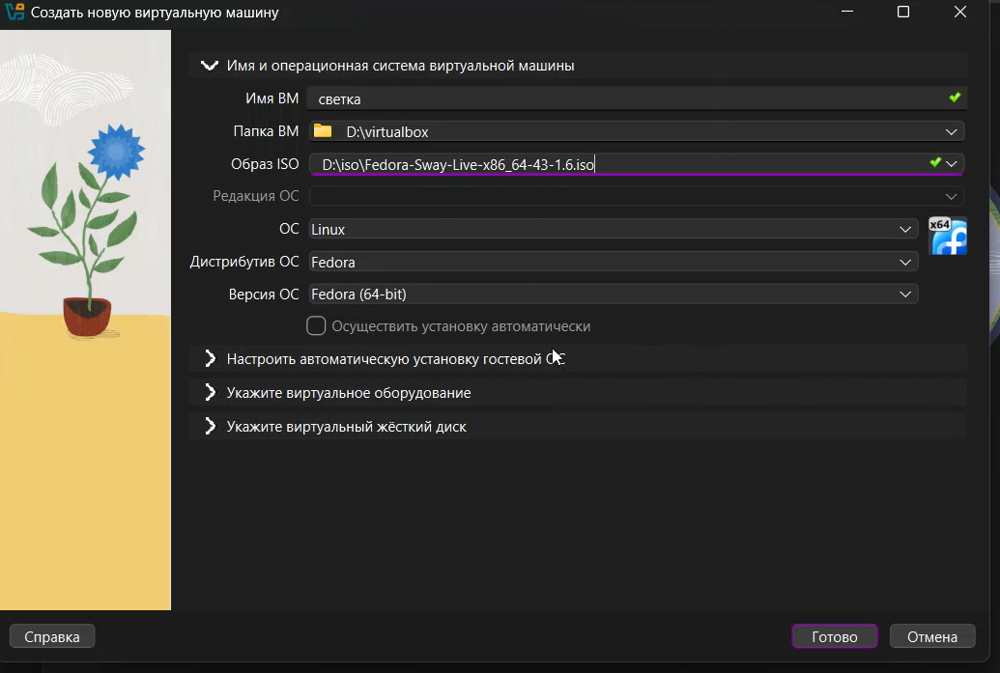

Рисунок 1: Создание виртуальной машины

------------------------------------------------------------------------

В терминале запустила liveinst
(<a href="#fig-002" class="quarto-xref">рис. 2</a>).

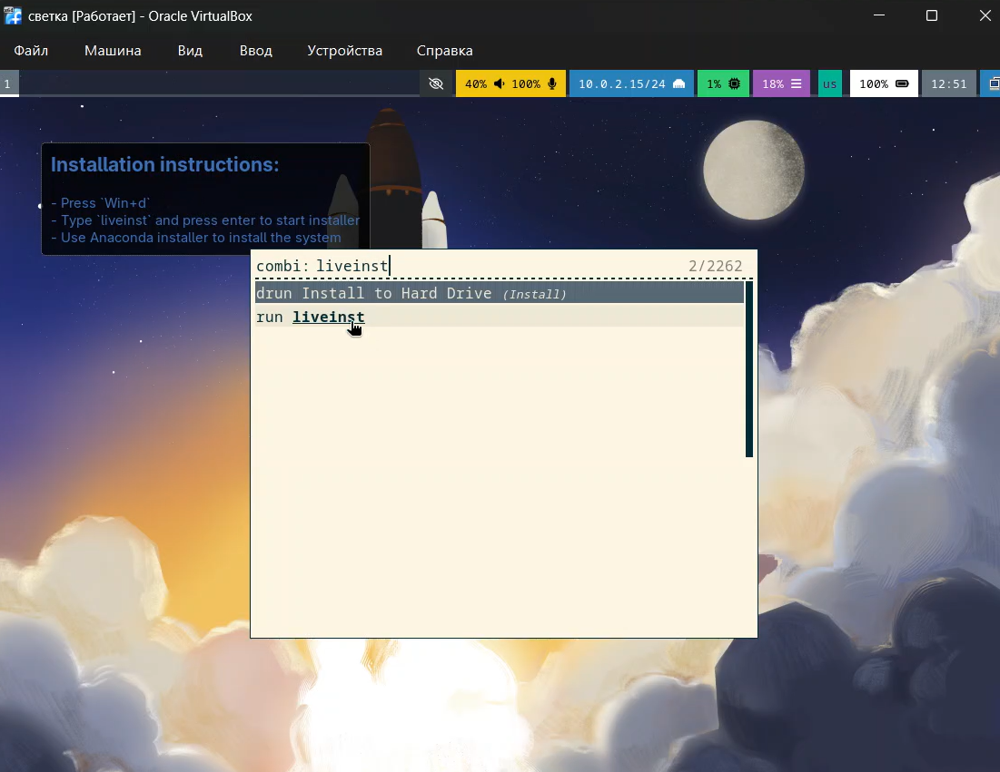

Рисунок 2: Запуск liveinst

------------------------------------------------------------------------

Выбрала язык интерфейса, установила имя и пароль пользователя, завершила
установку Fedora (<a href="#fig-003" class="quarto-xref">рис. 3</a>).

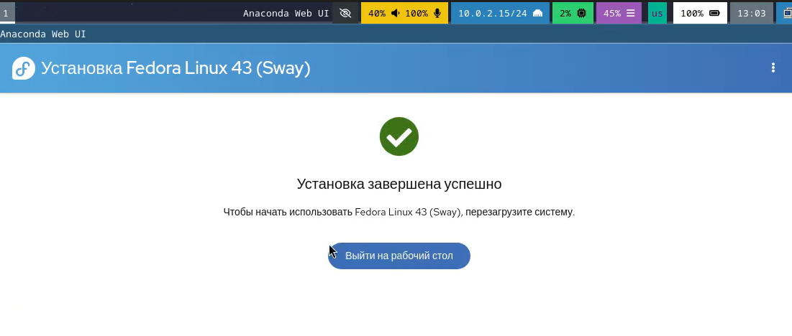

Рисунок 3: Установка Fedora sway

------------------------------------------------------------------------

Я удалила оптический диск, так как он не удалился автоматически
(<a href="#fig-004" class="quarto-xref">рис. 4</a>).

Рисунок 4: Удаление оптического диска

## После установки

Я переключилась на роль супер-пользователя и установила средства
разработки (<a href="#fig-005" class="quarto-xref">рис. 5</a>).

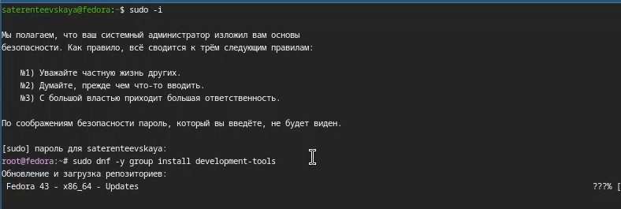

Рисунок 5: Переключение на роль супер-пользователя

------------------------------------------------------------------------

Обновила все пакеты (<a href="#fig-006" class="quarto-xref">рис. 6</a>).

Рисунок 6: Обновление пакетов

------------------------------------------------------------------------

Установила программы для удобства работы в консоли и другой вариант
консоли (<a href="#fig-007" class="quarto-xref">рис. 7</a>).

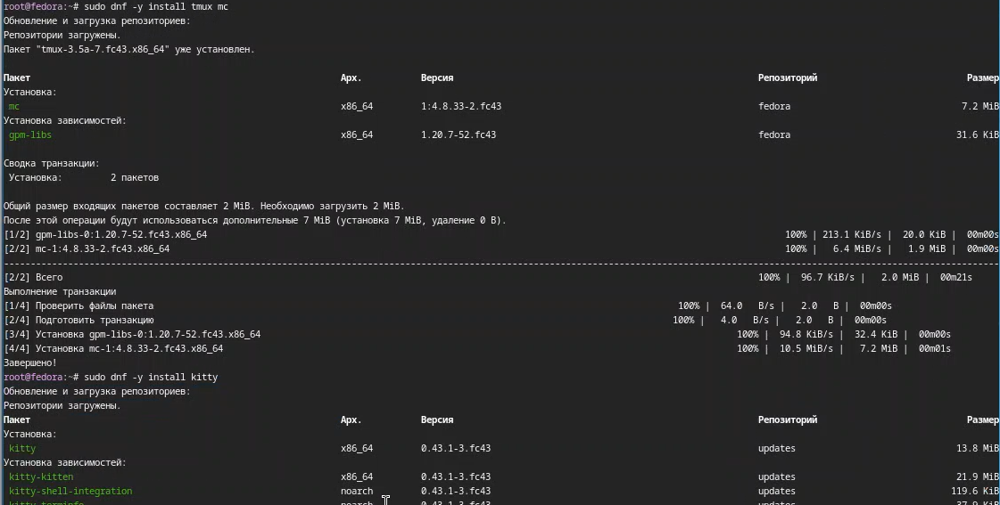

Рисунок 7: Установка программ

------------------------------------------------------------------------

В файле /etc/selinux/config я заменила значение SELINUX
(<a href="#fig-008" class="quarto-xref">рис. 8</a>).

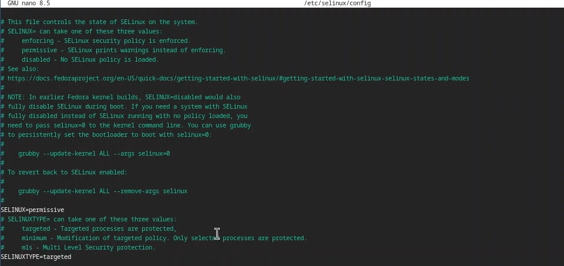

Рисунок 8: Замена SELINUX

------------------------------------------------------------------------

Перезагрузила виртуальную машину
(<a href="#fig-009" class="quarto-xref">рис. 9</a>).

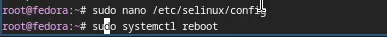

Рисунок 9: Перезагрузка

## Настройка раскладки клавиатуры

Я вошла в ОС при заданной мной учётной записью, запустила терминал и
запустила мультиплексор tmux
(<a href="#fig-010" class="quarto-xref">рис. 10</a>).

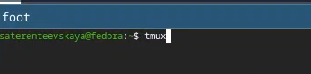

Рисунок 10: Запуск tmux

------------------------------------------------------------------------

Я создала конфигурационный файл
(<a href="#fig-011" class="quarto-xref">рис. 11</a>).

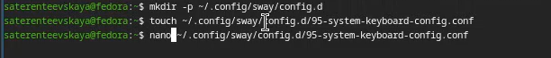

Рисунок 11: Создание конфигурационного файла

------------------------------------------------------------------------

Отредактировала конфигурационный файл 95-system-keyboard-config.conf
(<a href="#fig-012" class="quarto-xref">рис. 12</a>).

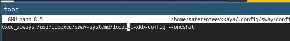

Рисунок 12: Редактирование файла

Я переключилась на роль супер-пользователя
(<a href="#fig-013" class="quarto-xref">рис. 13</a>).

------------------------------------------------------------------------

Рисунок 13: Переключение на роль супер-пользователя

И отредактировала конфигурационный файл 00-keyboard.conf
(<a href="#fig-014" class="quarto-xref">рис. 14</a>).

Рисунок 14: Редактирование файла

Снова перезагрузила виртуальную машину.

## Установка имени пользователя и названия хоста

Я запустила терминальный мультиплексор tmux и переключилась на роль
супер-пользователя. Установила имя хоста и проверила, что оно
установлено верно (<a href="#fig-015" class="quarto-xref">рис. 15</a>).

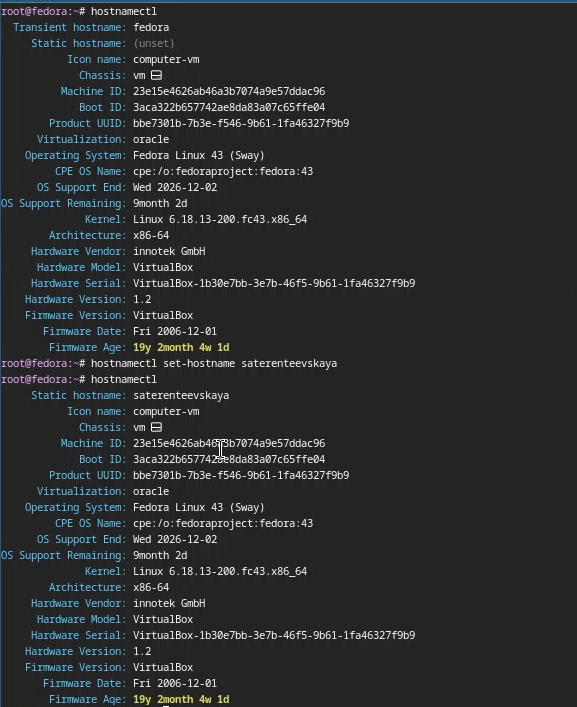

Рисунок 15: Установка имени хоста

## Установка программного обеспечения для создания документации

Я установила pandoc с помощью менеджера пакетов
(<a href="#fig-016" class="quarto-xref">рис. 16</a>).

Рисунок 16: Установка pandoc

------------------------------------------------------------------------

Я скачала необходимую версию pandoc-crossref и соответствующую версию
pandoc, распаковала архивы и поместила их в каталог /usr/local/bin
(<a href="#fig-017" class="quarto-xref">рис. 17</a>).

Рисунок 17: Скачивание pandoc-crossref и pandoc

------------------------------------------------------------------------

Я установила дистрибутив TeXlive
(<a href="#fig-018" class="quarto-xref">рис. 18</a>).

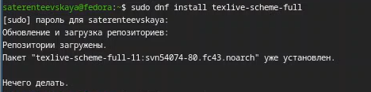

Рисунок 18: Установка TeXlive

## Домашнее задание

Я выполнила команду dmesg с помощью grep, чтобы получить информацию про
систему
(<a href="#fig-019" class="quarto-xref">рис. 19</a>,<a href="#fig-020" class="quarto-xref">рис. 20</a>).

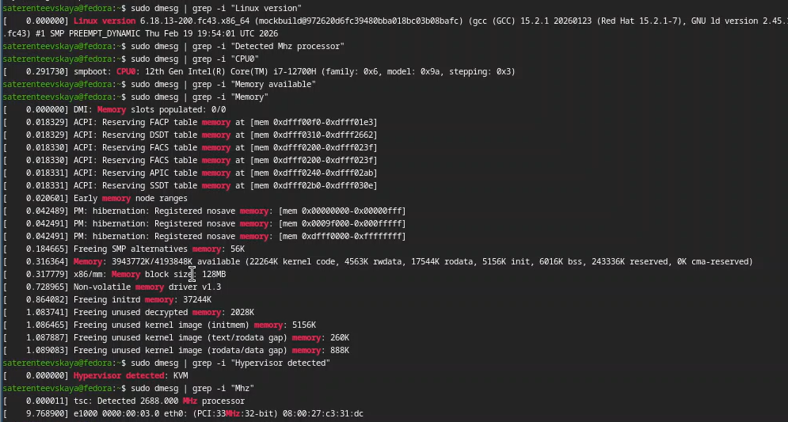

Рисунок 19: Получение информации с помощью grep

------------------------------------------------------------------------

Рисунок 20: Получение информации с помощью grep

## Результаты:

- Версия ядра: 6.18.13-200 fc43.x86_64

- Частота процессора: 2688 MHz

- Модель процессора: 12th Gen Intel(R) Core(TM) i7-12700H

- Доступная память: 3943772K/4193848K

- Тип гипервизора:KVM

- Тип файловой системы корневого раздела: ext4

- Последовательность монтирования файловых систем: Huge Pages -\> POSIX
  Message Queue -\> Kernel Debug -\> Kernel Trace -\> FUSE Control -\>
  корневой раздел (sda2)

# Выводы

В результате лабораторной работы я научилась устанавливать операционную
систему на виртуальную машину и настраивать минимально необходимые
сервисы.
