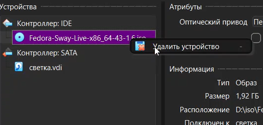
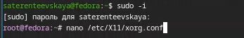
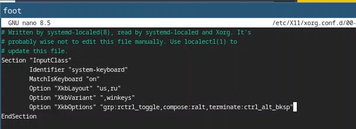
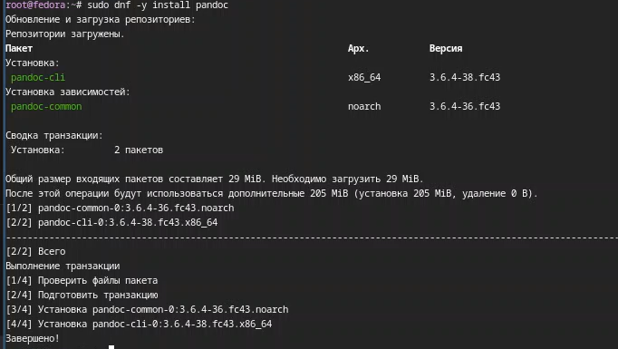
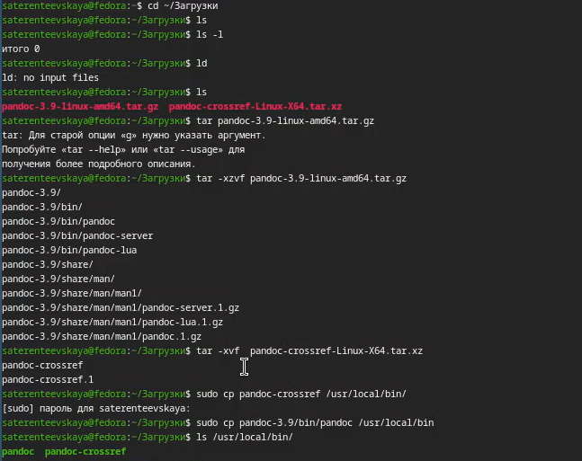
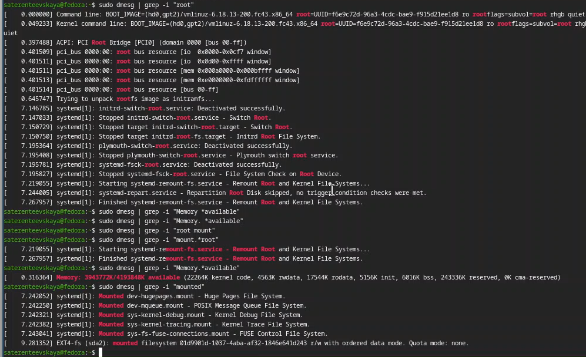

---
## Author
author:
  name: Терентеевская Светлана Александровна
  degrees: Student
  email: 1032253498@rudn.ru
  affiliation:
    - name: Российский университет дружбы народов
      country: Российская Федерация
      postal-code: 117198
      city: Москва
      address: ул. Миклухо-Маклая, д. 6

## Title
title: "Отчёт по лабораторной работе №1"
license: "CC BY"
---

# Цель работы
 
 Приобрести практические навыки установки операционной системы на виртуальную машину, настройки минимально необходимых для дальнейшей работы сервисов.

# Задание

Освоить процесс установки операционной системы Linux на виртуальную машину в VirtualBox и выполнить ее базовую настройку для последующей работы.

# Теоретическое введение

# Выполнение лабораторной работы

## Установка операционной системы
Я создала виртуальную машину, добавив в нее заранее скачанный образ Fedora sway ([рис. @fig-001]).

{#fig-001 width=100%}

В терминале запустила liveinst ([рис. @fig-002]).

{#fig-002 width=100%}

Выбрала язык интерфейса, установила имя и пароль пользователя, завершила установку Fedora ([рис. @fig-003]).

{#fig-003 width=100%}

Я удалила оптический диск, так как он не удалился автоматически ([рис. @fig-004]).

{#fig-004 width=100%}

## После установки 

Я переключилась на роль супер-пользователя и установила средства разработки ([рис. @fig-005]).

{#fig-005 width=100%}

Обновила все пакеты ([рис. @fig-006]).

{#fig-006 width=100%}

Установила программы для удобства работы в консоли и другой вариант консоли ([рис. @fig-007]).

{#fig-007 width=100%}

В файле /etc/selinux/cjnfig я заменила значение SELINUX ([рис. @fig-008]).

{#fig-008 width=100%}

Перезагрузила виртуальную машину ([рис. @fig-009]).

{#fig-009 width=100%}

## Настройка раскладки клавиатуры

Я вошла в ОС при заданной мной учётной записью, запустила терминал и запустила мультиплексор tmux ([рис. @fig-010]).

{#fig-010 width=100%}

Я создала конфигурационный файл ([рис. @fig-011]).

{#fig-011 width=100%}

Отредактировала конфигурационный файл 95-system-keyboard-config.conf ([рис. @fig-012]).

{#fig-012 width=100%}

Я переключилась на роль супер-пользователя ([рис. @fig-013]).

{#fig-013 width=100%}

И отредактировала конфигурационный файл 00-keyboard.conf ([рис. @fig-014]).

{#fig-014 width=100%}

Снова перезагрузила виртуальную машину.

## Установка имени пользователя и названия хоста

Я запустила терминальный мультиплексор tmux и переключилась на роль супер-пользователя.  Установила имя хоста и проверила, что оно установлено верно ([рис. @fig-015]).

{#fig-015 width=100%}

## Установка программного обеспечения для создания документации

Я установила pandoc с помощью менеджера пакетов ([рис. @fig-016]).

{#fig-016 width=100%}

Я скачала необходимую версию pandoc-crossref и соответствующую версию pandoc, распаковала архивы и поместила их в каталог /usr/local/bin ([рис. @fig-017]).

{#fig-017 width=100%}

Я установила дистрибутив TeXlive ([рис. @fig-018]).

{#fig-018 width=100%}

## Домашнее задание

Я выполнила команду dmesg с помощью grep, чтобы получить информацию про систему ([рис. @fig-019],[рис. @fig-020]).

{#fig-019 width=100%}

{#fig-020 width=100%}

Результаты:

* Версия ядра: 6.18.13-200 fc43.x86_64

* Частота процессора: 2688 MHz

* Модель процессора: 12th Gen Intel(R) Core(TM) i7-12700H 

* Доступная память: 3943772K/4193848K

* Тип гипервизора:KVM

* Тип файловой системы корневого раздела: ext4

* Последовательность монтирования файловых систем: Huge Pages -> POSIX Message Queue -> Kernel Debug -> Kernel Trace -> FUSE Control -> корневой раздел (sda2)

# Выводы

Я приобрела практические навыки установки операционной системы на виртуальную машину и настройки минимально необходимых для дальнейшей работы сервисов.

# Список литературы
* [ТУИС](https://esystem.rudn.ru/)

* [Методичка к лабораторной работе №1](https://esystem.rudn.ru/mod/page/view.php?id=1358180)
