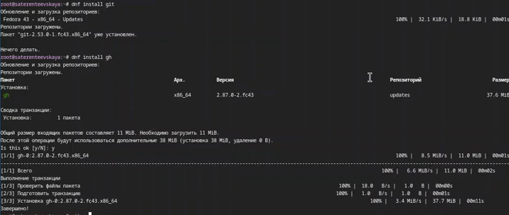
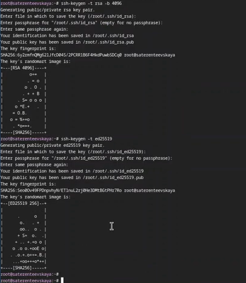
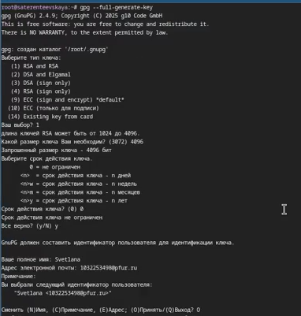
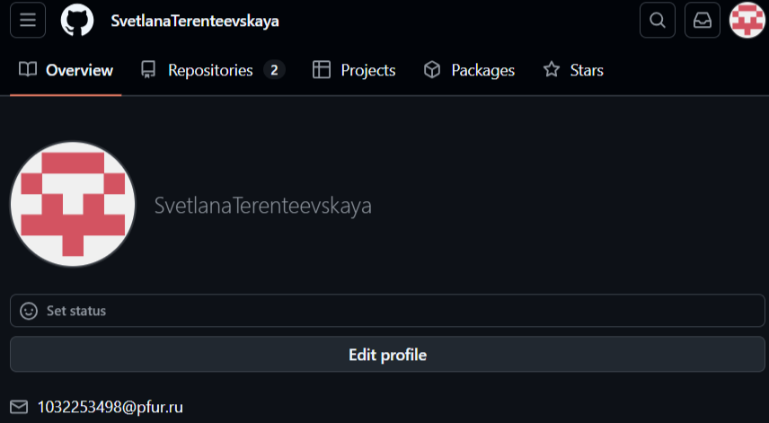
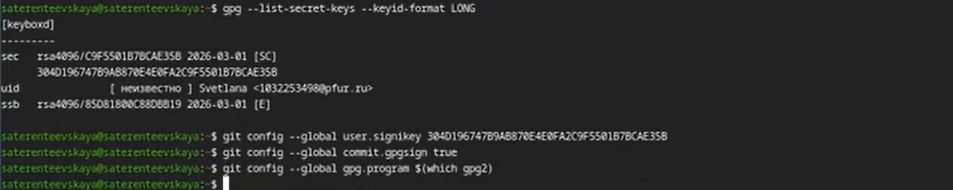
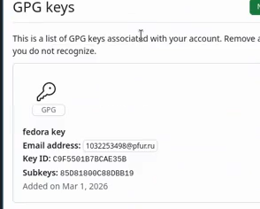
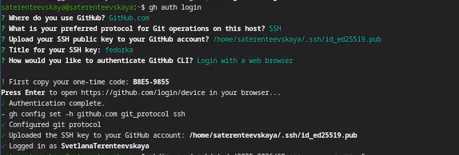
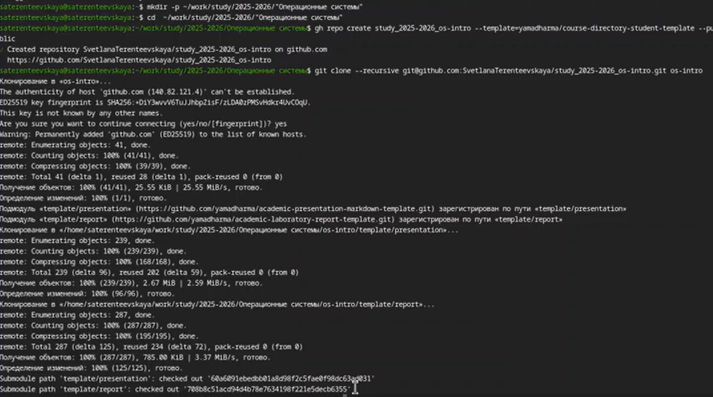
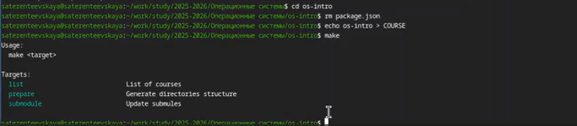
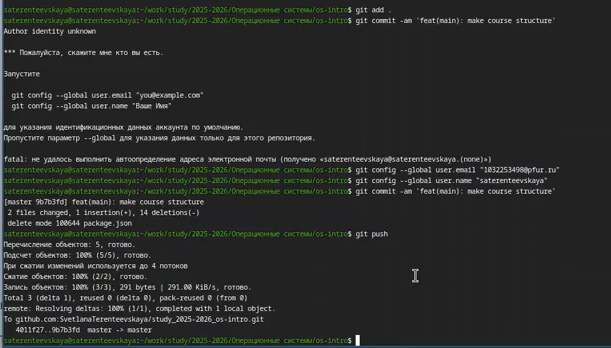

# Отчёт по лабораторной работе №2
Терентеевская Светлана Александровна
2026-03-07

# Информация

## Докладчик

- Терентеевская Светлана Александровна
- Группа НКАбд-05-25, студент бакалавра
- Российский университет дружбы народов им. П. Лумумбы
- <1032253498@rudn.ru>
- <https://github.com/SvetlanaTerenteevskaya>

# Вводная часть

## Цель работы

- Изучить идеологию и применение средств контроля версий.
- Освоить умения по работе с git.

## Задание

- Создать базовую конфигурацию для работы с git.
- Создать ключ SSH.
- Создать ключ PGP.
- Настроить подписи git.
- Зарегистрироваться на Github.
- Создать локальный каталог для выполнения заданий по предмету.

## Теоретическое введение

Системы контроля версий (Version Control System, VCS) используются для
организации совместной работы коллектива над общим проектом. Как
правило, основная ветка разработки хранится в репозитории — локальном
или удаленном, — к которому организован доступ всех участников. Когда
разработчики вносят правки, VCS позволяет регистрировать эти изменения,
объединять результаты работы разных специалистов, а при необходимости —
выполнять возврат к любой из более ранних версий проекта.

------------------------------------------------------------------------

В классической модели контроля версий применяется централизованный
подход: все файлы хранятся в едином репозитории, а управление версиями
обеспечивается выделенным сервером. Участник проекта перед началом
работы с помощью специальных команд запрашивает актуальную или нужную
ему версию файлов. Завершив внесение правок, он отправляет обновлённую
версию обратно в хранилище. При этом все предыдущие версии сохраняются в
центральном репозитории, и к ним можно обратиться в любой момент. Чтобы
экономить дисковое пространство, сервер может не сохранять полностью
каждый изменённый файл, а применять дельта-компрессию — записывать
только различия между последовательными версиями.

# Выполнение лабораторной работы

## Установка програмного обеспечения

Я установила git и gh
(<a href="#fig-001" class="quarto-xref">рис. 1</a>).

Рисунок 1: установка git и gh

## Базовая настройка git

Я задала имя и email владельца репозитория, настроила utf-8 в выводе
сообщений в git задала имя начальной ветки (master), параметр autocrlf и
параметр safecrlf
(<a href="#fig-002" class="quarto-xref">рис. 2</a>,<a href="#fig-003" class="quarto-xref">рис. 3</a>).

Рисунок 2: Настройка git

Рисунок 3: Настройка git

## Создание ключей ssh

Я создала ключи ssh: по алгоритму rsa с ключем размером 4096 бит и по
алгоритму ed25519 (<a href="#fig-004" class="quarto-xref">рис. 4</a>).

Рисунок 4: Создание ключей ssh

## Создание ключей pgp

Я сгенерировала ключ и выбрала необходимые опции
(<a href="#fig-005" class="quarto-xref">рис. 5</a>).

Рисунок 5: Создание ключей pgp

## Настройка github

У меня уже есть учетная запись в GitHub. Я добавила туда свою почту
(<a href="#fig-006" class="quarto-xref">рис. 6</a>).

Рисунок 6: Учетная запись на GitHub

## Добавление PGP ключа в GitHub

Я вывела список ключей и скопировала отпечаток приватного ключа. Свой
сгенерированный PGP ключ я скопировала в буфер обмена и вставила его в
поле ввода в GitHub
(<a href="#fig-007" class="quarto-xref">рис. 7</a>,<a href="#fig-008" class="quarto-xref">рис. 8</a>).

Рисунок 7: Генерация ключа

------------------------------------------------------------------------

Рисунок 8: Ключ в GitHub

## Настройка автоматических подписей коммитов git

Используя введенный email, я указала Git применять его при подписи
коммитов (<a href="#fig-009" class="quarto-xref">рис. 9</a>).

Рисунок 9: Настройка подписи коммитов

## Настройка gh

Я авторизовалась через браузер, ответив до этого на вопросы
(<a href="#fig-010" class="quarto-xref">рис. 10</a>).

Рисунок 10: Процесс авторизации

## Шаблон для рабочего пространства

Я создала репозиторий на основе шаблона для 2025-2026 учебного года по
предмету “Операционные системы”
(<a href="#fig-011" class="quarto-xref">рис. 11</a>).

Рисунок 11: Создание репозитория с работа с ним

------------------------------------------------------------------------

Я перешла в каталог курса, удалила лишнии файлы и создала необходимые
каталоги (<a href="#fig-012" class="quarto-xref">рис. 12</a>).

Рисунок 12: Создание репозитория с работа с ним

------------------------------------------------------------------------

Я отправила файлы на сервер
(<a href="#fig-013" class="quarto-xref">рис. 13</a>).

Рисунок 13: Отправка файлов на сервер

# Выводы

Я изучила идеологию и применение средств контроля версий и освоила
умения по работе с git.

# Список литературы

[ТУИС](https://esystem.rudn.ru/course)

[Методичка к лабораторной работе
№2](https://esystem.rudn.ru/mod/page/view.php?id=1358183)
