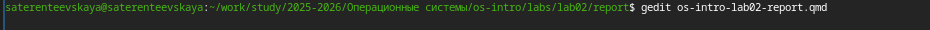
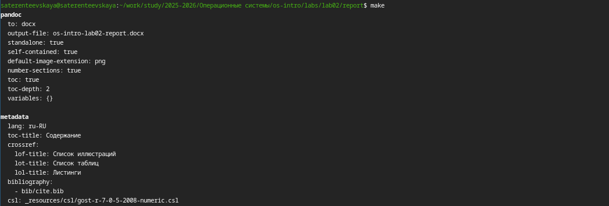
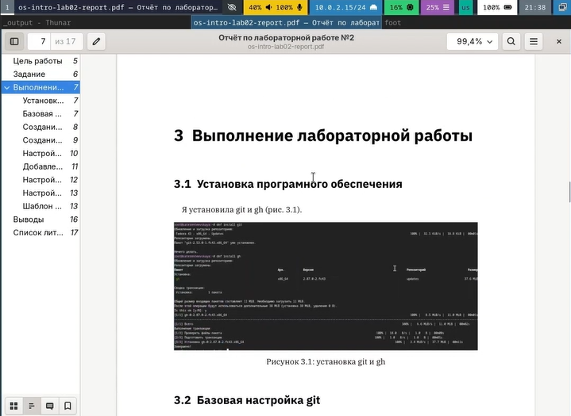

---
## Author
author:
  name: Терентеевская Светлана Александровна
  degrees: student
  email: 1032253498@rudn.ru
  affiliation:
    - name: Российский университет дружбы народов
      country: Российская Федерация
      postal-code: 117198
      city: Москва
      address: ул. Миклухо-Маклая, д. 6

## Title
title: "Отчёт по лабораторной работе №3"
subtitle: "Дисциплина: Операционные системы"
license: "CC BY"
---

# Цель работы

Научиться оформлять отчёты с помощью легковесного языка разметки Markdown.

# Задание

Сделать отчёт по предыдущей лабораторной работе в формате Markdown и предоставить отчёты в 3 форматах: pdf, docx и md.

# Теоретическое введение

Markdown — это облегчённый язык разметки, предназначенный для оформления текстовых документов с простым синтаксисом, который легко конвертируется в другие форматы, такие как HTML, PDF или DOCX. Основные элементы форматирования включают:

- **Заголовки** — создаются с помощью символа \# (например, `# Заголовок 1`, `## Заголовок 2`);
- **Выделение текста** — полужирное начертание (`**текст**`) и курсив (`*текст*`);
- **Списки** — маркированные (с помощью `*`, `+` или `-`) и нумерованные (с помощью цифр с точкой);
- **Блоки цитирования** — обозначаются символом `>`;
- **Ссылки** — формат `[текст ссылки](адрес)`;
- **Вставка кода** — ограждённые блоки с указанием языка (```` ```language ````);
- **Изображения** — ``;
- **Формулы** — поддерживаются LaTeX-синтаксис внутри `$$` или `\(...\)`.

Для обработки файлов в формате Markdown используется инструмент **Pandoc**, который позволяет преобразовывать `.md` файлы в `.pdf`, `.docx` и другие форматы. При необходимости для автоматизации процесса компиляции применяется **Makefile**.

# Выполнение лабораторной работы

Я открыла файл с шаблоном лабораторной работы с помощью команды gedit ([рис. @fig-001]).

{#fig-001 width=100%}

Я изменила текст шаблона для лабораторной работы и скомпилировала его с помощью команды make ([рис. @fig-002]).

{#fig-002 width=100%}

После компиляции проверила как выклядят файлы ([рис. @fig-003]).

{#fig-003 width=100%}

# Выводы

Я научилась оформлять отчёты с помощью легковесного языка разметки Markdown.

# Список литературы:

[ТУИС](https://esystem.rudn.ru/)

[Методичка к лабораторной работе №3](https://esystem.rudn.ru/mod/resource/view.php?id=1358185)
