---
## Author
author:
  name: Терентеевская Светлана Александровна
  degrees: Student
  email: 1032453498@rudn.ru
  affiliation:
    - name: Российский университет дружбы народов
      country: Российская Федерация
      postal-code: 197198
      city: Москва
      address: ул. Миклухо-Маклая, д. 6

## Title
title: "Отчёт по лабораторной работе №4"
subtitle: "Дисциплина: Операционные системы"
license: "CC BY"
---

# Цель работы

Получить навыки правильной работы с репозиториями git.

# Задание

* Выполнить работу для тестового репозитория 
* Преобразовать рабочий репозиторий в репозиторий с git-flow и conventional commits

# Теоретическое введение

Gitflow Workflow опубликована и популярована Винсентом Дриссеном.
Gitflow Workflow предполагает выстраивание строгой модели ветвления с учётом выпуска проекта.
Данная модель отлично подходит для организации рабочего процесса на основе релизов.
Работа по модели Gitflow включает создание отдельной ветки для исправлений ошибок в рабочей среде.

---

Последовательность действий при работе по модели Gitflow:

1. Из ветки `master` создаётся ветка `develop`.
2. Из ветки `develop` создаётся ветка `release`.
3. Из ветки `develop` создаются ветки `feature`.
4. Когда работа над веткой `feature` завершена, она сливается с веткой `develop`.
5. Когда работа над веткой релиза `release` завершена, она сливается в ветки `develop` и `master`.
6. Если в `master` обнаружена проблема, из `master` создаётся ветка `hotfix`.
7. Когда работа над веткой исправления `hotfix` завершена, она сливается в ветки `develop` и `master`.

# Выполнение лабораторной работы

## Установка программного обеспечения

### Установка git-flow

Я скачала установщик и через него установила gitflow ([рис. @fig-001]).

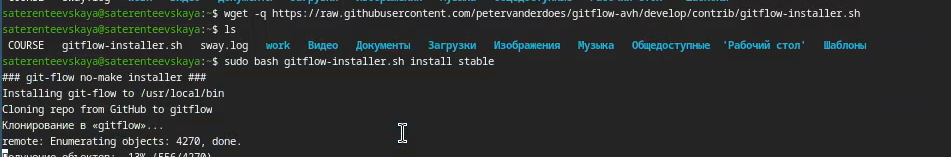{#fig-001 width=80%}

Удалила установщик ([рис. @fig-002]).

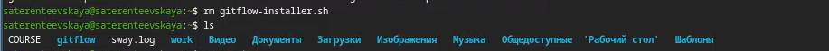{#fig-002 width=80%}

### Установка Node.js

Далее я установила Node.js ([рис. @fig-003]).

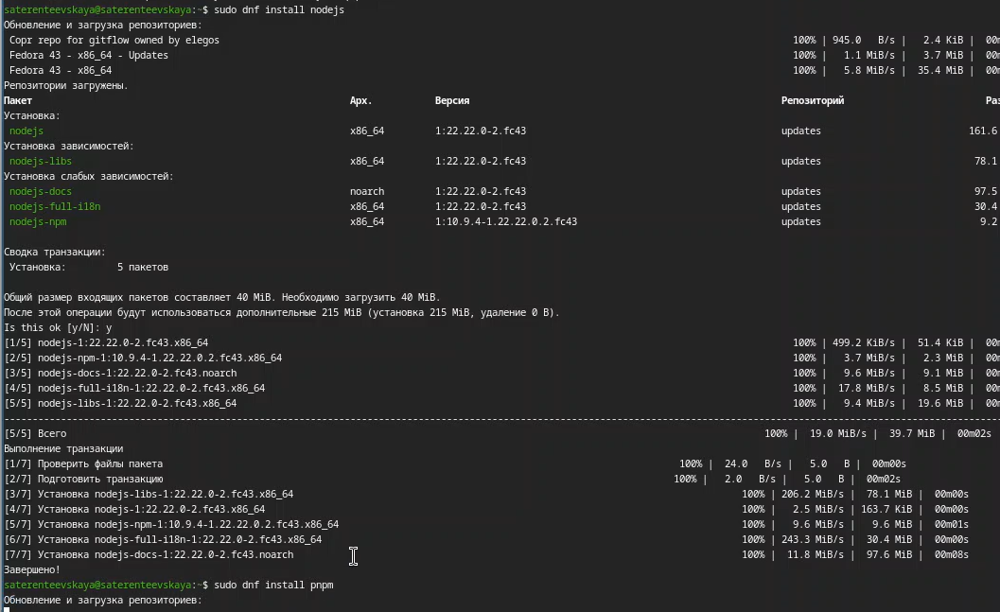{#fig-003 width=80%}

### Настройка Node.js

Я запустила pnpm setup и выполнила source ~/.bashrc ([рис. @fig-004]).

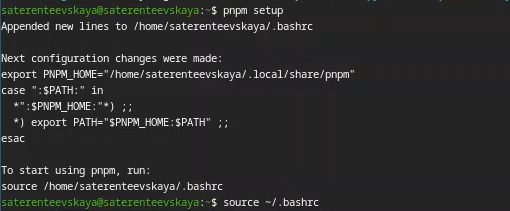{#fig-004 width=80%}

### Общепринятые коммиты

Я установила пакет commitizen ([рис. @fig-005]).

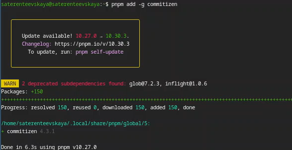{#fig-005 width=80%}

И скачала программу, которая используется для помощи в создании логов ([рис. @fig-006]).

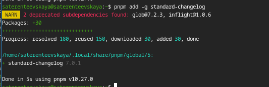{#fig-006 width=80%}

## Практический сценарий использования git

### Создание репозитория git 

Я создала репозиторий на GitHub и назвала его git-extended ([рис. @fig-007]).

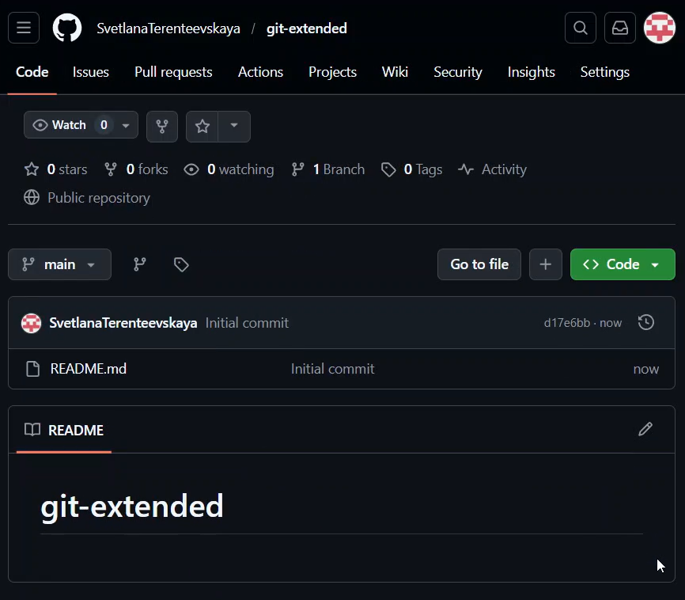{#fig-007 width=80%}

Перешла в созданный каталог и выполнила первый коммит, но поскольку не было никаких изменений, выдало : нечего комитить ([рис. @fig-008]).

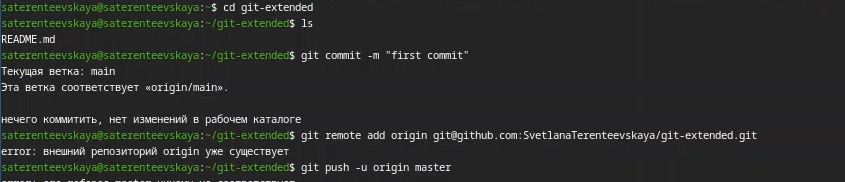{#fig-008 width=80%}

После этого я перешла к конфигурации для пакетов Node.js ([рис. @fig-009]).

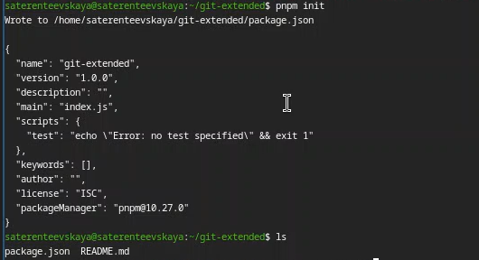{#fig-009 width=80%}

Изменила текст в файле package.json, добавив в него команду для формирования коммитов ([рис. @fig-010]).

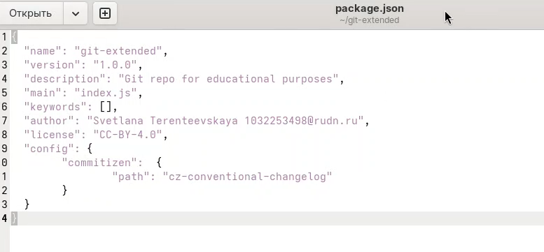{#fig-010 width=80%}

Добавила новые файлы, выполнила коммит и отправила на GitHub ([рис. @fig-011]).

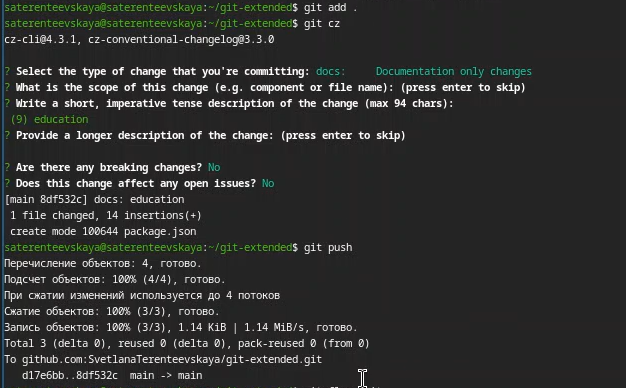{#fig-011 width=80%}

Далее я инициализировала git-flow, установила префикс для ярлыков -v, проверила, что нахожусь на ветке develop и загрузила весь репозиторий в хранилище ([рис. @fig-012]).

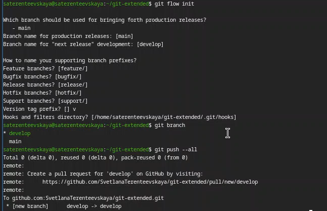{#fig-012 width=80%}

Я установила внешнюю ветку как вышестоящую для этой ветки и создала релиз с версией 1.0.0 ([рис. @fig-013]).

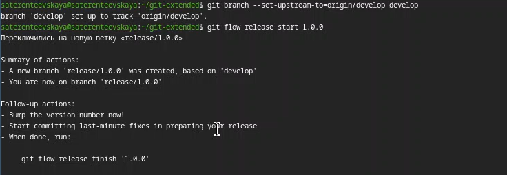{#fig-013 width=80%}

Создала журнал изменений, добавила журнал изменений в индекс и залила релизную ветку в основную ветку ([рис. @fig-014], [рис. @fig-015]).

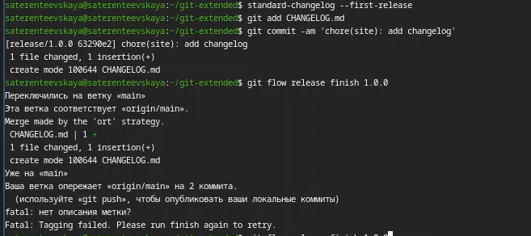{#fig-014 width=80%}

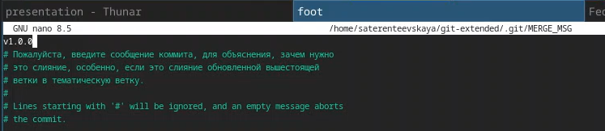{#fig-015 width=80%}

Отправила данные на GitHub и создала релиз на GitHub ([рис. @fig-016]).

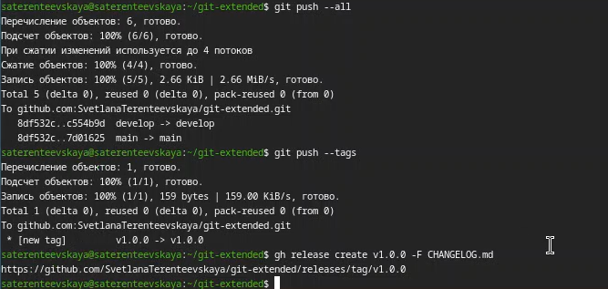{#fig-016 width=80%}

### Работа с репозиторием git

Я создала ветку для новой функциональности, проверила на какой я ветке и объединила ветки fearure_branch и develop ([рис. @fig-017]).

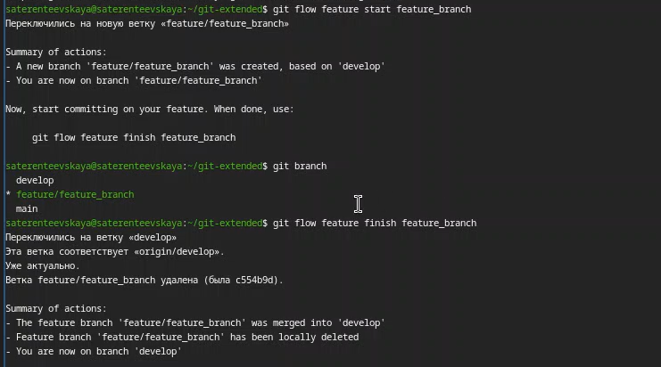{#fig-017 width=80%}

Создала релиз с версией 1.2.3 ([рис. @fig-018]).

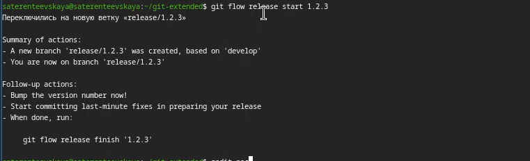{#fig-018 width=80%}

Обновила номер версии в файле package.json, установив её 1.2.3 ([рис. @fig-019]).

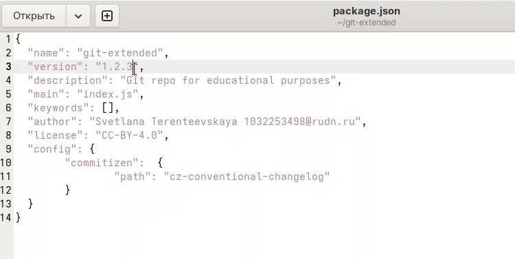{#fig-019 width=80%}

Создала журнал изменений и добавила журнал изменений в индекс ([рис. @fig-020]).

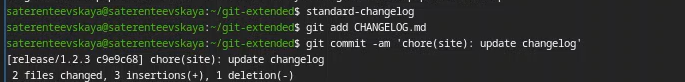{#fig-020 width=80%}

Залила релизную ветку в основную ветку ([рис. @fig-021], [рис. @fig-022]).

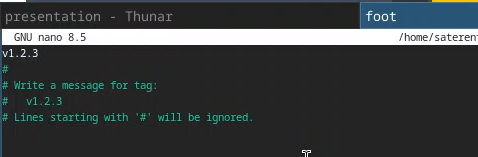{#fig-021 width=80%}

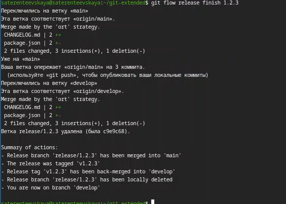{#fig-022 width=80%}

Я отправила данные на GitHub и создала релиз с комментарием из журнала изменений ([рис. @fig-023]).

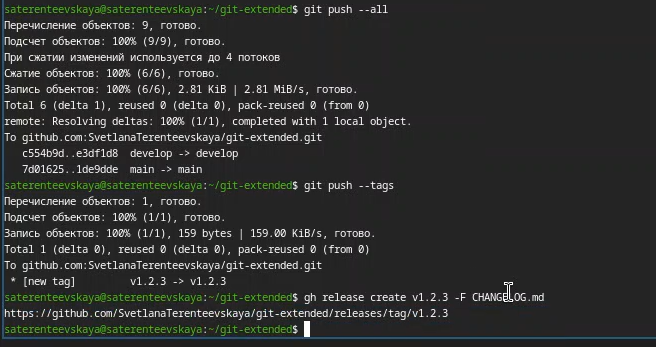{#fig-023 width=80%}

Проверила, что на GitHub видны изменения ([рис. @fig-024]).

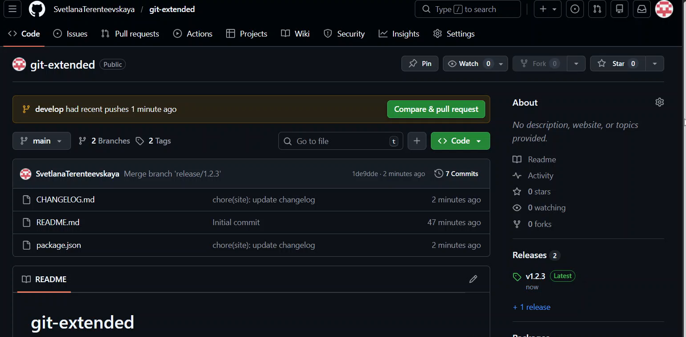{#fig-024 width=80%}

# Выводы

В результате выполнения лабораторной работы я получила навыки правильной работы с репзиториями git

# Список литературы

[ТУИС](https://esystem.rudn.ru/)

[Методичка к лабораторной работе №4](https://esystem.rudn.ru/mod/page/view.php?id=1358187)
