---
author:
- Терентеевская Светлана Александровна
authors:
- affiliation:
  - address: ул. Миклухо-Маклая, д. 6
    city: Москва
    country: Российская Федерация
    name: Российский университет дружбы народов
    postal-code: 117198
  degrees: Student
  email: 1032253498@rudn.ru
  name: Терентеевская Светлана Александровна
crossref:
  lof-title: Список иллюстраций
  lol-title: Листинги
  lot-title: Список таблиц
date: 2026-03-14
date-format: 2026-03-14
engines:
- path: /opt/quarto/share/extension-subtrees/julia-engine/\_extensions/julia-engine/julia-engine.js
lang: ru-RU
license:
  text: CC BY 4.0
  type: creative-commons
  url: "https://creativecommons.org/licenses/by/4.0/deed.ru-ru"
subtitle: Менеджер паролей pass и управление конфигурациями chezmoi
title: Отчёт по лабораторной работе №5
toc-title: Содержание
---

# Информация

## Докладчик

- Терентеевская Светлана Александровна
- Группа НКАбд-05-25, студент бакалавра
- Российский университет дружбы народов им. П. Лумумбы
- <1032253498@rudn.ru>
- <https://github.com/SvetlanaTerenteevskaya>

# Вводная часть

## Цель работы

Освоить использование менеджера паролей pass для безопасного хранения
учётных данных и систему управления кофигурацинными файлами chezmoi для
синхронизации настроек рабочей среды.

## Задание

- Установить и настроить менеджер паролей pass

- Установить и настроить chezmoi

- Выполнить настройку второй машины/компьютера с использованием
  созданного репозитория

## Теоретическое введение

**Менеджер паролей pass**

pass (The standard Unix password manager) --- менеджер паролей,
следующий философии Unix. Основные принципы работы:

- Хранение данных: пароли сохраняются в файловой системе в виде обычных
  файлов, организованных в каталоги.

- Безопасность: каждый файл шифруется с помощью GPG-ключа пользователя.

- Структура базы: может быть произвольной, но для совместимости с
  дополнительным ПО рекомендуется семантическая структура (например,
  example.com/user.gpg, user@example.com.gpg).

- Синхронизация: поддерживается работа с Git, что позволяет хранить базу
  паролей в удалённом репозитории и использовать её на нескольких
  устройствах.

------------------------------------------------------------------------

**Управление конфигурационными файлами с chezmoi**

chezmoi --- инструмент для управления dotfiles (конфигурационными
файлами) в домашнем каталоге пользователя.

Основные возможности:

- Хранение: состояние файлов сохраняется в \~/.local/share/chezmoi,
  который является клоном Git-репозитория.

- Шаблоны: поддержка шаблонов Go (синтаксис {{ .variable }}) для
  создания конфигураций, адаптируемых под разные машины.

- Переменные: доступ к данным окружения через chezmoi data (ОС, имя
  хоста, архитектура и др.).

- Условные выражения: возможность включать/исключать части конфигурации
  в зависимости от условий (if, eq, and, or).

- Работа с несколькими машинами: простая инициализация новой машины
  одной командой (chezmoi init --apply), автоматическая синхронизация
  изменений.

# Выполнение лабораторной работы

## **Менеджер паролей pass.** Установка

Я установила pass ([рис. 1](#fig-001){.quarto-xref}).

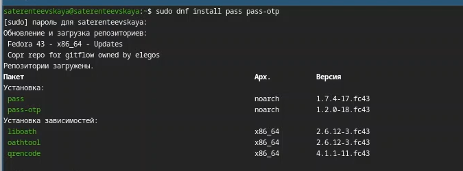{width="80%"}

------------------------------------------------------------------------

А также gopass ([рис. 2](#fig-002){.quarto-xref}).

{width="80%"}

## Настройка

Посмотрела список ключей ([рис. 3](#fig-003){.quarto-xref}).

{width="80%"}

------------------------------------------------------------------------

Инициализировала хранилище ([рис. 4](#fig-004){.quarto-xref}).

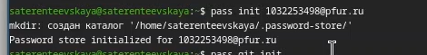{width="80%"}

------------------------------------------------------------------------

Создала структуру git и задала адрес репозитория на хостинге,
предварительно создав репозиторий ([рис. 5](#fig-005){.quarto-xref}).

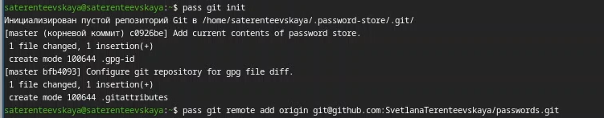{width="80%"}

------------------------------------------------------------------------

Выполнила следующую команду для синхронизации
([рис. 6](#fig-006){.quarto-xref}).

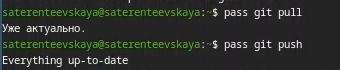{width="80%"}

## Настройка интерфейса с браузером

Я установила интерфейс для взаимодейтсвия с браузером
([рис. 7](#fig-007){.quarto-xref}).

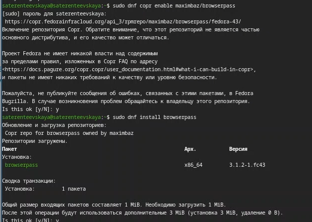{width="50%"}

------------------------------------------------------------------------

Посмотрела, что расширение появилось ([рис. 8](#fig-008){.quarto-xref}).

{width="80%"}

## Сохранение пароля

Я отредактировала ключ, изменив доверие с "неизвестно"
([рис. 9](#fig-009){.quarto-xref}).

{width="80%"}

------------------------------------------------------------------------

На "абсолютно" ([рис. 10](#fig-010){.quarto-xref}).

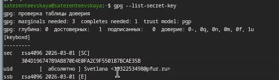{width="80%"}

------------------------------------------------------------------------

Я добавила новый пароль ([рис. 11](#fig-011){.quarto-xref}).

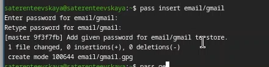{width="80%"}

------------------------------------------------------------------------

Отобразила пароль для указанного имени файла и заменила существующий
пароль ([рис. 12](#fig-012){.quarto-xref})

{width="80%"}

## **Управление файлами конфигурации.** Дополнительное программное обеспечение

Я установила дополнительное программное обеспечение
([рис. 13](#fig-013){.quarto-xref}).

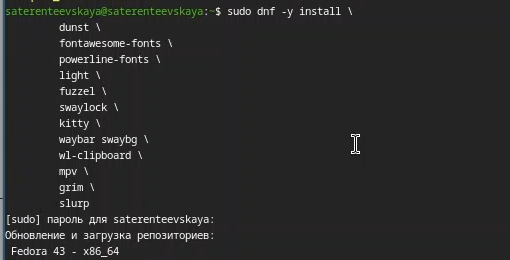{width="80%"}

------------------------------------------------------------------------

Установила шрифты ([рис. 14](#fig-014){.quarto-xref}).

{width="80%"}

## Установка

С помощью wget скачивается необходимый файл
([рис. 15](#fig-015){.quarto-xref}).

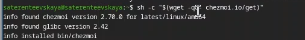{width="80%"}

## Создание собственного репозитория с помощью утилит

Я создала свой репозиторий для конфигурационных файлов на основе шаблона
([рис. 16](#fig-016){.quarto-xref}).

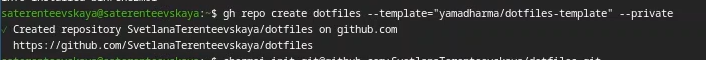{width="80%"}

## Подключение репозитория к своей системе

Далее инициализировала chezmoi с моим репозиторием dotfiles
([рис. 17](#fig-017){.quarto-xref}).

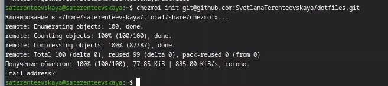{width="80%"}

------------------------------------------------------------------------

И проверила какие изменения внесет chezmoi в домашний каталог
([рис. 18](#fig-018){.quarto-xref}).

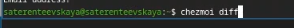{width="80%"}

------------------------------------------------------------------------

Запустила chezmoi apply -v, поскольку меня устраивают изменения
([рис. 19](#fig-019){.quarto-xref}).

{width="80%"}

## Использование chezmoi на нескольких машинах

На втором ноутбуке инициализировала chezmoi с моим репозиторием dotfiles
через ssh ([рис. 20](#fig-020){.quarto-xref}).

{width="80%"}

------------------------------------------------------------------------

Проверила, какие изменения внесёт chezmoi в домашний каталог
([рис. 21](#fig-021){.quarto-xref}).

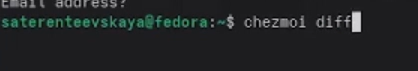{width="80%"}

------------------------------------------------------------------------

И запустила cheznoi apply -v, потому что меня устраивают изменения
([рис. 22](#fig-022){.quarto-xref}).

{width="80%"}

## Настройка новой машины с помощью одной команды

Также можно установить свои dotfiles на новый компьютер с помощью одной
команды:

chezmoi init --apply https://github.com/`<username>`{=html}/dotfiles.git

Через ssh:

chezmoi init --apply git@github.com:`<username>`{=html}/dotfiles.git

## Ежедневные операции с chezmoi

Я извлекла изменения из репозитория и применила их. Потом извлекла
изменения и посмотрела, что изменится, фактически не применяя изменения.
И т.к. я довольна изменениями, я применила их
([рис. 23](#fig-023){.quarto-xref}).

{width="80%"}

------------------------------------------------------------------------

Чтобы автоматически фиксировать и отправлять изменения в репозиторий, я
добавила в файл конфигурации \~/.config/chezmoi/chezmoi.toml следующее:
([рис. 24](#fig-024){.quarto-xref}).

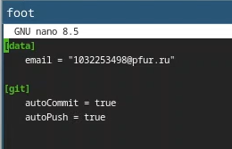{width="60%"}

------------------------------------------------------------------------

Перезагрузила виртуальную машину и посмотрела, что интерфейс изменился
([рис. 25](#fig-025){.quarto-xref}).

{width="80%"}

# Выводы

В процессе выполнения лабораторной работы я освоила использование
менеджера паролей pass для безопасного хранения учётных данных и систему
управления кофигурацинными файлами chezmoi для синхронизации настроек
рабочей среды.

# Список литературы

[ТУИС](https://esystem.rudn.ru/)

[Методичка к лабораторной работе
№5](https://esystem.rudn.ru/mod/page/view.php?id=1358189#org26b78c6)
