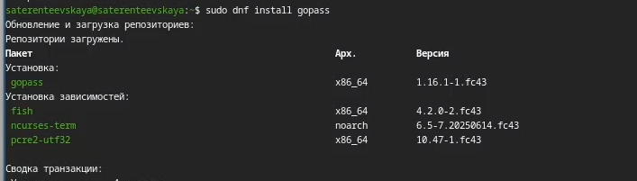
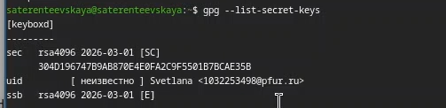
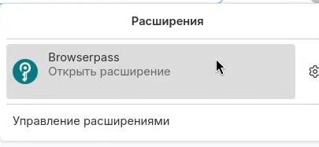
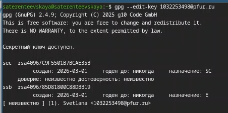
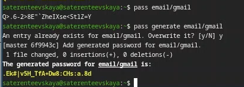
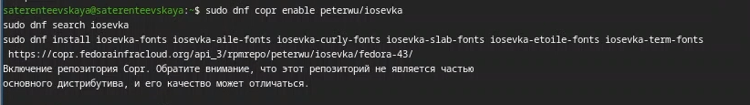
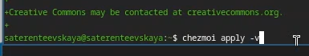
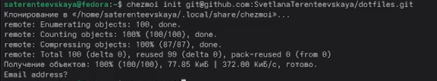
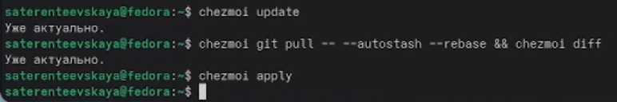
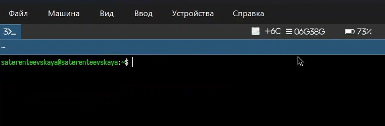

---
author:
- Терентеевская Светлана Александровна
authors:
- affiliation:
  - address: ул. Миклухо-Маклая, д. 6
    city: Москва
    country: Российская Федерация
    name: Российский университет дружбы народов
    postal-code: 117198
  degrees: Student
  email: 1032253498@rudn.ru
  name: Терентеевская Светлана Александровна
bibliography:
- bib/cite.bib
crossref:
  lof-title: Список иллюстраций
  lol-title: Листинги
  lot-title: Список таблиц
csl: \_resources/csl/gost-r-7-0-5-2008-numeric.csl
engines:
- path: /opt/quarto/share/extension-subtrees/julia-engine/\_extensions/julia-engine/julia-engine.js
lang: ru-RU
license:
  text: CC BY 4.0
  type: creative-commons
  url: "https://creativecommons.org/licenses/by/4.0/deed.ru-ru"
subtitle: "Дисциплина: Операционные системы"
title: Отчёт по лабораторной работе №5
toc-title: Содержание
---

- [[1]{.toc-section-number} Цель работы](#цель-работы){#toc-цель-работы}
- [[2]{.toc-section-number} Задание](#задание){#toc-задание}
- [[3]{.toc-section-number} Теоретическое
  введение](#теоретическое-введение){#toc-теоретическое-введение}
  - [[3.1]{.toc-section-number} Менеджер паролей
    pass](#менеджер-паролей-pass){#toc-менеджер-паролей-pass}
  - [[3.2]{.toc-section-number} Управление конфигурационными файлами с
    chezmoi](#управление-конфигурационными-файлами-с-chezmoi){#toc-управление-конфигурационными-файлами-с-chezmoi}
- [[4]{.toc-section-number} Выполнение лабораторной
  работе](#выполнение-лабораторной-работе){#toc-выполнение-лабораторной-работе}
  - [[4.1]{.toc-section-number} **Менеджер паролей
    pass**](#менеджер-паролей-pass-1){#toc-менеджер-паролей-pass-1}
  - [[4.2]{.toc-section-number} Установка](#установка){#toc-установка}
  - [[4.3]{.toc-section-number} Настройка](#настройка){#toc-настройка}
  - [[4.4]{.toc-section-number} Настройка интерфейса с
    браузером](#настройка-интерфейса-с-браузером){#toc-настройка-интерфейса-с-браузером}
  - [[4.5]{.toc-section-number} Сохранение
    пароля](#сохранение-пароля){#toc-сохранение-пароля}
  - [[4.6]{.toc-section-number} **Управление файлами
    конфигурации**](#управление-файлами-конфигурации){#toc-управление-файлами-конфигурации}
  - [[4.7]{.toc-section-number} **Дополнительное программное
    обеспечение**](#дополнительное-программное-обеспечение){#toc-дополнительное-программное-обеспечение}
  - [[4.8]{.toc-section-number}
    Установка](#установка-1){#toc-установка-1}
  - [[4.9]{.toc-section-number} Создание собственного репозитория с
    помощью
    утилит](#создание-собственного-репозитория-с-помощью-утилит){#toc-создание-собственного-репозитория-с-помощью-утилит}
  - [[4.10]{.toc-section-number} Подключение репозитория к своей
    системе](#подключение-репозитория-к-своей-системе){#toc-подключение-репозитория-к-своей-системе}
  - [[4.11]{.toc-section-number} Использование chezmoi на нескольких
    машинах](#использование-chezmoi-на-нескольких-машинах){#toc-использование-chezmoi-на-нескольких-машинах}
  - [[4.12]{.toc-section-number} Настройка новой машины с помощью одной
    команды](#настройка-новой-машины-с-помощью-одной-команды){#toc-настройка-новой-машины-с-помощью-одной-команды}
  - [[4.13]{.toc-section-number} Ежедневные операции с
    chezmoi](#ежедневные-операции-с-chezmoi){#toc-ежедневные-операции-с-chezmoi}
- [[5]{.toc-section-number} Выводы](#выводы){#toc-выводы}
- [[6]{.toc-section-number} Список
  литературы](#список-литературы){#toc-список-литературы}

# Цель работы {#цель-работы number="1"}

Освоить использование менеджера паролей pass для безопасного хранения
учётных данных и систему управления кофигурацинными файлами chezmoi для
синхронизации настроек рабочей среды.

# Задание {#задание number="2"}

- Установить и настроить менеджер паролей pass

- Установить и настроить chezmoi

- Выполнить настройку второй машины/компьютера с использованием
  созданного репозитория

# Теоретическое введение {#теоретическое-введение number="3"}

## Менеджер паролей pass {#менеджер-паролей-pass number="3.1"}

pass (The standard Unix password manager) --- менеджер паролей,
следующий философии Unix. Основные принципы работы:

- Хранение данных: пароли сохраняются в файловой системе в виде обычных
  файлов, организованных в каталоги.

- Безопасность: каждый файл шифруется с помощью GPG-ключа пользователя.

- Структура базы: может быть произвольной, но для совместимости с
  дополнительным ПО рекомендуется семантическая структура (например,
  example.com/user.gpg, user@example.com.gpg).

- Синхронизация: поддерживается работа с Git, что позволяет хранить базу
  паролей в удалённом репозитории и использовать её на нескольких
  устройствах.

## Управление конфигурационными файлами с chezmoi {#управление-конфигурационными-файлами-с-chezmoi number="3.2"}

chezmoi --- инструмент для управления dotfiles (конфигурационными
файлами) в домашнем каталоге пользователя.

Основные возможности:

- Хранение: состояние файлов сохраняется в \~/.local/share/chezmoi,
  который является клоном Git-репозитория.

- Шаблоны: поддержка шаблонов Go (синтаксис {{ .variable }}) для
  создания конфигураций, адаптируемых под разные машины.

- Переменные: доступ к данным окружения через chezmoi data (ОС, имя
  хоста, архитектура и др.).

- Условные выражения: возможность включать/исключать части конфигурации
  в зависимости от условий (if, eq, and, or).

- Безопасность: отделение общих конфигураций от чувствительных данных
  (пароли, токены) с помощью шаблонов и внешних хранилищ секретов.

- Работа с несколькими машинами: простая инициализация новой машины
  одной командой (chezmoi init --apply), автоматическая синхронизация
  изменений.

# Выполнение лабораторной работе {#выполнение-лабораторной-работе number="4"}

## **Менеджер паролей pass** {#менеджер-паролей-pass-1 number="4.1"}

## Установка {#установка number="4.2"}

Я установила pass ([рис. 1](#fig-001){.quarto-xref}).

{width="80%"}

А также gopass ([рис. 2](#fig-002){.quarto-xref}).

{width="80%"}

## Настройка {#настройка number="4.3"}

Посмотрела список ключей ([рис. 3](#fig-003){.quarto-xref}).

{width="80%"}

Инициализировала хранилище ([рис. 4](#fig-004){.quarto-xref}).

{width="80%"}

Создала структуру git и задала адрес репозитория на хостинге,
предварительно создав репозиторий ([рис. 5](#fig-005){.quarto-xref}).

{width="80%"}

Выполнила следующую команду для синхронизации
([рис. 6](#fig-006){.quarto-xref}).

{width="80%"}

## Настройка интерфейса с браузером {#настройка-интерфейса-с-браузером number="4.4"}

Я установила интерфейс для взаимодейтсвия с браузером
([рис. 7](#fig-007){.quarto-xref}).

{width="80%"}

Посмотрела, что расширение появилось ([рис. 8](#fig-008){.quarto-xref}).

{width="80%"}

## Сохранение пароля {#сохранение-пароля number="4.5"}

Я отредактировала ключ, изменив доверие с "неизвестно"
([рис. 9](#fig-009){.quarto-xref}).

{width="80%"}

На "абсолютно" ([рис. 10](#fig-010){.quarto-xref}).

{width="80%"}

Я добавила новый пароль ([рис. 11](#fig-011){.quarto-xref}).

{width="80%"}

Отобразила пароль для указанного имени файла и заменила существующий
пароль ([рис. 12](#fig-012){.quarto-xref})

{width="80%"}

## **Управление файлами конфигурации** {#управление-файлами-конфигурации number="4.6"}

## **Дополнительное программное обеспечение** {#дополнительное-программное-обеспечение number="4.7"}

Я установила дополнительное программное обеспечение
([рис. 13](#fig-013){.quarto-xref}).

{width="80%"}

Установила шрифты ([рис. 14](#fig-014){.quarto-xref}).

{width="80%"}

## Установка {#установка-1 number="4.8"}

С помощью wget скачивается необходимый файл
([рис. 15](#fig-015){.quarto-xref}).

{width="80%"}

## Создание собственного репозитория с помощью утилит {#создание-собственного-репозитория-с-помощью-утилит number="4.9"}

Я создала свой репозиторий для конфигурационных файлов на основе шаблона
([рис. 16](#fig-016){.quarto-xref}).

{width="80%"}

## Подключение репозитория к своей системе {#подключение-репозитория-к-своей-системе number="4.10"}

Далее инициализировала chezmoi с моим репозиторием dotfiles
([рис. 17](#fig-017){.quarto-xref}).

{width="80%"}

И проверила какие изменения внесет chezmoi в домашний каталог
([рис. 18](#fig-018){.quarto-xref}).

{width="80%"}

Запустила chezmoi apply -v, поскольку меня устраивают изменения
([рис. 19](#fig-019){.quarto-xref}).

{width="80%"}

## Использование chezmoi на нескольких машинах {#использование-chezmoi-на-нескольких-машинах number="4.11"}

На втором ноутбуке инициализировала chezmoi с моим репозиторием dotfiles
через ssh ([рис. 20](#fig-020){.quarto-xref}).

{width="80%"}

Проверила, какие изменения внесёт chezmoi в домашний каталог
([рис. 21](#fig-021){.quarto-xref}).

{width="80%"}

И запустила cheznoi apply -v, потому что меня устраивают изменения
([рис. 22](#fig-022){.quarto-xref}).

{width="80%"}

## Настройка новой машины с помощью одной команды {#настройка-новой-машины-с-помощью-одной-команды number="4.12"}

Также можно установить свои dotfiles на новый компьютер с помощью одной
команды:

chezmoi init --apply https://github.com/`<username>`{=html}/dotfiles.git

Через ssh:

chezmoi init --apply git@github.com:`<username>`{=html}/dotfiles.git

## Ежедневные операции с chezmoi {#ежедневные-операции-с-chezmoi number="4.13"}

Я извлекла изменения из репозитория и применила их. Потом извлекла
изменения и посмотрела, что изменится, фактически не применяя изменения.
И т.к. я довольна изменениями, я применила их
([рис. 23](#fig-023){.quarto-xref}).

{width="80%"}

Чтобы автоматически фиксировать и отправлять изменения в репозиторий, я
добавила в файл конфигурации \~/.config/chezmoi/chezmoi.toml следующее:
([рис. 24](#fig-024){.quarto-xref}).

{width="80%"}

Перезагрузила виртуальную машину и посмотрела, что интерфейс изменился
([рис. 25](#fig-025){.quarto-xref}).

{width="80%"}

# Выводы {#выводы number="5"}

Я освоила использование менеджера паролей зфыы для безопасного хранения
учётных данных и систему управления кофигурацинными файлами chezmoi для
синхронизации настроек рабочей среды.

# Список литературы {#список-литературы number="6"}

[ТУИС](https://esystem.rudn.ru/)

[Методичка к лабораторной работе
№5](https://esystem.rudn.ru/mod/page/view.php?id=1358189#org26b78c6)
