---
author:
- Терентеевская Светлана Александровна
authors:
- affiliation:
  - address: ул. Миклухо-Маклая, д. 6
    city: Москва
    country: Российская Федерация
    name: Российский университет дружбы народов
    postal-code: 117198
  degrees: Student
  email: 1032253498@rudn.ru
  name: Терентеевская Светлана Александровна
crossref:
  lof-title: Список иллюстраций
  lol-title: Листинги
  lot-title: Список таблиц
date: 2026-03-17
date-format: 2026-03-17
engines:
- path: /opt/quarto/share/extension-subtrees/julia-engine/\_extensions/julia-engine/julia-engine.js
lang: ru-RU
license:
  text: CC BY 4.0
  type: creative-commons
  url: "https://creativecommons.org/licenses/by/4.0/deed.ru-ru"
subtitle: Основы интерфейса взаимодействия пользователя с системой Unix
  на уровне командной строки
title: Отчёт по лабораторной работе №6
toc-title: Содержание
---

# Информация

## Докладчик

- Терентеевская Светлана Александровна
- Группа НКАбд-05-25, студент бакалавра
- Российский университет дружбы народов им. П. Лумумбы
- <1032253498@rudn.ru>
- <https://github.com/SvetlanaTerenteevskaya>

# Вводная часть

## Цель работы

Приобрести практические навыки взаимодействия пользователя с системой
посредством командной строки.

## Задание

- Исследовать содержимое каталога /tmp и домашнего каталога с помощью
  команды ls с различными опциями

- Создать и удалить каталоги

- Изучить команды с помощью man

## Теоретическое введение

**Командная строка**

В ОС Linux взаимодействие с системой осуществляется через командную
строку с помощью командных интерпретаторов shell (/bin/sh, /bin/csh,
/bin/ksh).

**Формат команды:**

`<имя_команды> <аргументы>`

**Основные команды:**

- `man <команда>` --- просмотр руководства (q --- выход, Space ---
  страница вперёд)

- `cd [путь]` --- переход в каталог (`cd ..` --- на уровень выше, `cd`
  --- домой)

- `pwd` --- показать текущий путь

- `ls [опции] [путь]` --- просмотр содержимого каталога

  - `-a` --- показать скрытые файлы
  - `-l` --- подробная информация (владелец, права, размер)
  - `-F` --- показать типы файлов (/ --- каталог, \* --- исполняемый)

------------------------------------------------------------------------

- `mkdir [опции] имя` --- создание каталога
  - `-p` --- создать родительские каталоги
  - `-v` --- подробный вывод
- `rmdir имя` --- удалить пустой каталог
- `rm [опции] файл` --- удалить файл/каталог
  - `-r` --- рекурсивно (для каталогов)
  - `-f` --- принудительно

------------------------------------------------------------------------

- `history` --- показать историю команд
  - `!<номер>` --- выполнить команду по номеру

# Выполнение лабораторной работы

1.  Я определила полное имя моего домашнего каталога
    ([рис. 1](#fig-001){.quarto-xref}).

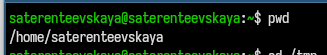{width="80%"}

------------------------------------------------------------------------

2.  Выполнила следующие действия:

    - 2.1. Перешла в каталог /tmp ([рис. 2](#fig-002){.quarto-xref}).

{width="70%"}

- 2.2 Вывела на экран содержимое каталога /tmp.
  ([рис. 3](#fig-003){.quarto-xref}, [рис. 4](#fig-004){.quarto-xref},
  [рис. 5](#fig-005){.quarto-xref}).

------------------------------------------------------------------------

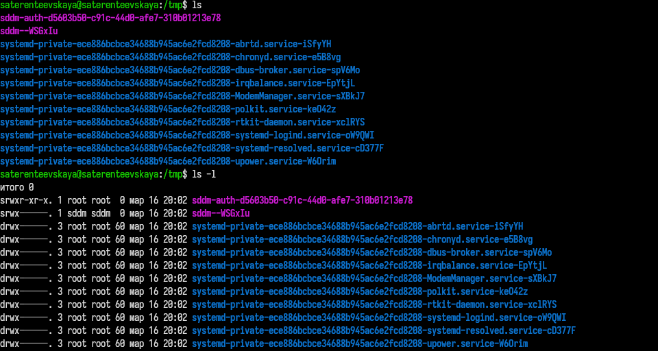{width="80%"}

------------------------------------------------------------------------

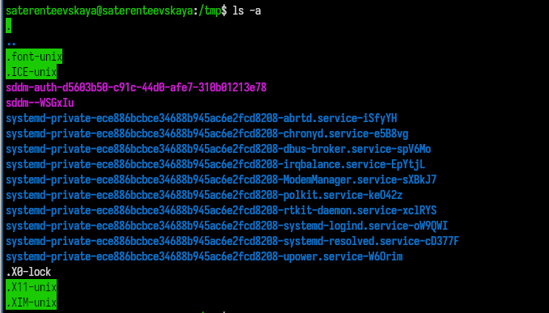{width="80%"}

------------------------------------------------------------------------

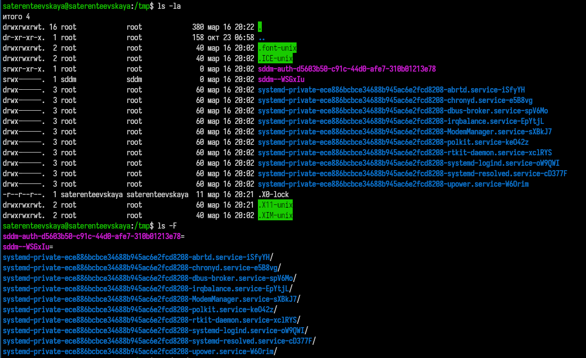{width="80%"}

------------------------------------------------------------------------

**ls**

Показывает:

- Только нескрытые файлы (без точки в начале)

- Только имена файлов

- нет текущего (.) и родительского (..) каталогов

**ls -l**

Показывает:

- Только нескрытые файлы (без точек в начале)

- Подробная информация (права доступа, владелец, группа, размер, дата)

- нет текущего (.) и родительского (..) каталогов

**ls -a**

Показывает:

- Все файлы (включая скрытые с точкой)

- Только имена файлов

- Есть текущий (.) и родительский (..) каталоги

------------------------------------------------------------------------

**ls -la**

Показывает:

- Все файлы

- Подробная информация (права доступа, владелец, группа, размер, дата)

- Есть текущий (.) и родительский (..) каталоги

**ls -F**

Показывает:

- Добавляет специальные символы к именам файлов, чтобы показать их тип
  (например / каталог)

- Нескрытые файлы

------------------------------------------------------------------------

- 2.3 Я проверила, что в каталоге /var/spool есть подкаталог с именем
  cron ([рис. 6](#fig-006){.quarto-xref}).

{width="60%"}

- 2.4 Перешла в мой домашний каталог и вывела его содержимое
  ([рис. 7](#fig-007){.quarto-xref}).

------------------------------------------------------------------------

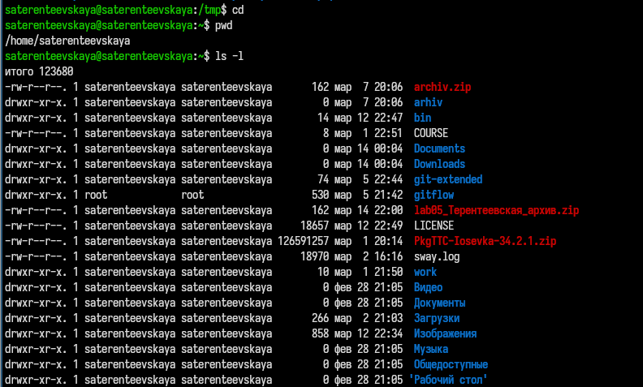{width="80%"}

------------------------------------------------------------------------

3.  Я выполнила следующие действия:

- 3.1 В домашнем каталоге создала новый каталог с именем newdir
  ([рис. 8](#fig-008){.quarto-xref}).

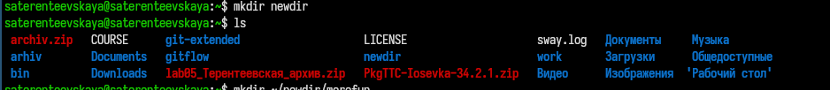{width="80%"}

- 3.2 В каталоге \~/newdir я создала новый каталог с именем morefun
  ([рис. 9](#fig-009){.quarto-xref}).

{width="80%"}

------------------------------------------------------------------------

- 3.3 В домашнем каталоге создала одной командной три новых каталога с
  именами letters, memos, misk ([рис. 10](#fig-010){.quarto-xref}).

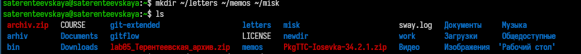{width="80%"}

Затем удалила их одной командой ([рис. 11](#fig-011){.quarto-xref}).

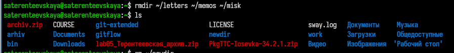{width="80%"}

------------------------------------------------------------------------

- 3.4 Я попробовала удалить ранее созданный каталог \~/newdir командой
  rm. Он не был удален
  ([рис. 12](#fig-012){.quarto-xref},[рис. 13](#fig-013){.quarto-xref}).

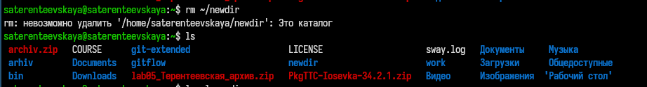{width="80%"}

{width="80%"}

------------------------------------------------------------------------

- 3.5 Я удалила каталог \~/newdir/morefun из домашнего каталога. Он был
  удален ([рис. 14](#fig-014){.quarto-xref}).

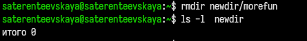{width="60%"}

------------------------------------------------------------------------

4.  С помощью команды man я определила, какую опцию команды ls нужно
    использовать для просмотра содержимогго не только указанного
    каталога, но и подкаталогов, входящих в него. Это опция -R
    ([рис. 15](#fig-015){.quarto-xref}).

{width="60%"}

------------------------------------------------------------------------

5.  С помощью команды man я определила набор опций команды ls,
    позволяющий отстортировать по времени последнего изменения выводимый
    список содержимого каталога с развернутым описанием файлов. Это
    опции -t и -l
    ([рис. 16](#fig-016){.quarto-xref},[рис. 17](#fig-017){.quarto-xref},[рис. 18](#fig-018){.quarto-xref}).

{width="80%"}

{width="80%"}

------------------------------------------------------------------------

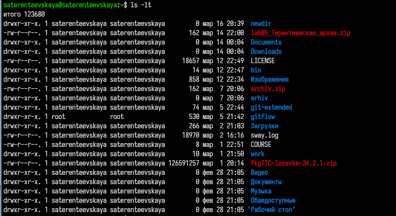{width="80%"}

------------------------------------------------------------------------

6.  Я использовала команду man для просмотра описания следующих команд:
    cd, pwd, mkdir, rmdir, rm (\[рис.
    [Рисунок 19](#fig-019){.quarto-xref}).

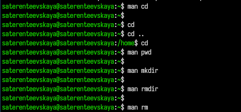{width="80%"}

------------------------------------------------------------------------

**Основные опции этих команд:**

**cd**

cd переход в домашний каталог

cd .. переход на уровень выше

cd - переход в предыдущий каталог

cd /путь переход по абсолютному пути

cd папка переход в подкаталог

**pwd**

pwd показать текущий каталог

pwd -P показать физический путь без символьных ссылок

pwd -L показать путь с учётом символьных ссылок

------------------------------------------------------------------------

**mkdir**

mkdir dir создать каталог

mkdir -p path/to/dir создать родительские каталоги

mkdir -v dir показать сообщение о создании

mkdir -m 755 dir установить права доступа

mkdir dir1 dir2 dir3 создать несколько каталогов

**rmdir**

rmdir dir удалить пустой каталог

rmdir -p path/to/dir удалить каталог и родительские

rmdir -v dir показать сообщение об удалении

------------------------------------------------------------------------

**rm**

rm file удалить файл

rm -r dir удалить каталог рекурсивно

rm -f file принудительно без подтверждения

rm -i file запрашивать подтверждение

rm -v file показать подробности удаления

rm -rf dir рекурсивно + принудительно

------------------------------------------------------------------------

7.  Используя информацию, полученную при помощи команды history, я
    выполнила модификацию и исполнение нескольких команд из буфера
    команд
    ([рис. 20](#fig-020){.quarto-xref},[рис. 21](#fig-021){.quarto-xref}).

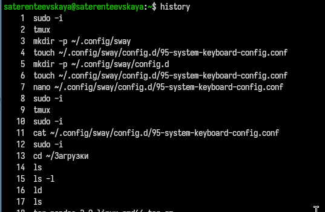{width="60%"}

------------------------------------------------------------------------

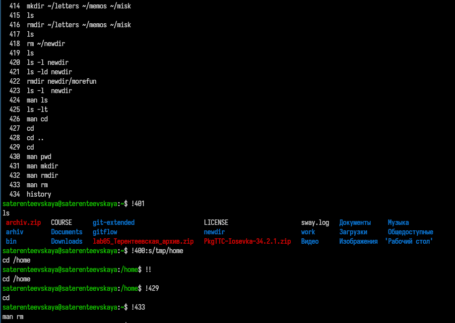{width="60%"}

# Выводы

В ходе выполнения лабораторной работы я приобрела практические навыки
взаимодействия пользователя с системой посредством командной строки.

# Список литературы

[ТУИС](https://esystem.rudn.ru/course)

[Методичка к лабораторной работе
№6](https://esystem.rudn.ru/mod/resource/view.php?id=1358191)
