---
## Author
author:
  name: Терентеевская Светлана Александровна
  degrees: Student 
  email: 1032253498@rudn.ru
  affiliation:
    - name: Российский университет дружбы народов
      country: Российская Федерация
      postal-code: 117198
      city: Москва
      address: ул. Миклухо-Маклая, д. 6

## Title
title: "Отчёт по лабораторной работе №7"
subtitle: "Дисциплина: Операционные системы"
license: "CC BY"
---

# Цель работы

Ознакомиться с файловой системой Linux, её структурой, командами для работы с файлами и каталогами. Получить практические навыки по применению команд для работы с файлами и каталогами, по управлению процессами, по проверке использования диска и обслуживанию файловой системы.

# Задание

* Ознакомиться с командами для работы с файлами и каталогами и выполнить их

* Выполнить действия по копированию и перемещению файлов

* Изучить права доступа к файлам и каталогам

* Установить заданные права 

# Теоретическое введение

## 1. Основные команды для работы с файлами

| Команда | Назначение |
|---------|-----------|
| `touch` | создание пустого файла |
| `cat` | просмотр содержимого файла |
| `less` | постраничный просмотр файла |
| `head` | просмотр первых строк файла |
| `tail` | просмотр последних строк файла |
| `cp` | копирование файлов и каталогов |
| `mv` | перемещение и переименование |
| `mkdir` | создание каталога |

## 2. Права доступа

Каждый файл и каталог имеет три типа прав для трёх категорий пользователей:

| Категория | Обозначение |
|-----------|-------------|
| владелец | `u` (user) |
| группа | `g` (group) |
| остальные | `o` (others) |

| Право | Для файла | Для каталога |
|-------|-----------|--------------|
| `r` (чтение) | просмотр содержимого | просмотр списка файлов |
| `w` (запись) | изменение и переименование | создание и удаление файлов |
| `x` (выполнение) | запуск программы | доступ в каталог |

Права могут быть заданы в символьном формате (`u+x`, `g-w`, `o=r`) или числовом (восьмеричном) формате, например `755` соответствует `rwxr-xr-x`.

## 3. Анализ файловой системы

Для работы с файловой системой используются следующие команды:

| Команда | Назначение |
|---------|-----------|
| `mount` | просмотр смонтированных файловых систем |
| `df` | информация об использовании дискового пространства |
| `fsck` | проверка целостности файловой системы |
| `mkfs` | создание файловой системы |

# Выполнение лабораторной работы

## Выполнение примеров 

Я выполнила все примеры, приведенные в первой части лабораторной работы.

 Я создала файл abc1 и скопировала его в файл april и в файл may. После чего создала каталог monthly и скопировала файлы april и may в него. А также скопировала файл monthly/may в файл с именем ([рис. @fig-001]).
 
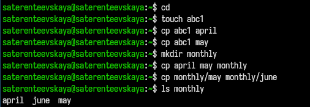{#fig-001 width=80%}

Я создала файл monthly.00 и скопировала в него каталог monthly. Скопировала каталог monthly.00 в каталог /tmp ([рис. @fig-002]).
 
 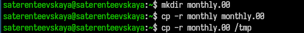{#fig-002 width=80%}
 
Я изменила название файла april на july, переместила его в каталог monthly.00. Далее переименовла monthly.00 в monthly.01 и переместила его в катлог reports. После чего переименовала каталог reports/monthly.01 в reports/monthly ([рис. @fig-003]).
 
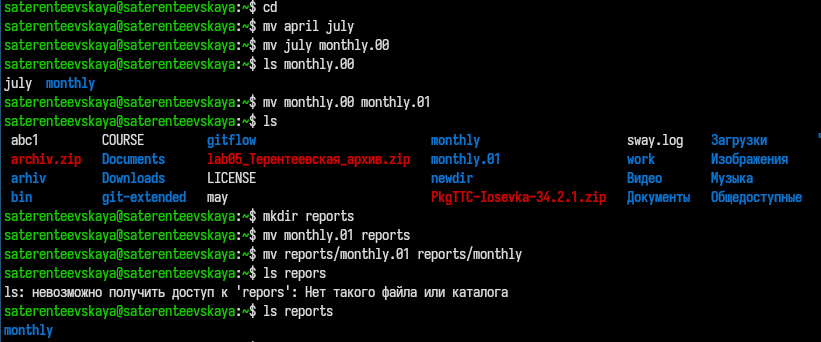{#fig-003 width=80%}
 
Я создала файл may с правом выполнения для владельца, лишила его прав на выполнения. Потом создала каталог monthly с запретом на чтение для членов группы и всех остальных пользователей, а также создала файл abc1 с правом  записи для членов группы ([рис. @fig-004]).
 
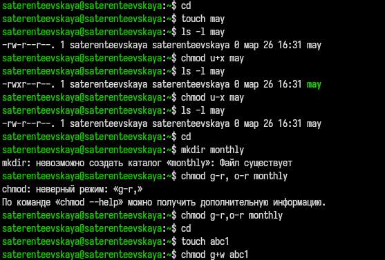{#fig-004 width=80%}
 
Я использовала команду mount для просмотра используемых файловых систем ([рис. @fig-005]).
 
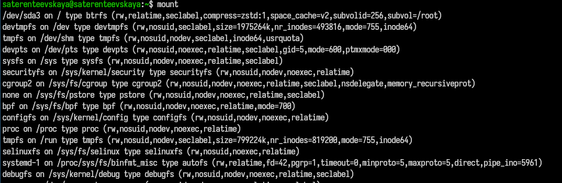{#fig-005 width=80%}
 
Для определения объема свободного пространства на файловой системе я воспользовалась командой df ([рис. @fig-006]).

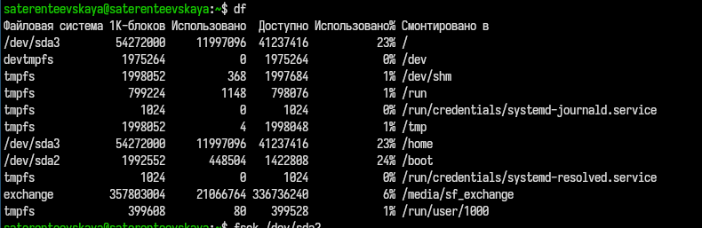{#fig-006 width=80%}
 
Проверила целостность файловой системы ([рис. @fig-007]).
 
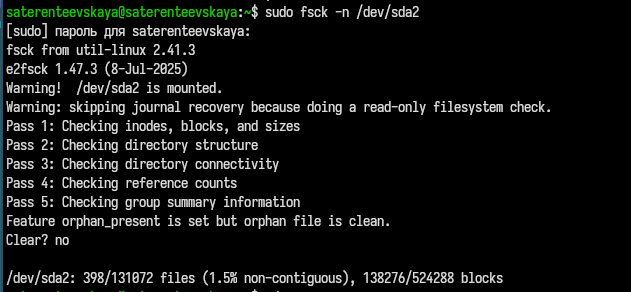{#fig-007 width=80%}
 
## Создание и перемещение файлов 
 
Я скопировала файл /usr/include/sys/io.h в домашний каталог и назовите его equipment. Проверила что он переместился ([рис. @fig-008]).
 
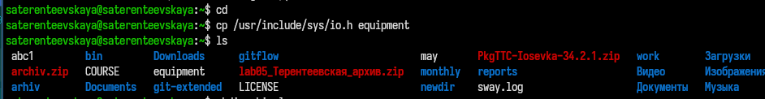{#fig-008 width=80%}
 
В домашнем каталоге создала директорию ~/ski.plases, переместила файл equipment в каталог ~/ski.plases и переименовала файл ~/ski.plases/equipment в ~/ski.plases/equiplist ([рис. @fig-009]).

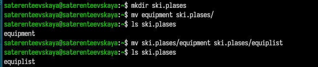{#fig-009 width=80%}

Я создала в домашнем каталоге файл abc1, скопировала его в каталог ~/ski.plases и назвала equiplist2. Потом создала каталог с именем equipment в каталоге ~/ski.plases и переместила файлы ~/ski.plases/equiplist и equiplist2 в каталог ~/ski.plases/equipment. Проверила командой ls ([рис. @fig-010]).

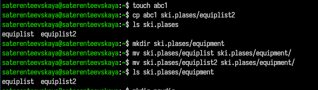{#fig-010 width=80%}

## 3. Работа с правами доступа 

Создала и переместила каталог ~/newdir в каталог ~/ski.plases и назвала его plans ([рис. @fig-011]).
 
 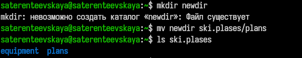{#fig-011 width=80%}
 
Далее я создала каталоги australia и play, а также файлы my_os и feathers и определила опции команды chmod, необходимые для того, чтобы присвоить им выделенные права доступа ([рис. @fig-012],[рис. @fig-013]).

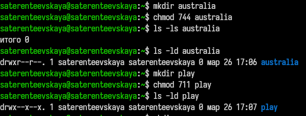{#fig-012 width=80%}

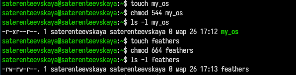{#fig-013 width=80%}

## Копирование файлов и смена прав доступа 

Я просмотрела содержимое файла /etc/passwd ([рис. @fig-014]).

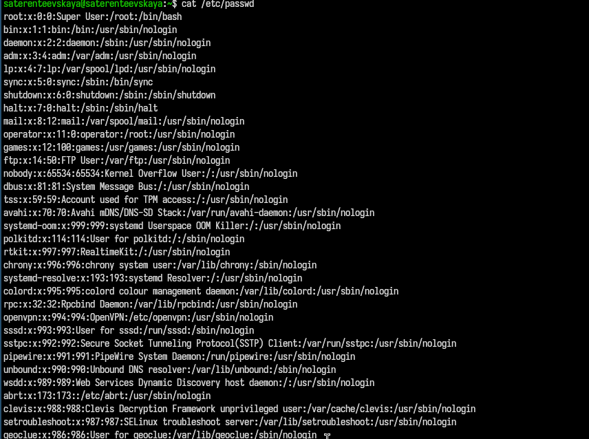{#fig-014 width=80%}

Я скопировала файл ~/feathers в файл ~/file.old и переместила файл ~/file.old в каталог ~/play ([рис. @fig-015]).
 
 {#fig-015 width=80%}
 
Я скопировала каталог ~/play в каталог ~/fun и переместила каталог ~/fun в каталог ~/play и назвала его games\ ([рис. @fig-016]).

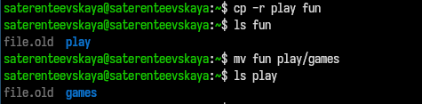{#fig-016 width=80%}

Я лишила владельца файла ~/feathers права на чтение. Я попыталась просмотреть файл ~/feathers командой
cat, но выдало: Отказано в доступе. Я попыталась скопировать файл ~/feathers, на что также отказано в доступе. После этого я дала владельцу файла ~/feathers право на чтение ([рис. @fig-017]).

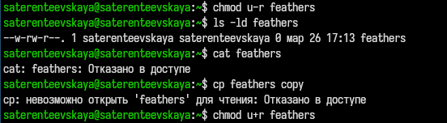{#fig-017 width=80%}

Я лишила владельца каталога ~/play права на выполнение. Попробовала перейти в каталог ~/play, мне было отказано в доступе. Я дала владельцу каталога ~/play право на выполнение ([рис. @fig-018]).

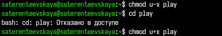{#fig-018 width=80%}

## Команда man и описание команд mount, fsck, mkfs, kill
 
Я прочитала man по команде mount ([рис. @fig-019]).

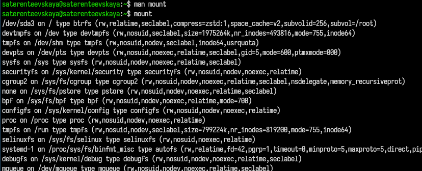{#fig-019 width=80%}

Подключает диск, флешку или раздел к системе, чтобы с ним можно было работать 

Я прочитала man по команде fsck ([рис. @fig-020]).

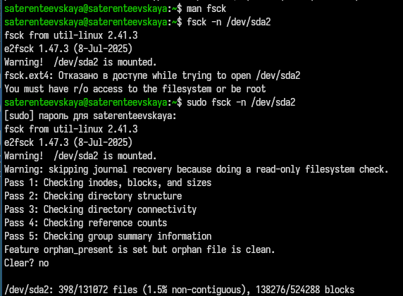{#fig-020 width=80%}

Проверяет диск на ошибки и исправляет их

Я прочитала man по команде mkfs ([рис. @fig-021]).

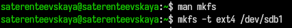{#fig-021 width=80%}

Создает файловую систему на диске (форматирует диск)

Я прочитала man по команде kill ([рис. @fig-022]).

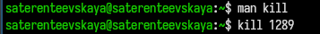{#fig-022 width=80%}

Завершает работающую программу (процесс) по ее номеру (PID)

# Выводы

В ходе выполнения рабораторной работы я ознакомилась с файловой системой Linux, её структурой, командами для работы с файлами и каталогами. Получила практические навыки по применению команд для работы с файлами и каталогами, по управлению процессами, по проверке использования диска и обслуживанию файловой системы.

# Список литературы

[ТУИС](esystem.rudn.ru)

[Методичка к лабораторной работе №7](https://esystem.rudn.ru/mod/resource/view.php?id=1358193php)
