---
author:
- Терентеевская Светлана Александровна
authors:
- affiliation:
  - address: ул. Миклухо-Маклая, д. 6
    city: Москва
    country: Российская Федерация
    name: Российский университет дружбы народов
    postal-code: 117198
  degrees: Student
  email: 1032253498@rudn.ru
  name: Терентеевская Светлана Александровна
crossref:
  lof-title: Список иллюстраций
  lol-title: Листинги
  lot-title: Список таблиц
date: 2026-03-29
date-format: 2026-03-29
engines:
- path: /opt/quarto/share/extension-subtrees/julia-engine/\_extensions/julia-engine/julia-engine.js
lang: ru-RU
license:
  text: CC BY 4.0
  type: creative-commons
  url: "https://creativecommons.org/licenses/by/4.0/deed.ru-ru"
subtitle: Поиск файлов. Перенаправление ввода-вывода. Просмотр
  запущенных процессов
title: Отчёт по лабораторной работе №8
toc-title: Содержание
---

# Информация

## Докладчик

- Терентеевская Светлана Александровна
- Группа НКАбд-05-25, студент бакалавра
- Российский университет дружбы народов им. П. Лумумбы
- <1032253498@rudn.ru>
- <https://github.com/SvetlanaTerenteevskaya>

# Вводная часть

## Цель работы

Ознакомиться с инструментами поиска файлов и фильтрации текстовых
данных. Приобрести практических навыков: по управлению процессами (и
заданиями), по проверке использования диска и обслуживанию файловых
систем

## Задание

- Выполнить перенаправление потоков ввода-вывода и фильтрацию текстовых
  данных.

- Осуществить поиск файлов, запуск процессов в фоновом режиме и
  управление ими.

- Изучить использование дискового пространства и получить справочную
  информацию о командах.

## Теоретическое введение

### Перенаправление ввода-вывода

- В Linux существует три стандартных потока:

- `stdin` (ввод, по умолчанию --- клавиатура), файловый дескриптор 0

- `stdout` (вывод, по умолчанию --- консоль), файловый дескриптор 1

- `stderr` (вывод ошибок, по умолчанию --- консоль), файловый дескриптор
  2

- Символ `>` перенаправляет `stdout` в файл (файл создаётся или
  перезаписывается)

- Символ `>>` перенаправляет `stdout` в файл в режиме добавления (данные
  дописываются в конец)

- Символы `2>` и `2>>` служат для перенаправления `stderr`

- Символ `&>` перенаправляет и `stdout`, и `stderr` в один файл

------------------------------------------------------------------------

### Конвейер (pipe)

- Конвейер (`|`) позволяет объединять несколько команд в цепочку

- Вывод предыдущей команды передаётся на ввод следующей

- Синтаксис: `команда1 | команда2`

------------------------------------------------------------------------

### Поиск файлов (команда `find`)

- Команда `find` ищет файлы и каталоги, соответствующие заданным
  критериям

- Формат: `find путь [опции]`

- Поиск ведётся в указанном каталоге и всех его подкаталогах

- Пример: `find ~ -name "f*" -print` --- найти все файлы, начинающиеся
  на "f", в домашнем каталоге

------------------------------------------------------------------------

### Фильтрация текста (команда `grep`)

- Команда `grep` ищет строки, содержащие заданный образец

- Формат: `grep строка имя_файла`- Может обрабатывать стандартный вывод
  других команд через конвейер

- Пример: `ls -l | grep lab`

------------------------------------------------------------------------

### Проверка использования диска (`df` и `du`)

- `df` --- показывает размер каждого смонтированного раздела диска

- `du` --- показывает количество килобайт, используемое каждым файлом
  или каталогом

- Пример: `df -h`, `du -sh ~`

------------------------------------------------------------------------

### Управление задачами и процессами

- Символ `&` в конце команды запускает процесс в **фоновом режиме**

- `jobs` --- выводит список запущенных в данный момент задач

- `kill %номер_задачи` --- завершает указанную задачу

- `ps aux` --- выводит информацию о процессах

- Каждому процессу присваивается уникальный идентификатор --- **PID**

------------------------------------------------------------------------

# Выполнение лабораторной работы

1.  Я осуществила вход в систему, используя соответствующее имя
    пользователя.

2.  Я записала в файл file.txt названия файлов, содержащихся в каталоге
    /etc ([рис. 1](#fig-001){.quarto-xref}).

{width="70%"}

Дописала в этот же файл названия файлов, содержащихся в моем домашнем
каталог ([рис. 2](#fig-002){.quarto-xref}).

{width="70%"}

------------------------------------------------------------------------

3.  Я вывела имена всех файлов из file.txt, имеющих расширение .conf
    ([рис. 3](#fig-003){.quarto-xref}).

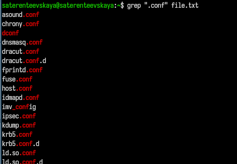{width="50%"}

------------------------------------------------------------------------

После чего записала их в новый текстовой файл conf.txt
([рис. 4](#fig-004){.quarto-xref}).

{width="70%"}

------------------------------------------------------------------------

4.  Я определила, какие файлы в моем домашнем каталоге имеют имена,
    начинавшиеся с символа c

- Через ls и grep ([рис. 5](#fig-005){.quarto-xref}).

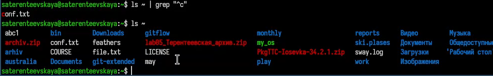{width="70%"}

------------------------------------------------------------------------

- Через find ([рис. 6](#fig-006){.quarto-xref}).

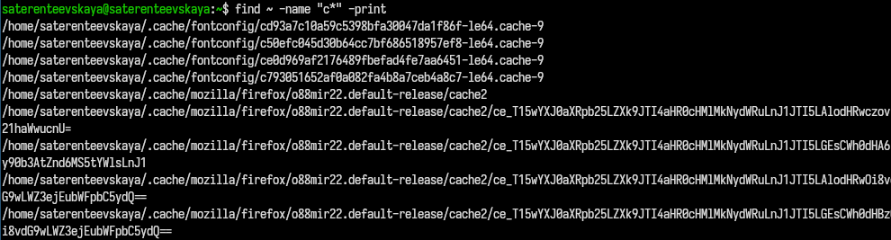{width="90%"}

------------------------------------------------------------------------

- Через ls ([рис. 7](#fig-007){.quarto-xref}).

{width="70%"}

------------------------------------------------------------------------

5.  Вывела на экран (по странично) имена файлов из каталога /etc,
    начинающиеся с символа h ([рис. 8](#fig-008){.quarto-xref}).

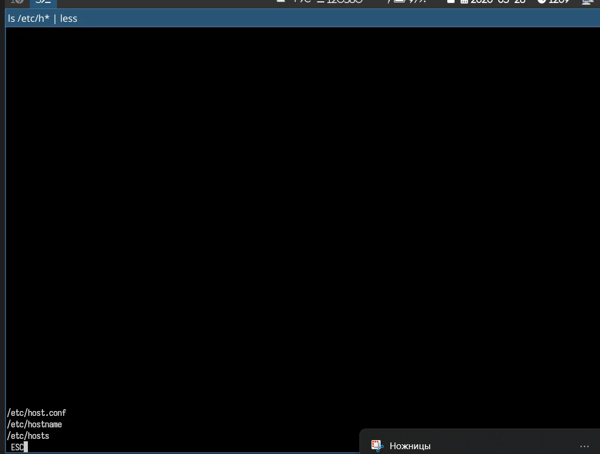{width="50%"}

------------------------------------------------------------------------

6-7. Я запустила в фоновом режиме процесс, который будет записывать в
файл \~/logfile файлы, имена которых начинаются с log. И удалила файл
\~/logfile ([рис. 9](#fig-009){.quarto-xref}).

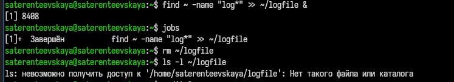{width="70%"}

------------------------------------------------------------------------

8-9. Я запустила из консоли в фоновом режиме редактор gedit и определила
идентификатор процесса gedit, используя команду ps, конвейер и фильтр
grep ([рис. 10](#fig-010){.quarto-xref}).

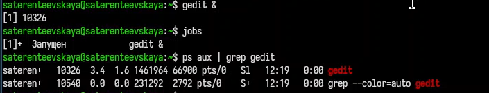{width="70%"}

------------------------------------------------------------------------

10. Я прочитала справку (man) команды kill, после чего использовала её
    для завершения процесса gedit ([рис. 11](#fig-011){.quarto-xref},
    [рис. 12](#fig-012){.quarto-xref}).

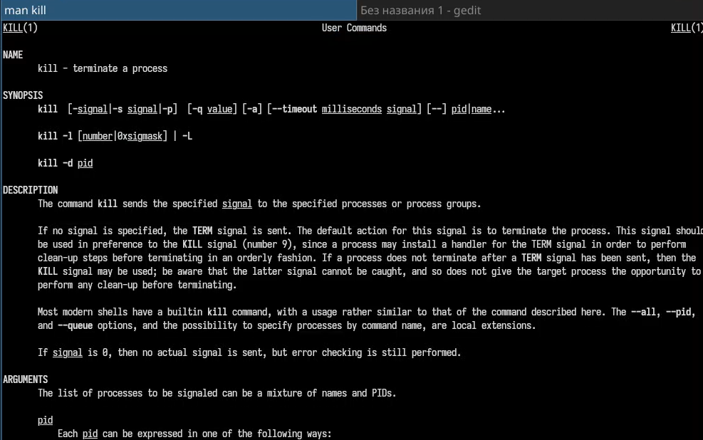{width="70%"}

------------------------------------------------------------------------

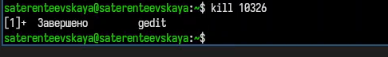{width="70%"}

------------------------------------------------------------------------

11. Я выполинила команды df и du, предварительно получив более подробную
    информацию об этих командах, с помощью команды man
    ([рис. 13](#fig-013){.quarto-xref},
    [рис. 14](#fig-014){.quarto-xref},
    [рис. 15](#fig-015){.quarto-xref},
    [рис. 16](#fig-016){.quarto-xref}).

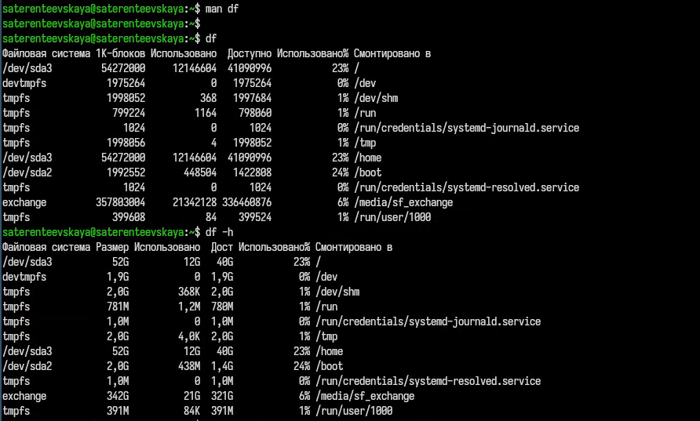{width="60%"}

------------------------------------------------------------------------

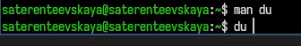{width="40%"}

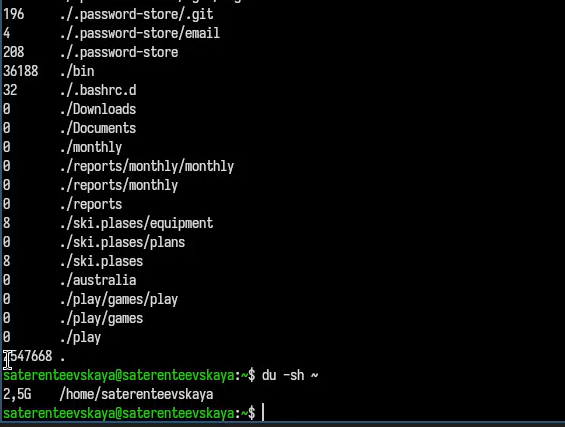{width="50%"}

------------------------------------------------------------------------

{width="70%"}

------------------------------------------------------------------------

12. Воспользовавшись справкой команды find, вывела имена всех
    директорий, имею- щихся в моем домашнем каталоге
    ([рис. 17](#fig-017){.quarto-xref},
    [рис. 18](#fig-018){.quarto-xref}).

{width="70%"}

------------------------------------------------------------------------

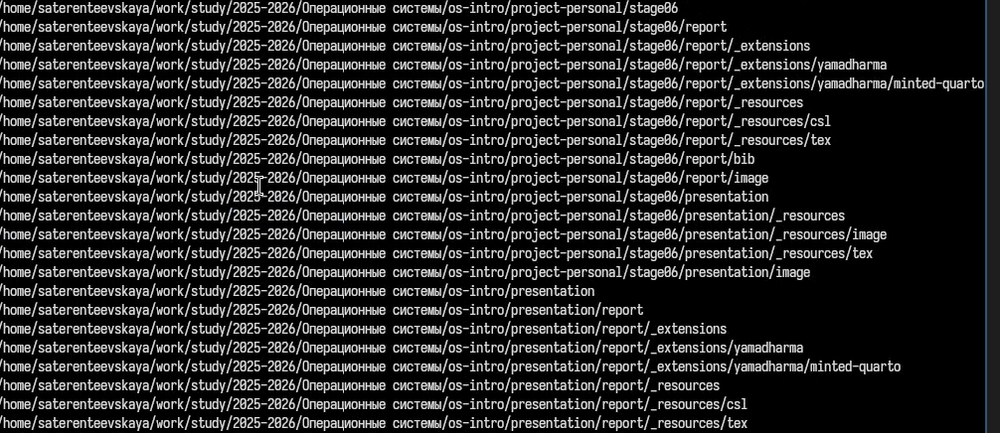{width="80%"}

# Выводы

В ходе выполнения лабораторной работы я ознакомилась с инструментами
поиска файлов и фильтрации текстовых данных, приобрела практических
навыков: по управлению процессами (и заданиями), по проверке
использования диска и обслуживанию файловых систем

# Список литературы

[ТУИС](https://esystem.rudn.ru)

[Методичка к лабораторной работе
№8](https://esystem.rudn.ru/pluginfile.php/3097020/mod_resource/content/4/006-lab_proc.pdf)
