---
author:
- Терентеевская Светлана Александровна
authors:
- affiliation:
  - address: ул. Миклухо-Маклая, д. 6
    city: Москва
    country: Российская Федерация
    name: Российский универсилат дружбы народов
    postal-code: 117198
  degrees: Student
  email: 1032253498@rudn.ru
  name: Терентеевская Светлана Александровна
bibliography:
- bib/cite.bib
crossref:
  lof-title: Список иллюстраций
  lol-title: Листинги
  lot-title: Список таблиц
csl: \_resources/csl/gost-r-7-0-5-2008-numeric.csl
engines:
- path: /opt/quarto/share/extension-subtrees/julia-engine/\_extensions/julia-engine/julia-engine.js
lang: ru-RU
license:
  text: CC BY 4.0
  type: creative-commons
  url: "https://creativecommons.org/licenses/by/4.0/deed.ru-ru"
subtitle: "Дисциплина: Операционные системы"
title: Отчёт по лабораторной работе №9
toc-title: Содержание
---

- [[1]{.toc-section-number} Цель работы](#цель-работы){#toc-цель-работы}
- [[2]{.toc-section-number} Задание](#задание){#toc-задание}
- [[3]{.toc-section-number} Теоретическое
  введение](#теоретическое-введение){#toc-теоретическое-введение}
  - [[3.1]{.toc-section-number} Midnight Commander
    (mc)](#midnight-commander-mc){#toc-midnight-commander-mc}
  - [[3.2]{.toc-section-number} Основные возможности Midnight Commander
    (mc)](#основные-возможности-midnight-commander-mc){#toc-основные-возможности-midnight-commander-mc}
  - [[3.3]{.toc-section-number} Управление
    панелями](#управление-панелями){#toc-управление-панелями}
  - [[3.4]{.toc-section-number} Меню (вызов ---
    `F9`)](#меню-вызов-f9){#toc-меню-вызов-f9}
  - [[3.5]{.toc-section-number} Встроенный редактор (вызов ---
    `F4`)](#встроенный-редактор-вызов-f4){#toc-встроенный-редактор-вызов-f4}
- [[4]{.toc-section-number} Выполнение лабораторной
  работы](#выполнение-лабораторной-работы){#toc-выполнение-лабораторной-работы}
  - [[4.1]{.toc-section-number} Задание по
    mc](#задание-по-mc){#toc-задание-по-mc}
  - [[4.2]{.toc-section-number} Задание по встроенному редактору
    mc](#задание-по-встроенному-редактору-mc){#toc-задание-по-встроенному-редактору-mc}
- [[5]{.toc-section-number} Выводы](#выводы){#toc-выводы}
- [[6]{.toc-section-number} Список
  литературы](#список-литературы){#toc-список-литературы}

# Цель работы {#цель-работы number="1"}

Освоить основные возможностей командной оболочки Midnight Commander.
Приобрести навыки практической работы по просмотру каталогов и файлов;
манипуляций с ними.

# Задание {#задание number="2"}

- Освоить интерфейс и базовые операции Midnight Commander.

- Научиться использовать основные меню mc.

- Овладеть встроенным редактором mc.

# Теоретическое введение {#теоретическое-введение number="3"}

## Midnight Commander (mc) {#midnight-commander-mc number="3.1"}

Псевдографическая файловая оболочка для Linux/Unix. Запуск:

mc

## Основные возможности Midnight Commander (mc) {#основные-возможности-midnight-commander-mc number="3.2"}

  Действие               Клавиши
  ---------------------- ---------
  Просмотр файла         `F3`
  Редактирование файла   `F4`
  Копирование            `F5`
  Перемещение            `F6`
  Создание каталога      `F7`
  Удаление               `F8`
  Выход из mc            `F10`

## Управление панелями {#управление-панелями number="3.3"}

  Действие                        Клавиши
  ------------------------------- -------------------------------------
  Переставить панели местами      `Ctrl + u`
  Временно отключить панели       `Ctrl + o`
  Сравнить содержимое каталогов   `Ctrl + x` → `d`
  Режим                           Назначение
  -------                         ------------
  Стандартный                     Список файлов каталога
  Информация                      Сведения о файле и файловой системе
  Дерево                          Древовидная структура каталогов

## Меню (вызов --- `F9`) {#меню-вызов-f9 number="3.4"}

  Меню            Назначение
  --------------- -----------------------------------------
  Левая панель    Настройка левой панели
  Правая панель   Настройка правой панели
  Файл            Операции с файлами
  Команда         Поиск, история команд, быстрые переходы
  Настройки       Внешний вид и поведение mc

## Встроенный редактор (вызов --- `F4`) {#встроенный-редактор-вызов-f4 number="3.5"}

  Действие               Описание
  ---------------------- -----------------------------------------
  Подсветка синтаксиса   Включение/отключение через меню редакто

# Выполнение лабораторной работы {#выполнение-лабораторной-работы number="4"}

## Задание по mc {#задание-по-mc number="4.1"}

1-2. Я изучила информацию о mc, вызвав в командной строке man mc и
запустила из командной строки mc, изучила его структуру и меню
([рис. 1](#fig-001){.quarto-xref}).

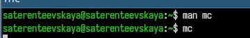{width="70%"}

3.  Выполнила несколько операций в mc, используя управляющие клавиши
    (операции с панелями; выделение/отмена выделения файлов,
    копирование/перемещение файлов, получение информации о размере и
    правах доступа на файлы и/или каталоги и т.п.)
    ([рис. 2](#fig-002){.quarto-xref}, [рис. 3](#fig-003){.quarto-xref},
    [рис. 4](#fig-004){.quarto-xref})

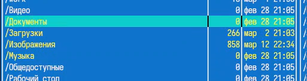{width="70%"}

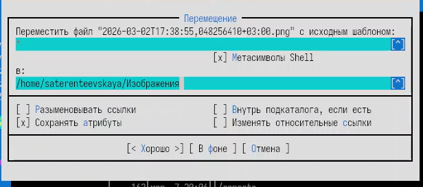{width="70%"}

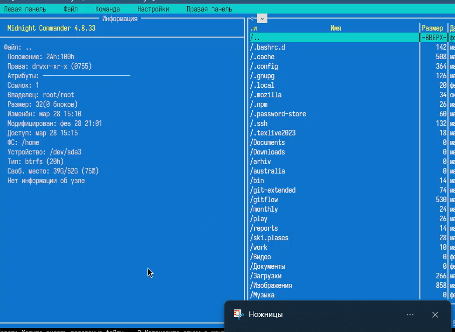{width="70%"}

4.  Выполнила основные команды меню левой (или правой) панели. Оценила
    степень подробности вывода информации о файлах
    ([рис. 5](#fig-005){.quarto-xref}, [рис. 6](#fig-006){.quarto-xref},
    [рис. 7](#fig-007){.quarto-xref}, [рис. 8](#fig-008){.quarto-xref},
    [рис. 9](#fig-009){.quarto-xref}).

{width="70%"}

{width="70%"}

{width="70%"}

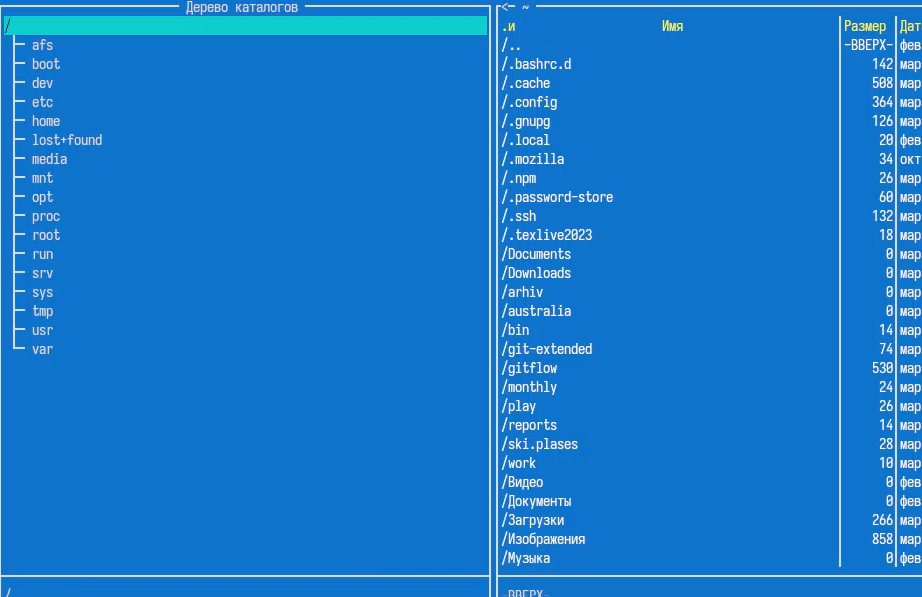{width="70%"}

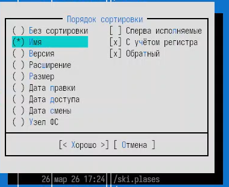{width="70%"}

5.  Используя возможности подменю Файл , я выполнила:

-- просмотр содержимого текстового файла
([рис. 10](#fig-010){.quarto-xref});

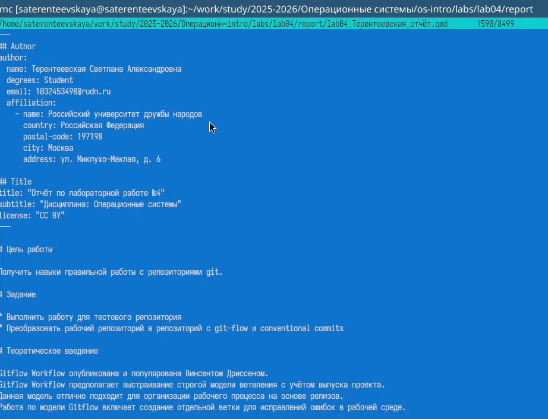{width="70%"}

-- редактирование содержимого текстового файла (без сохранения
результатов редактирования) ([рис. 11](#fig-011){.quarto-xref});

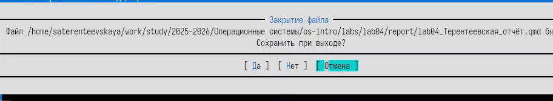{width="70%"}

-- создание каталога ([рис. 12](#fig-012){.quarto-xref});

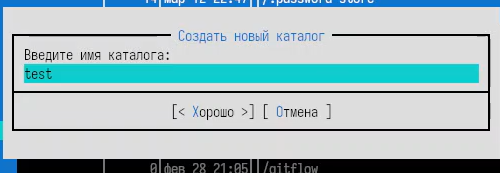{width="70%"}

-- копирование в файлов в созданный каталог
([рис. 13](#fig-013){.quarto-xref}).

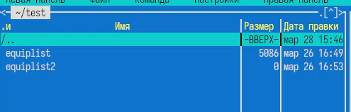{width="70%"}

6.  С помощью соответствующих средств подменю Команда осуществила:

-- поиск в файловой системе файла с заданными условиями (файл с
расширением qmd и содержимым author)
([рис. 14](#fig-014){.quarto-xref});

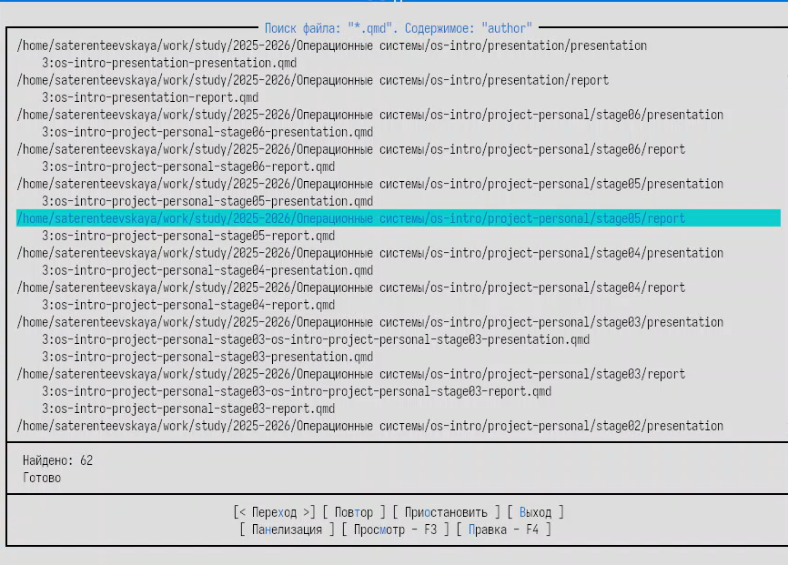{width="70%"}

-- выбор и повторение одной из предыдущих команд
([рис. 15](#fig-015){.quarto-xref});

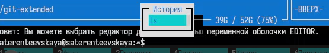{width="70%"}

-- переход в домашний каталог ([рис. 16](#fig-016){.quarto-xref});

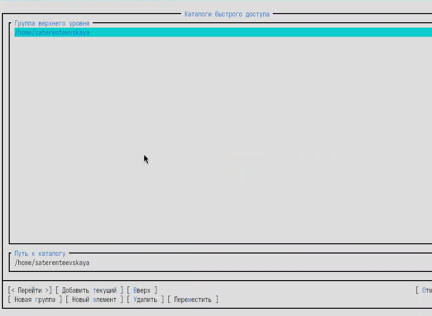{width="70%"}

-- анализ файла меню и файла расширений
([рис. 17](#fig-017){.quarto-xref}, [рис. 18](#fig-018){.quarto-xref}).

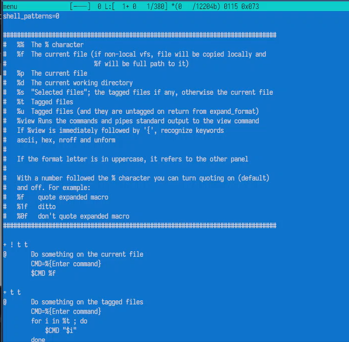{width="70%"}

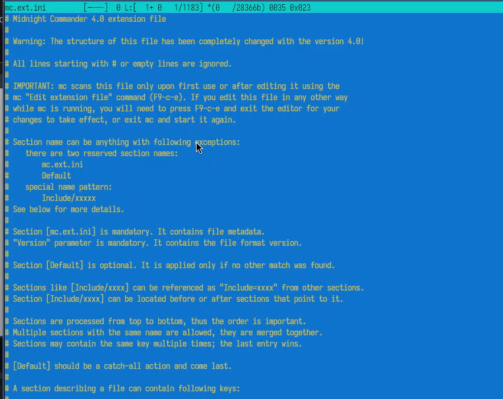{width="70%"}

7.  Вызвала подменю Настройки . Освоила операции, определяющие структуру
    экрана mc ([рис. 19](#fig-019){.quarto-xref},
    [рис. 20](#fig-020){.quarto-xref}).

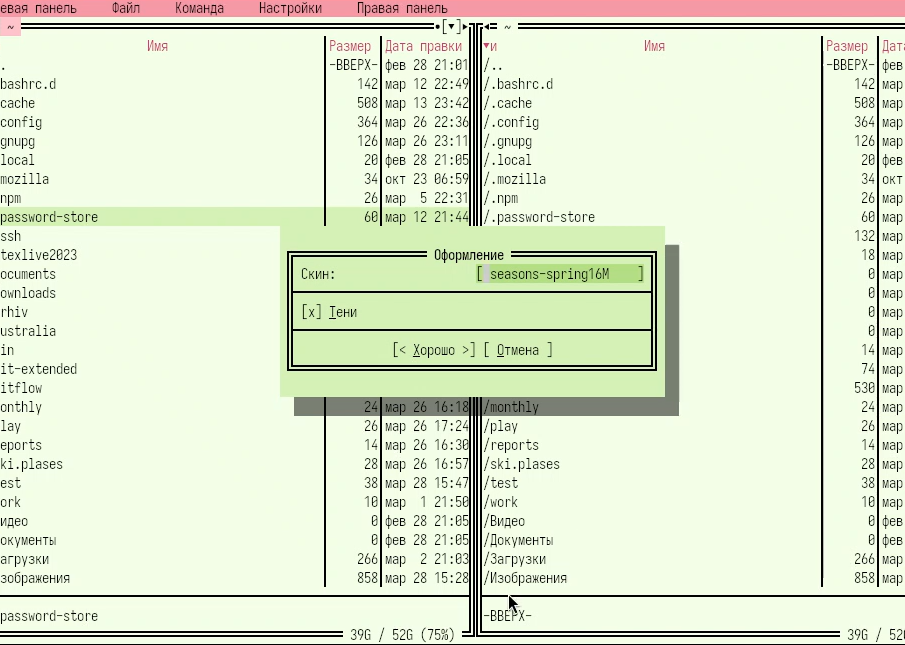{width="70%"}

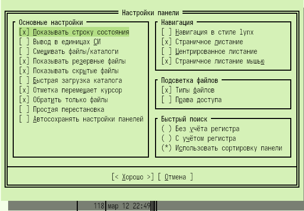{width="70%"}

## Задание по встроенному редактору mc {#задание-по-встроенному-редактору-mc number="4.2"}

1-3. Я создала текстовой файл text.txt, открыла этот файл с помощью
встроенного в mc редактора и вставила в открытый файл небольшой фрагмент
текста, скопированный из другого файла
([рис. 21](#fig-021){.quarto-xref}).

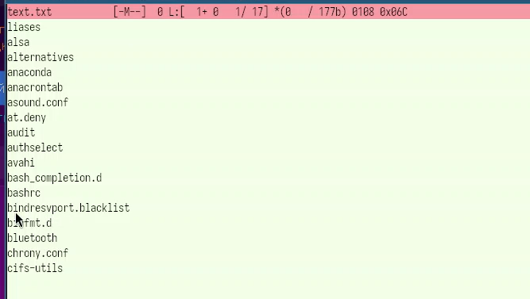{width="70%"}

4.  Проделала с текстом следующие манипуляции, используя горячие
    клавиши:

4.1. Удалила строки текста ([рис. 22](#fig-022){.quarto-xref}).

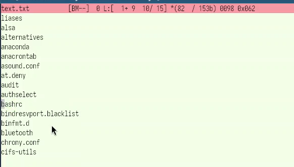{width="70%"}

4.2. Выделила фрагмент текста и скопировала его на новую строку
([рис. 23](#fig-023){.quarto-xref}).

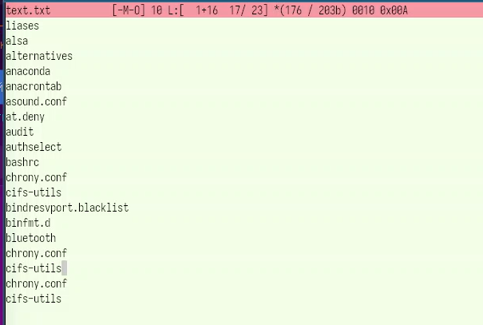{width="70%"}

4.3. Выделила фрагмент текста и перенесила его на новую строку
([рис. 24](#fig-024){.quarto-xref}).

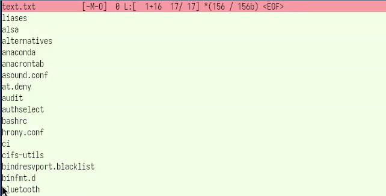{width="70%"}

4.4. Сохранила файл ([рис. 25](#fig-025){.quarto-xref}).

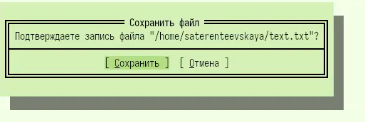{width="70%"}

4.5-4.6. Отменила последнее действие и перейшла в конец файла (нажав
комбинацию клавиш), написала некоторый текста, перешла в начало файла
(нажав комбинацию клавиш) и написала некоторый текст
([рис. 26](#fig-026){.quarto-xref}).

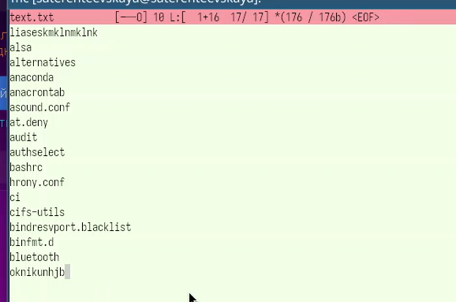{width="70%"}

4.8. Сохранила и закрыла файл ([рис. 27](#fig-027){.quarto-xref}).

{width="70%"}

5.  Открыла файл с исходным текстом на некотором языке программирования
    (С) ([рис. 28](#fig-028){.quarto-xref}).

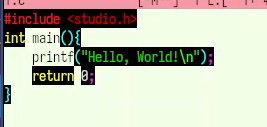{width="70%"}

6.  Используя меню редактора, выключила подсветку синтаксиса и включила
    обратно ([рис. 29](#fig-029){.quarto-xref},
    ([рис. 30](#fig-030){.quarto-xref})

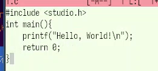{width="70%"}

{width="70%"}

# Выводы {#выводы number="5"}

В ходе выполнения лабораторной работы я освоила основные возможности
командной оболочки Midnight Commander. Приобрела навыки практической
работы по просмотру каталогов и файлов; манипуляций с ними.

# Список литературы {#список-литературы number="6"}

[Методичка к лабораторной работе
№9](https://esystem.rudn.ru/pluginfile.php/3097022/mod_resource/content/5/007-lab_mc.pdf)

[ТУИС](https://esystem.rudn.ru)
