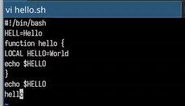
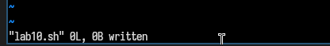
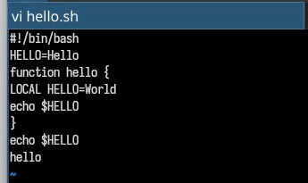
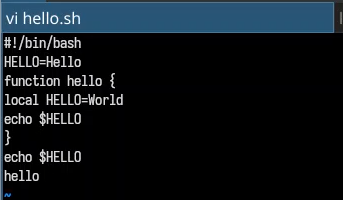
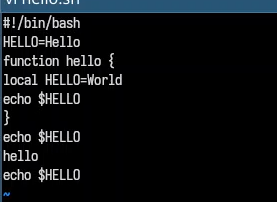
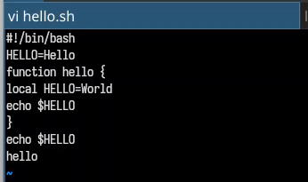
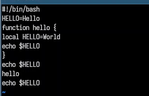
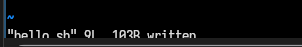

---
author:
- Терентеевская Светлана Александровна
authors:
- affiliation:
  - address: ул. Миклухо-Маклая, д. 6
    city: Москва
    country: Российская Федерация
    name: Российский университет дружбы народов
    postal-code: 117198
  degrees: Student
  email: 1032253498@rudn.ru
  name: Терентеевская Светлана Александровна
bibliography:
- bib/cite.bib
crossref:
  lof-title: Список иллюстраций
  lol-title: Листинги
  lot-title: Список таблиц
csl: \_resources/csl/gost-r-7-0-5-2008-numeric.csl
engines:
- path: /opt/quarto/share/extension-subtrees/julia-engine/\_extensions/julia-engine/julia-engine.js
lang: ru-RU
license:
  text: CC BY 4.0
  type: creative-commons
  url: "https://creativecommons.org/licenses/by/4.0/deed.ru-ru"
subtitle: "Дисциплина: Операционные системы"
title: Отчёт по лабораторной работе №10
toc-title: Содержание
---

- [[1]{.toc-section-number} Цель работы](#цель-работы){#toc-цель-работы}
- [[2]{.toc-section-number} Задание](#задание){#toc-задание}
- [[3]{.toc-section-number} Теоретическое
  введение](#теоретическое-введение){#toc-теоретическое-введение}
  - [[3.1]{.toc-section-number} Редактор
    vi](#редактор-vi){#toc-редактор-vi}
  - [[3.2]{.toc-section-number} Режимы работы
    vi](#режимы-работы-vi){#toc-режимы-работы-vi}
  - [[3.3]{.toc-section-number} Основные
    команды](#основные-команды){#toc-основные-команды}
  - [[3.4]{.toc-section-number} Вызов
    редактора](#вызов-редактора){#toc-вызов-редактора}
- [[4]{.toc-section-number} Выполнение лабораторной
  работы](#выполнение-лабораторной-работы){#toc-выполнение-лабораторной-работы}
  - [[4.1]{.toc-section-number} Задание 1. Создание нового файла с
    использованием
    vi](#задание-1.-создание-нового-файла-с-использованием-vi){#toc-задание-1.-создание-нового-файла-с-использованием-vi}
  - [[4.2]{.toc-section-number} Задание 2. Редактирование существующего
    файла](#задание-2.-редактирование-существующего-файла){#toc-задание-2.-редактирование-существующего-файла}
- [[5]{.toc-section-number} Выводы](#выводы){#toc-выводы}
- [[6]{.toc-section-number} Список
  лиларатуры](#список-лиларатуры){#toc-список-лиларатуры}

# Цель работы {#цель-работы number="1"}

Познакомиться с операционной системой Linux. Получить практические
навыки работы с редактором vi, установленным по умолчанию практически во
всех дистрибутивах.

# Задание {#задание number="2"}

- Создать файл, используя редактор vi

- Выполнить редактирование файла: исправить содержимое, удалить
  фрагменты, добавить новую строку

# Теоретическое введение {#теоретическое-введение number="3"}

## Редактор vi {#редактор-vi number="3.1"}

**vi** (Visual display editor) --- интерактивный экранный текстовый
редактор, установленный по умолчанию практически во всех дистрибутивах
Linux. Он работает в режиме командной строки и не требует графического
интерфейса.

## Режимы работы vi {#режимы-работы-vi number="3.2"}

Редактор vi имеет три режима работы:

  -----------------------------------------------------------------------
  Режим                      Назначение
  -------------------------- --------------------------------------------
  **Командный режим**        Ввод команд редактирования и навигации по
                             файлу. Переход --- клавиша `Esc`

  **Режим вставки**          Ввод и редактирование текста. Переход ---
                             клавиши `i`, `a`, `o` и др.

  **Режим последней строки** Сохранение изменений, выход из редактора,
                             настройка опций. Переход --- `:` (двоеточие)
  -----------------------------------------------------------------------

## Основные команды {#основные-команды number="3.3"}

**Навигация:**

- Перемещение курсора: `h` (влево), `l` (вправо), `k` (вверх), `j`
  (вниз)

- По словам: `w` (вперёд), `b` (назад)

- По строкам: `0` (начало строки), `$` (конец строки)- По файлу: `G`
  (конец файла), `1G` (начало файла)

**Редактирование:**

- Вставка текста: `i` (перед курсором), `a` (после курсора), `o` (новая
  строка снизу)

- Удаление: `x` (символ), `dw` (слово), `dd` (строка), `ndd` (n строк)

- Отмена: `u`

**Сохранение и выход:**

- `:wq` --- сохранить и выйти

- `:q!` --- выйти без сохранения

## Вызов редактора {#вызов-редактора number="3.4"}

vi `<имя_файла>`{=html}

# Выполнение лабораторной работы {#выполнение-лабораторной-работы number="4"}

1-3. Я ознакомилась с теоретическим материалом, с редактором vi и
выполнила упражнения, используя команды vi.

## Задание 1. Создание нового файла с использованием vi {#задание-1.-создание-нового-файла-с-использованием-vi number="4.1"}

1-3. Я перешла в уже созданный каталог lab10, вызвала vi и создала файл
hello.sh ([рис. 1](#fig-001){.quarto-xref}).

{width="80%"}

4-5. Нажала клавишу i и ввела текст из методички. Нажала клавишу Esc для
перехода в командный режим после завершения ввода текста
([рис. 2](#fig-002){.quarto-xref}).

{width="70%"}

6-7. Нажала : для перехода в режим последней строки и внизу моего экрана
появилось приглашение в виде двоеточия. Нажала w (записать) и q (выйти),
а затем нажала клавишу Enter для сохранения моего текста и завершения
работы ([рис. 3](#fig-003){.quarto-xref}).

{width="60%"}

8.  Сделала файл исполняемым ([рис. 4](#fig-004){.quarto-xref}).

{width="70%"}

## Задание 2. Редактирование существующего файла {#задание-2.-редактирование-существующего-файла number="4.2"}

1.  Вызвала vi на редактирование файла
    ([рис. 5](#fig-005){.quarto-xref}).

{width="70%"}

2.  Установила курсор в конец слова HELL второй строки, перешла в режим
    вставки и заменила на HELLO. Нажала Esc для возврата в командный
    режим ([рис. 6](#fig-006){.quarto-xref}).

{width="70%"}

4-5. Установила курсор на четвертую строку и стерла слово LOCAL, перешла
в режим вставки и набрала следующий текст: local, нажала Esc для
возврата в командный режим ([рис. 7](#fig-007){.quarto-xref}).

{width="70%"}

6.  Установила курсор на последней строке файла. Вставила после неё
    строку, содержащую следующий текст: echo \$HELLO
    ([рис. 8](#fig-008){.quarto-xref}).

{width="70%"}

7-8. Нажала Esc для перехода в командный режим и удалила последнюю
строку ([рис. 9](#fig-009){.quarto-xref}).

{width="70%"}

9.  Ввела команду отмены изменений u для отмены последней команды
    ([рис. 10](#fig-010){.quarto-xref}).

{width="70%"}

10. Ввела символ : для перехода в режим последней строки. Записала
    произведённые изменения и вышла из vi
    ([рис. 11](#fig-011){.quarto-xref}).

{width="70%"}

# Выводы {#выводы number="5"}

В ходе данной лабораторной работы я познакомилась с операционной
системой Linux. Получила практические навыки работы с редактором vi,
установленным по умолчанию практически во всех дистрибутивах.

# Список лиларатуры {#список-лиларатуры number="6"}

[ТУИС](https://esystem.rudn.ru)

[Методичка к лабораторной работе
№10](https://esystem.rudn.ru/pluginfile.php/3097024/mod_resource/content/4/008-lab_vi.pdf)
