---
## Author
author:
  name: Терентеевская Светлана Александровна
  degrees: Student
  email: 1032253498@rudn.ru
  affiliation:
    - name: Российский университет дружбы народов
      country: Российская Федерация
      postal-code: 117198
      city: Москва
      address: ул. Миклухо-Маклая, д. 6

## Title
title: "Отчёт по лабораторной работе №11"
subtitle: "Дисциплина: Операционные системы"
license: "CC BY"
---

# Цель работы

Познакомиться с операционной системой Linux. Получить практические навыки работы с редактором Emacs.

# Задание

* Освоить  основные приёмы работы с редактором Emacs.

* Научиться работать  с несколькими буферами и окнами одновременно.

* Отработать  поиск и замену текста.

# Теоретическое введение

## 1. Назначение редактора Emacs

Emacs — это мощный экранный текстовый редактор, написанный на языке Elisp. Он поддерживает расширения и может использоваться не только для редактирования текста, но и для компиляции программ, работы с файлами, электронной почтой и т.д.

## 2. Основные понятия

- **Буфер** — объект, содержащий текст (файл, результаты компиляции, справку и т.п.).

- **Фрейм** — графическое окно Emacs (в обычном понимании ОС).

- **Окно** — прямоугольная область внутри фрейма, отображающая содержимое буфера.

- **Область вывода** — нижняя часть фрейма для сообщений и запросов.

- **Минибуфер** — часть области вывода, предназначенная для ввода информации.

- **Точка вставки** — текущая позиция курсора в буфере.

- **Режим** — набор расширений, изменяющих поведение редактора для определённого типа текста (например, режим C, Lisp, Text).

## 3. Префиксные комбинации клавиш

- `C-x` — префикс основных команд редактора (работа с файлами, окнами, буферами).

- `C-c` — префикс команд, зависящих от текущего режима.

- `C-h` — префикс вызова справки.- `M-x` — выполнение команды по имени.

## 4. Способы работы

Emacs позволяет выполнять команды двумя способами:

- через **меню** (графический интерфейс);

- через **комбинации клавиш** (рекомендуемый способ для быстрой работы).

## 5. Основные группы команд

- **Перемещение курсора** (по символам, словам, строкам, страницам, началу/концу буфера).

- **Редактирование текста** (удаление, вставка, вырезание, копирование, отмена действий).

- **Управление буферами** (открытие, переключение, просмотр списка, закрытие).

- **Управление окнами** (разделение по вертикали/горизонтали, переключение между окнами, закрытие).

- **Поиск и замена** (обычный поиск, инкрементальный поиск, глобальный поиск, замена с подтверждением).

- **Справка** (учебник, описание функций, переменных, комбинаций клавиш).

## 6. Особенности ввода команд

- Клавиша `Meta` в IBM PC-совместимых компьютерах эмулируется клавишами `Alt` или `Esc`.

- `C-<буква>` означает удержание `Ctrl` и нажатие буквы.

- `M-<буква>` означает удержание `Alt` (или однократное нажатие `Esc` с последующим нажатием буквы).

- Комбинации могут быть многоступенчатыми: например, `C-x C-f` — сначала `C-x`,

затем `C-f`.

## 7. Регулярные выражения в Emacs

Emacs поддерживает регулярные выражения, но с некоторыми отличиями от стандарта Perl (PCRE):

- `\s` — пробел;

- `\t` — табуляция;

- остальные синтаксисы близки к классическим.

# Выполнение лабораторной работы

1-4. Ознакомилась с теоретическим материалом, ознакомилась с редактором emacs, выполнила  упражнения и ответила  на контрольные вопросы.

## Основные команды emacs

1. Я открыла emacs ([рис. @fig-001]).

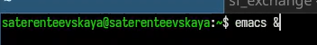{#fig-001 width=70%}

2-4. Создала  файл lab07.sh с помощью комбинации Ctrl-x Ctrl-f и набрала  текст из методички. Сохранила  файл с помощью комбинации Ctrl-x Ctrl-s (C-x C-s) ([рис. @fig-002]).

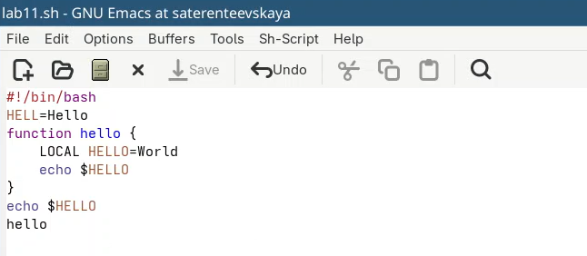{#fig-002 width=70%}

5. Проделала  с текстом стандартные процедуры редактирования, каждое действие должно осуществляться комбинацией клавиш.

5.1. Вырезала  одной командой целую строку (С-k) ([рис. @fig-003]).

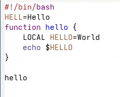{#fig-003 width=70%}

5.2. Вставила  эту строку в конец файла (C-y) ([рис. @fig-004]).

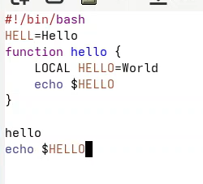{#fig-004 width=70%}

5.3-5.4. Выделила  область текста (C-space) и скопировала  область в буфер обмена (M-w) ([рис. @fig-005]).

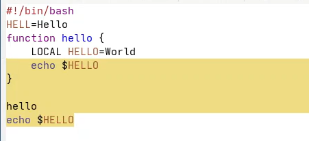{#fig-005 width=70%}

5.5. Вставила  область в конец файла ([рис. @fig-006]).

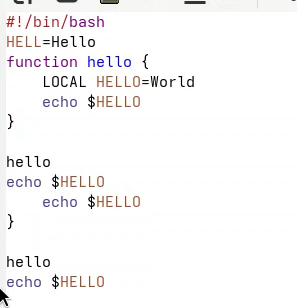{#fig-006 width=70%}

5.6. Вновь выделила  эту область и на этот раз вырезала  её (C-w) ([рис. @fig-007]).

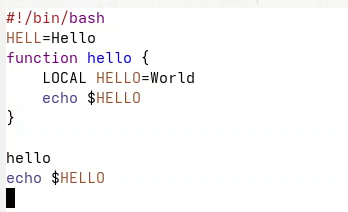{#fig-007 width=70%}

5.7. Отменила  последнее действие (C-/) ([рис. @fig-008]).

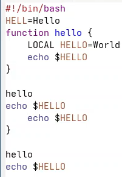{#fig-008 width=70%}

6. Научилась использовать  команды по перемещению курсора.

6.1. Переместила  курсор в начало строки (C-a) ([рис. @fig-009]).

{#fig-009 width=70%}

6.2. Переместила  курсор в конец строки (C-e) ([рис. @fig-010]).

{#fig-010 width=70%}

6.3. Переместила  курсор в начало буфера (M-<) ([рис. @fig-011]).

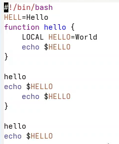{#fig-011 width=70%}

6.4. Переместила  курсор в конец буфера (M->) ([рис. @fig-012]).

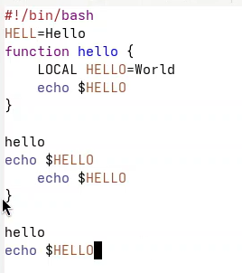{#fig-012 width=70%}

7. Управление буферами.

7.1. Вывела список активных буферов на экран (C-x C-b) ([рис. @fig-013]).

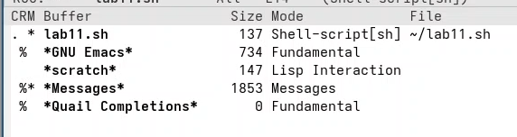{#fig-013 width=70%}

7.2. Переместилась во вновь открытое окно (C-x) o со списком открытых буферов и переключилась на другой буфер ([рис. @fig-014]).

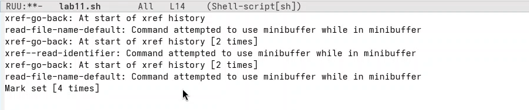{#fig-014 width=80%}

7.3. Закрыла это окно (C-x 0)

7.4. Теперь вновь переключалась между буферами, но уже без вывода их списка на экран (C-x b) ([рис. @fig-015]).

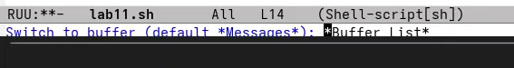{#fig-015 width=70%}

8. Управление окнами.

8.1. Поделила  фрейм на 4 части: разделила  фрейм на два окна по вертикали (C-x 3), а затем каждое из этих окон на две части по горизонтали (C-x 2) ([рис. @fig-016]).

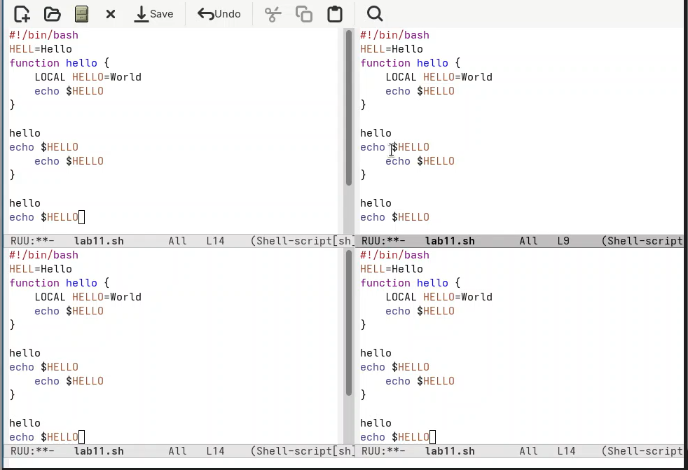{#fig-016 width=90%}

8.2. В каждом из четырёх созданных окон откройте новый буфер (файл) и ввела текст ([рис. @fig-017]).

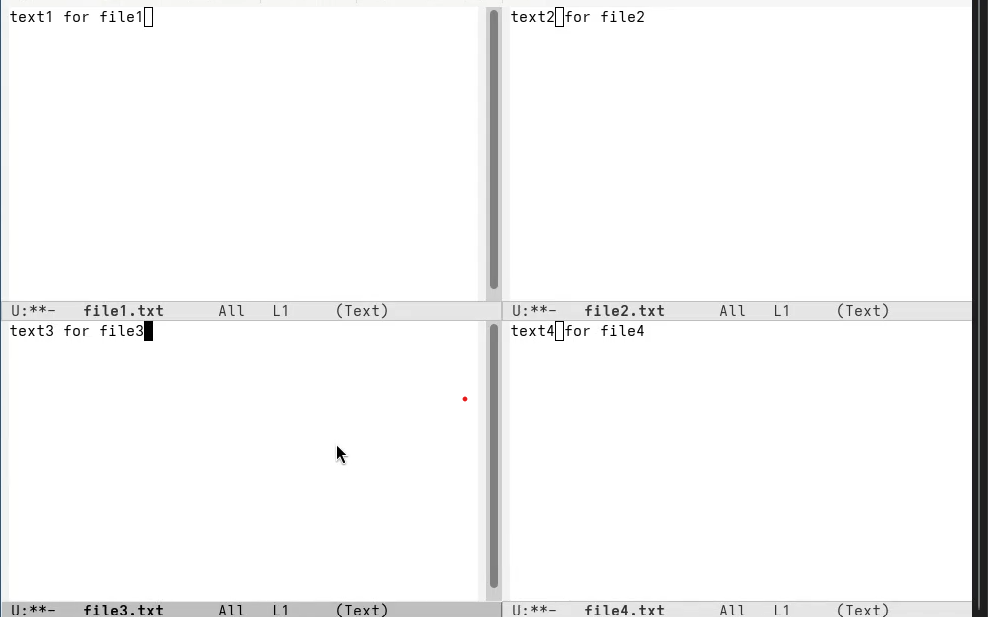{#fig-017 width=90%}

9. Режим поиска

9.1. Переключилась в режим поиска (C-s) и найдила  несколько слов, присутствующих в тексте ([рис. @fig-018]).

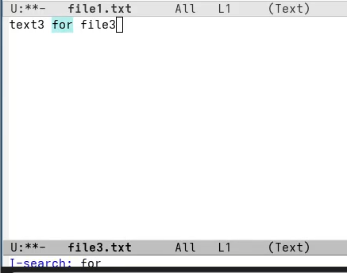{#fig-018 width=70%}

9.2. Переключалась между результатами поиска, нажимая C-s.

9.3. Вышла из режима поиска, нажав C-g.

9.4. Перешла в режим поиска и замены (M-%), ввелла  текст, который следует найти и заменила , нажалаа  Enter , затем ввела текст для замены. После того как будут подсвечены результаты поиска, нажмила  ! для подтверждения замены. Я заменяла слово for на file ([рис. @fig-019]).

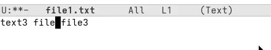{#fig-019 width=70%}

9.5. Испробовала другой режим поиска, нажав M-s o ([рис. @fig-020]).

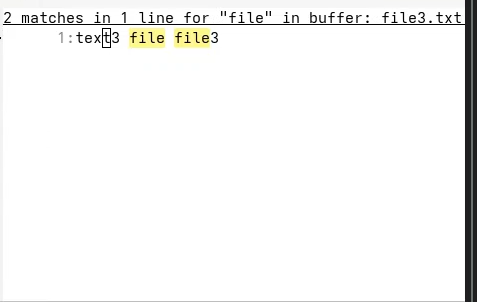{#fig-020 width=70%}

- **`C-s`** — находит слово и прыгает по одному совпадению за раз.

- **`M-s o`** — показывает **все** строки с этим словом в отдельном окошке списком.

**Главное отличие:** `M-s o` даёт обзор всех совпадений сразу, а `C-s` ходит по ним по
очереди.

# Контрольные вопросы 

### 1. Кратко охарактеризуйте редактор emacs.

Emacs — многофункциональный текстовый редактор с открытым исходным кодом. Поддерживает расширения на языке Elisp, позволяет редактировать текст, компилировать программы, работать с файлами, почтой и т.д. Имеет мощную систему справки и настраиваемых комбинаций клавиш.

### 2. Какие особенности данного редактора могут сделать его сложным для освоения
новичком?

- Большое количество комбинаций клавиш, которые нужно запомнить.

- Использование клавиши Meta (Alt/Esc) в комбинациях.

- Собственная терминология (буфер, фрейм, окно, точка вставки и т.д.).- Многофункциональность — избыточность возможностей для простых задач.

- Отсутствие привычных сочетаний Ctrl+C/Ctrl+V для копирования/вставки.

### 3. Своими словами объясните, что такое буфер и окно в терминологии emacs.

- **Буфер** — это область памяти, в которой Emacs хранит какой-либо текст. Это
может быть содержимое файла, результат работы программы, справочная информация
и т.п.

- **Окно** — это видимая прямоугольная область внутри фрейма (графического окна), в которой отображается содержимое одного буфера. Один фрейм может содержать несколько окон.

### 4. Можно ли открыть больше 10 буферов в одном окне?

Да, можно. Количество буферов в Emacs ограничено только объёмом оперативной памяти. Их можно переключать даже не отображая одновременно в окнах.

### 5. Какие буферы создаются по умолчанию при запуске emacs?

При запуске Emacs создаёт несколько буферов:

- `*scratch*` — черновик для временных записей и выражений Elisp;

- `*Messages*` — системные сообщения и ошибки;

- `*GNU Emacs*` — приветственное сообщение;

- буферы справки (если вызывалась справка).

### 6. Какие клавиши вы нажмёте, чтобы ввести следующую комбинацию C-c | и C-c C-| ?
- `C-c |` — зажать Ctrl → нажать c → отпустить → нажать | (вертикальная черта, обычно Shift+обратный слэш).

- `C-c C-|` — зажать Ctrl → нажать c → отпустить → снова зажать Ctrl → нажать |.

### 7. Как поделить текущее окно на две части?

- По вертикали (два окна друг над другом): `C-x 2`

- По горизонтали (два окна рядом): `C-x 3`

### 8. В каком файле хранятся настройки редактора emacs?

Настройки Emacs хранятся в файле `.emacs` или `init.el`, который расположен в домашней директории пользователя (`~/.emacs` или `~/.config/emacs/init.el`).

### 9. Какую функцию выполняет клавиша `|` и можно ли её переназначить?

Клавиша `|` (вертикальная черта) в Emacs по умолчанию вводит сам символ при наборе текста. В режимах программирования может использоваться в комбинациях. Да, можно переназначить через настройки (файл `.emacs`) с помощью функции `global-set-key`.

### 10. Какой редактор вам показался удобнее в работе — vi или emacs? Поясните почему.

Мне удобнее Emacs, потому что:

- команды запоминаются логичнее (C-x C-f — открыть файл, C-x C-s — сохранить);

- есть графический интерфейс и меню;

- легче выйти из редактора (C-x C-c);

- проще управлять окнами и буферами.

# Выводы

В ходе выполнения данной лабораторной работы я познакомилась с операционной системой Linux. Получила  практические навыки работы с редактором Emacs.

# Список литературы 

[ТУИС](https://esystem.rudn.ru)

[Методичка к лабораторной работе №11](https://esystem.rudn.ru/mod/resource/view.php?id=1358201)
