---
author:
- Терентеевская Светлана Александровна
authors:
- affiliation:
  - address: ул. Миклухо-Маклая, д. 6
    city: Москва
    country: Российская Федерация
    name: Российский университет дружбы народов
    postal-code: 117198
  degrees: Student
  email: 1032253498@rudn.ru
  name: Терентеевская Светлана Александровна
bibliography:
- bib/cite.bib
crossref:
  lof-title: Список иллюстраций
  lol-title: Листинги
  lot-title: Список таблиц
csl: \_resources/csl/gost-r-7-0-5-2008-numeric.csl
engines:
- path: /opt/quarto/share/extension-subtrees/julia-engine/\_extensions/julia-engine/julia-engine.js
lang: ru-RU
license:
  text: CC BY 4.0
  type: creative-commons
  url: "https://creativecommons.org/licenses/by/4.0/deed.ru-ru"
subtitle: "Дисциплина: Операционные системы"
title: Отчёт по лабораторной работе №12
toc-title: Содержание
---

- [[1]{.toc-section-number} Цель работы](#цель-работы){#toc-цель-работы}
- [[2]{.toc-section-number} Задание](#задание){#toc-задание}
- [[3]{.toc-section-number} Теоретическое
  введение](#теоретическое-введение){#toc-теоретическое-введение}
  - [[3.1]{.toc-section-number} Стандартные
    переменные](#стандартные-переменные){#toc-стандартные-переменные}
  - [[3.2]{.toc-section-number} Метасимволы и
    экранирование**Метасимволы** --- символы, имеющие специальный смысл:
    `*` `?` `[ ]` `>` `<` `|` `&` `\` `$` `;` `#` `` ` `` `(` `)` `{`
    `}` `'`
    `"`.](#метасимволы-и-экранированиеметасимволы-символы-имеющие-специальный-смысл-.){#toc-метасимволы-и-экранированиеметасимволы-символы-имеющие-специальный-смысл-.}
  - [[3.3]{.toc-section-number} Командные
    файлы](#командные-файлы){#toc-командные-файлы}
  - [[3.4]{.toc-section-number} Функции](#функции){#toc-функции}
  - [[3.5]{.toc-section-number} Специальные переменные для командных
    файлов](#специальные-переменные-для-командных-файлов){#toc-специальные-переменные-для-командных-файлов}
  - [[3.6]{.toc-section-number} Команда
    getopts](#команда-getopts){#toc-команда-getopts}
  - [[3.7]{.toc-section-number} Управляющие
    конструкции](#управляющие-конструкции){#toc-управляющие-конструкции}
- [[4]{.toc-section-number} Выполнение лабораторной
  работы](#выполнение-лабораторной-работы){#toc-выполнение-лабораторной-работы}
- [[5]{.toc-section-number} Выводы](#выводы){#toc-выводы}
- [[6]{.toc-section-number} Список
  литературы](#список-литературы){#toc-список-литературы}

# Цель работы {#цель-работы number="1"}

Изучить основы программирования в оболочке ОС UNIX/Linux. Научиться
писать небольшие командные файлы.

# Задание {#задание number="2"}

- Сделать резервную копию самого скрипта в каталог \~/backup с
  использованием архиватора.

- Обработать произвольное число аргументов командной строки.

- Вывести содержимое каталога и права доступа к файлам без использования
  ls и dir.

- Подсчитать количество файлов с заданным расширением в указанной
  директории.

# Теоретическое введение {#теоретическое-введение number="3"}

## Стандартные переменные {#стандартные-переменные number="3.1"}

  -----------------------------------------------------------------------
  Переменная                         Назначение
  ---------------------------------- ------------------------------------
  `PATH`                             Список каталогов для поиска команд
                                     (разделитель --- двоеточие). По

  умолчанию: текущий каталог,        
  `/bin`, `/usr/bin`                 

  `HOME`                             Домашний каталог пользователя

  `IFS`                              Разделители полей в командной строке
                                     (пробел, табуляция, перевод строки)

  `MAIL`                             Файл для проверки почты

  `TERM`                             Тип используемого терминала

  `LOGNAME`                          Регистрационное имя пользователя
  -----------------------------------------------------------------------

Просмотреть значения всех переменных можно командой `set`.

## Метасимволы и экранирование**Метасимволы** --- символы, имеющие специальный смысл: `*` `?` `[ ]` `>` `<` `|` `&` `\` `$` `;` `#` `` ` `` `(` `)` `{` `}` `'` `"`. {#метасимволы-и-экранированиеметасимволы-символы-имеющие-специальный-смысл-. number="3.2"}

**Назначение основных метасимволов:**

- `*` --- любая строка (в том числе пустая)

- `?` --- один любой символ

- `[c1-c2]` --- любой символ из диапазона

**Экранирование** --- снятие специального смысла:

- Обратный слеш перед метасимволом

- Одинарные кавычки (полное экранирование)

- Двойные кавычки (частичное экранирование)

## Командные файлы {#командные-файлы number="3.3"}

**Командный файл (скрипт)** --- текстовый файл с последовательностью
команд. Для запуска необходимо установить право на выполнение и указать
путь к файлу.

## Функции {#функции number="3.4"}

Функция определяется один раз в начале скрипта и может вызываться по
имени.

## Специальные переменные для командных файлов {#специальные-переменные-для-командных-файлов number="3.5"}

  -----------------------------------------------------------------------
  Переменная                         Назначение
  ---------------------------------- ------------------------------------
  `$0`                               Имя скрипта

  `$1`...`$9`                        Аргументы командной строки (для
                                     10-го и более --- `${10}`)

  `$#`                               Количество аргументов

  `$@`                               Все аргументы как отдельные слова

  `$*`                               Все аргументы как одна строка

  `$?`                               Код завершения последней выполненной
                                     команды (0 --- истина, ненулевое ---
                                     ложь)

  `$$`                               PID текущего процесса

  `$!`                               PID последнего фонового процесса

  `${#name}`                         Длина строки в переменной `name`

  `${name:-value}`                   Если переменная не определена,
                                     подставляется значение

  `${name:=value}`                   Если переменная не определена, ей
                                     присваивается значение
  -----------------------------------------------------------------------

## Команда getopts {#команда-getopts number="3.6"}

`getopts` осуществляет синтаксический анализ командной строки, выделяя
флаги (опции). Строка опций содержит список допустимых флагов; если
после флага ожидается аргумент, ставится двоеточие. `getopts` использует
переменные `OPTARG` (аргумент флага) и `OPTIND` (индекс следующего
аргумента). Обычно `getopts` применяется в цикле `while` совместно с
оператором `case`.

## Управляющие конструкции {#управляющие-конструкции number="3.7"}

### Цикл for {#цикл-for number="3.7.1"}

Перебирает элементы списка, последовательно присваивая их переменной и
выполняя заданные команды.

### Оператор выбора case {#оператор-выбора-case number="3.7.2"}

Сравнивает значение переменной с несколькими шаблонами и выполняет
команды, соответствующие первому совпавшему шаблону. Метасимвол `*`
используется как шаблон по умолчанию.

### Условный оператор if {#условный-оператор-if number="3.7.3"}

Выполняет проверку условия. Если последняя команда в списке после `if`
возвращает нулевой код (истина), выполняется блок `then`. Если нет ---
проверяется `elif` или выполняется блок `else`. Завершается конструкция
служебным словом `fi`.

**Команда `test`** используется для проверки условий:

- `-d` --- проверка, является ли файл каталогом

- `-f` --- проверка, является ли файл обычным файлом

- `-r` --- проверка доступа на чтение

- `-w` --- проверка доступа на запись

- `-x` --- проверка доступа на выполнение

### Цикл while {#цикл-while number="3.7.4"}

Выполняется, пока последняя команда в списке условий возвращает нулевой
код (истина).

### Цикл until {#цикл-until number="3.7.5"}

Выполняется, пока последняя команда в списке условий возвращает
ненулевой код (ложь). Условие выхода из цикла ---противоположное
`while`.

### Команды true и false {#команды-true-и-false number="3.7.6"}

- `true` --- всегда возвращает нулевой код (истина)

- `false` --- всегда возвращает ненулевой код (ложь)

### Прерывание циклов {#прерывание-циклов number="3.7.7"}

- `break` --- полностью завершает выполнение цикла

- `continue` --- завершает текущую итерацию и переходит к следующей

# Выполнение лабораторной работы {#выполнение-лабораторной-работы number="4"}

1.  Я создала и открыла файл backup_self.sh
    ([рис. 1](#fig-001){.quarto-xref}).

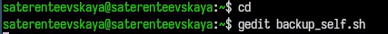{width="70%"}

Написала в нем скрипт, который при запуске будет делала резервную копию
самого себя (то есть файла, в котором содержится его исходный код) в
другую директорию backup в моём домашнем каталоге
([рис. 2](#fig-002){.quarto-xref}).

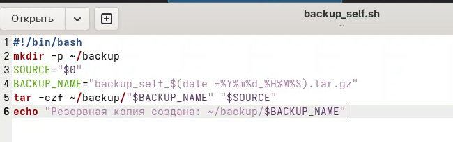{width="70%"}

Запустила ([рис. 3](#fig-003){.quarto-xref}).

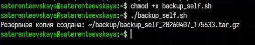{width="70%"}

Проверила, что создался архив (2 раза)
([рис. 4](#fig-004){.quarto-xref}).

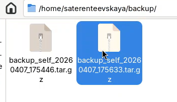{width="70%"}

2.  Я написала пример командного файла, обрабатывающего любое
    произвольное число аргументов командной строки, в том числе
    превышающее десять ([рис. 5](#fig-005){.quarto-xref}).

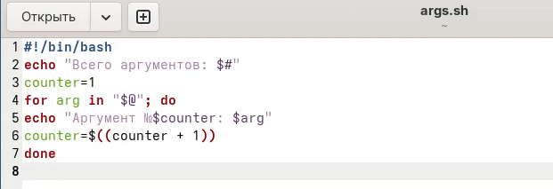{width="70%"}

Запустила с разными аргументами ([рис. 6](#fig-006){.quarto-xref}).

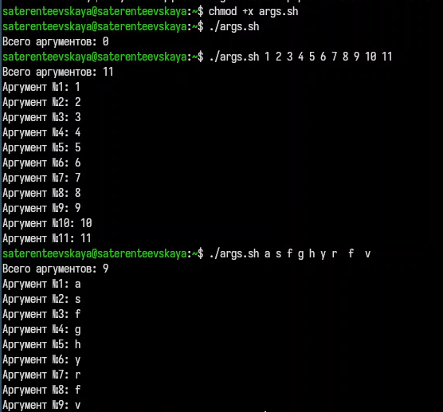{width="70%"}

3.  Я написала командный файл --- аналог команды ls (без использования
    самой этой команды и команды dir). Он выдает информацию о нужном
    каталоге и выводит информацию о возможностях доступа к файлам этого
    каталога ([рис. 7](#fig-007){.quarto-xref}),
    [рис. 8](#fig-008){.quarto-xref})

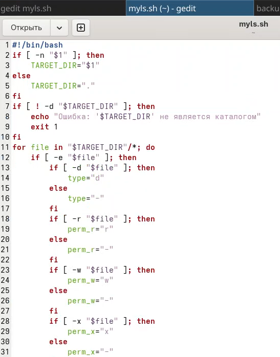{width="70%"}

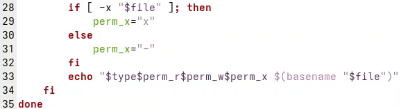{width="70%"}

Запустила ([рис. 9](#fig-009){.quarto-xref}).

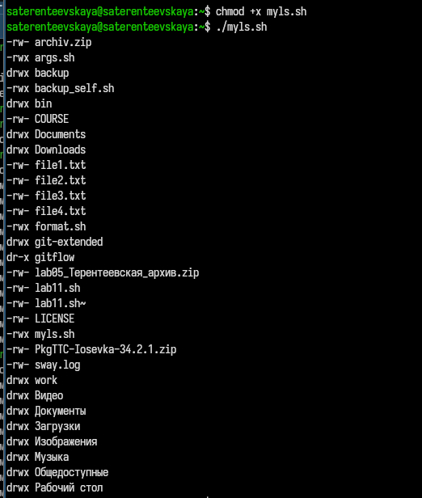{width="70%"}

4.  Я написала командный файл, который получает в качестве аргумента
    командной строки формат файла (.txt, .doc, .jpg, .pdf и т.д.) и
    вычисляет количество таких файлов в указанной директории. Путь к
    директории также передаётся в виде аргумента командной строки
    ([рис. 10](#fig-011){.quarto-xref}).

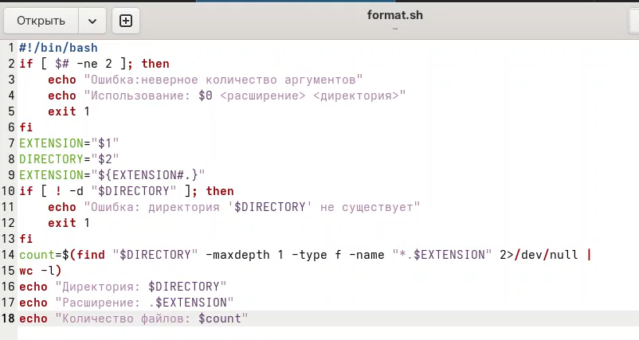{width="70%"}

Запустила и проверила с txt ([рис. 11](#fig-012){.quarto-xref}).

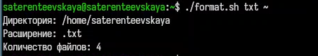{width="70%"}

и sh ([рис. 12](#fig-013){.quarto-xref}).

{width="70%"}

# Выводы {#выводы number="5"}

В ходе данной лабораторной работы я изучила основы программирования в
оболочке ОС UNIX/Linux и научилась писать небольшие командные файлы.

# Список литературы {#список-литературы number="6"}

[ТУИС](https://esystem.rudn.ru)

[Методичка к лабораторной работе
№12](https://esystem.rudn.ru/pluginfile.php/3097028/mod_resource/content/4/010lab_shell_prog_1.pdf)
