---
author:
- Терентеевская Светлана Александровна
authors:
- affiliation:
  - address: ул. Миклухо-Маклая, д. 6
    city: Москва
    country: Российская Федерация
    name: Российский университет дружбы народов
    postal-code: 117198
  degrees: Student
  email: 1032253498@rudn.ru
  name: Терентеевская Светлана Александровна
bibliography:
- bib/cite.bib
crossref:
  lof-title: Список иллюстраций
  lol-title: Листинги
  lot-title: Список таблиц
csl: \_resources/csl/gost-r-7-0-5-2008-numeric.csl
engines:
- path: /opt/quarto/share/extension-subtrees/julia-engine/\_extensions/julia-engine/julia-engine.js
lang: ru-RU
license:
  text: CC BY 4.0
  type: creative-commons
  url: "https://creativecommons.org/licenses/by/4.0/deed.ru-ru"
subtitle: "Дисциплина: Операционные системы"
title: Отчёт по лабораторной работе №13
toc-title: Содержание
---

- [[1]{.toc-section-number} Цель работы](#цель-работы){#toc-цель-работы}
- [[2]{.toc-section-number} Задание](#задание){#toc-задание}
- [[3]{.toc-section-number} Теоретическое
  введение](#теоретическое-введение){#toc-теоретическое-введение}
- [[4]{.toc-section-number} Выполнение лабораторной
  работы](#выполнение-лабораторной-работы){#toc-выполнение-лабораторной-работы}
  - [[4.1]{.toc-section-number} Задание 1](#задание-1){#toc-задание-1}
  - [[4.2]{.toc-section-number} Задание 2](#задание-2){#toc-задание-2}
  - [[4.3]{.toc-section-number} Задание 3](#задание-3){#toc-задание-3}
  - [[4.4]{.toc-section-number} Задание 4](#задание-4){#toc-задание-4}
- [[5]{.toc-section-number} Выводы](#выводы){#toc-выводы}
- [[6]{.toc-section-number} Список
  литературы](#список-литературы){#toc-список-литературы}

# Цель работы {#цель-работы number="1"}

- Изучить основы программирования в оболочке ОС UNIX.

- Научится писать более сложные командные файлы с использованием
  логических управляющих конструкций и циклов.

# Задание {#задание number="2"}

- Реализовать командный файл, анализирующий ключи (-inputfile,
  -outputfile, -p, -C, -n) с помощью getopts для поиска строк по шаблону
  в файле.

- Написать программу на C, возвращающей код завершения (знак числа), и
  командный файл, анализирующий этот код через \$? с выводом
  соответствующего сообщения.

- Разработать командный файл, создающий N пронумерованных файлов
  (например, 1.tmp, 2.tmp) или удаляющий их, с передачей N через
  аргумент командной строки.

- Написать командный файл для архивации (через tar) всех файлов в
  указанной директории, а затем модифицировать его для упаковки только
  файлов, изменённых за последнюю неделю (используя find).

# Теоретическое введение {#теоретическое-введение number="3"}

В командных процессорах ОС UNIX (оболочках, таких как bash)
программирование позволяет автоматизировать сложные задачи
администрирования и обработки данных. В отличие от простых
последовательных команд, скрипты используют управляющие конструкции:
**ветвления** (`if-then-else`, `case`) и **циклы** (`for`, `while`,
`until`), что делает их полноценным языком сценариев.

Ключевым инструментом для разбора параметров командной строки является
встроенная команда `getopts`. Она позволяет обрабатывать ключи
(например, `-f`, `-o`) и их аргументы, избавляя программиста от ручного
анализа позиционных параметров.

Особое место занимает **код завершения** команды (`$?`). Любая программа
(включая написанные на Си) возвращает целое число: `0` --- успех,
ненулевое значение --- ошибка или специальное состояние. Это позволяет
организовывать цепочки проверок и условное выполнение.

Для работы с файлами часто используются генерация имён с помощью
**метасимволов** (`*`, `?`, `[ ]`), а также команды `find` (фильтрация
по времени изменения) и `tar` (архивация). Понимание различий между
циклами `while` (выполняется, пока условие истинно) и `until`
(выполняется, пока условие ложно) необходимо для корректной реализации
повторяющихся действий.

# Выполнение лабораторной работы {#выполнение-лабораторной-работы number="4"}

## Задание 1 {#задание-1 number="4.1"}

Используя команды getopts grep, я написала командный файл, который
анализирует командную строку с ключами: -iinputfile, -ooutputfile,
-pшаблон, -C, -n, а затем ищет в указанном файле нужные строки,
определяемые ключом -p ([рис. 1](#fig-001){.quarto-xref}).

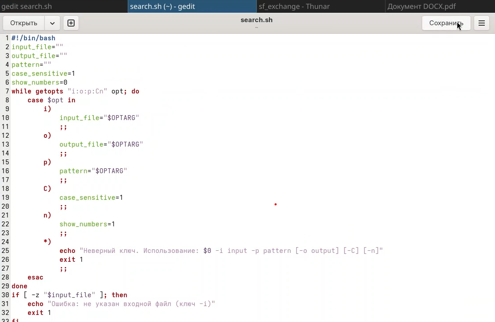{width="80%"}

Создала текстовый файл для проверки программы
([рис. 2](#fig-002){.quarto-xref}).

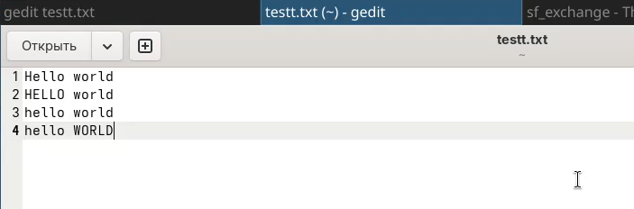{width="80%"}

Сделала файл search.sh исполняемым и проверила его работу с разными
ключами ([рис. 3](#fig-003){.quarto-xref}).

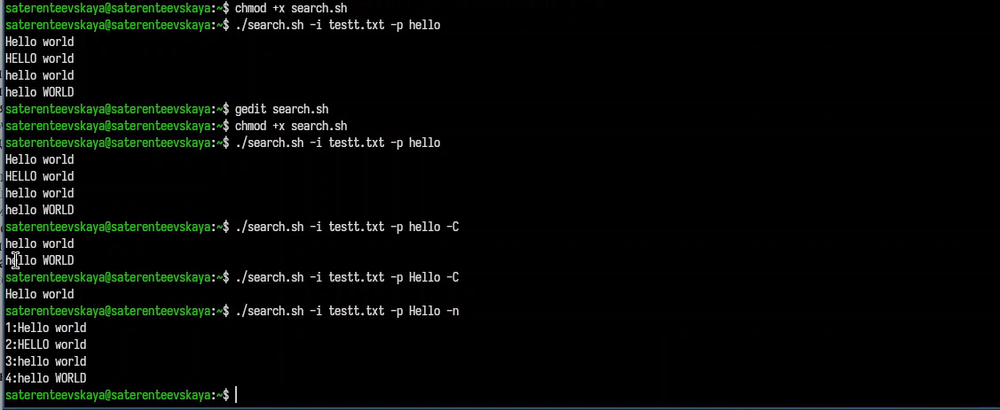{width="90%"}

## Задание 2 {#задание-2 number="4.2"}

Я написала на языке Си программу, которая вводит число и определяет,
является ли оно больше нуля, меньше нуля или равно нулю. Затем программа
завершается с помощью функции exit(n), передавая информацию в о коде
завершения в оболочку ([рис. 4](#fig-004){.quarto-xref}).

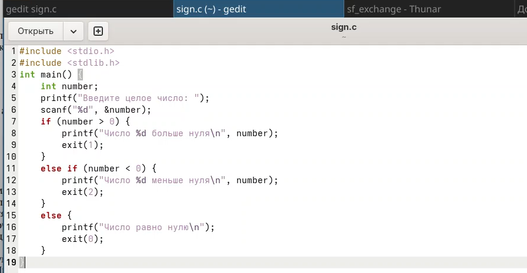{width="80%"}

Дальше я написала командный файл, который вызывает эту программу и,
проанализировав с помощью команды \$?, выдает сообщение о том, какое
число было введено ([рис. 5](#fig-005){.quarto-xref}).

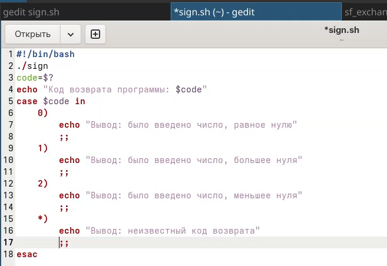{width="80%"}

Сделала файл исполняемым и проверила его работу
([рис. 6](#fig-006){.quarto-xref}).

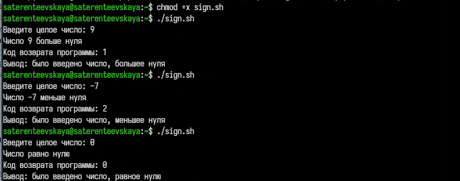{width="80%"}

## Задание 3 {#задание-3 number="4.3"}

Я написала командный файл, создающий указанное число файлов,
пронумерованных последовательно от 1 до 𝑁. Этот же командный файл должен
уметь удалять все созданные им файлы (если они существуют)
([рис. 7](#fig-007){.quarto-xref}).

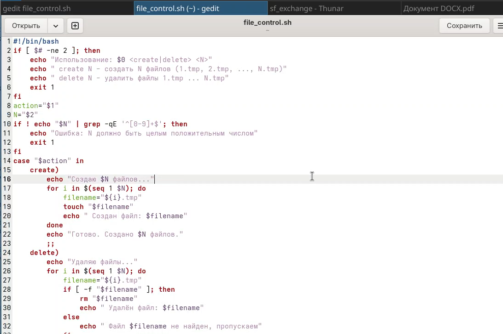{width="80%"}

Сделала исполняемым и запустила ([рис. 8](#fig-008){.quarto-xref}).

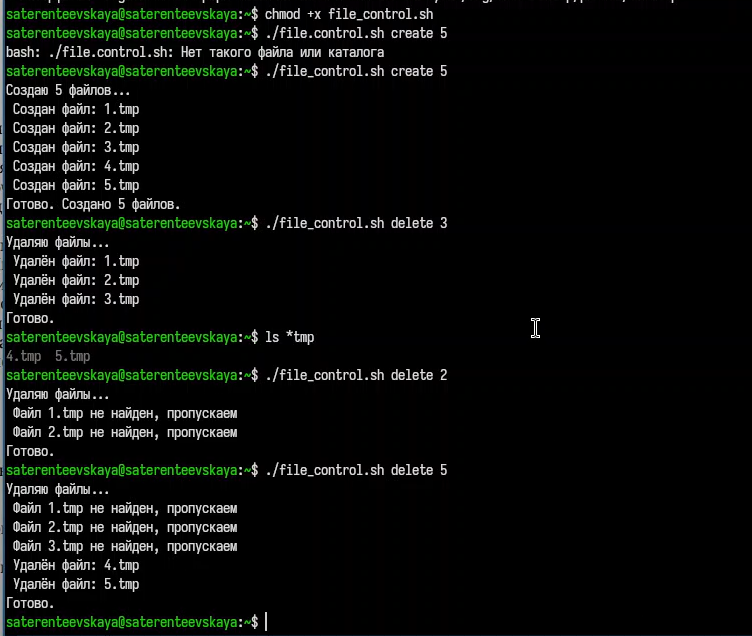{width="90%"}

## Задание 4 {#задание-4 number="4.4"}

Написала командный файл, который с помощью команды tar запаковывает в
архив все файлы в указанной директории
([рис. 9](#fig-009){.quarto-xref}).

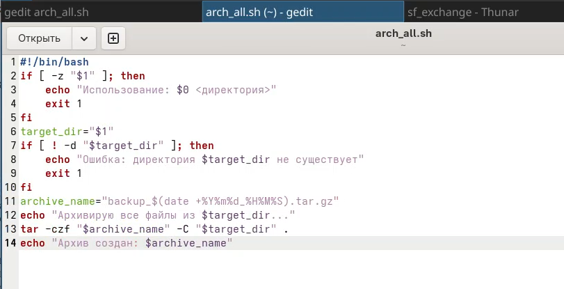{width="80%"}

Далее модифицировала его так, чтобы запаковывались только те файлы,
которые были изменены менее недели тому назад (использовала команду
find), создав для этого второй файл ([рис. 10](#fig-010){.quarto-xref}).

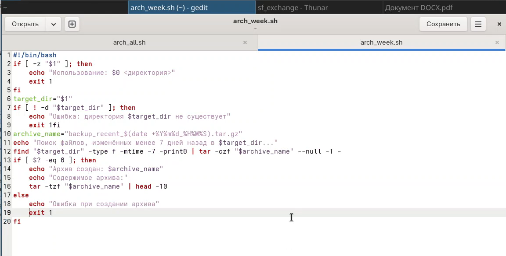{width="80%"}

Сделала файлы исполняемыми, создала тестовую директорию с файлами: для
одного изменила дату, а другой не трогала и запустила
([рис. 11](#fig-011){.quarto-xref}).

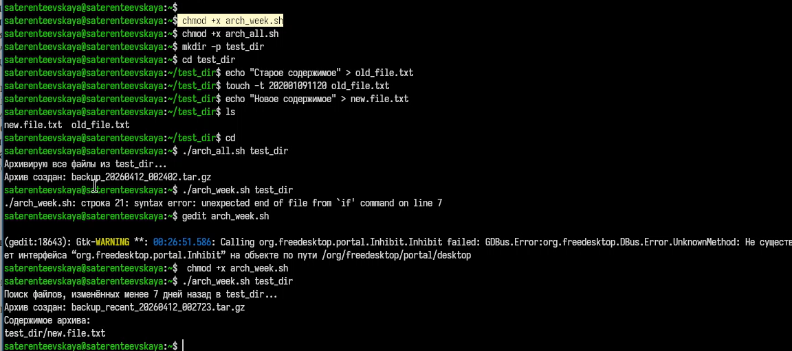{width="90%"}

# Выводы {#выводы number="5"}

В ходе выполнения данной лабораторной работы я изучила основы
программирования в оболочке ОС UNIX и научилась писать более сложные
командные файлы с использованием логических управляющих конструкций и
циклов.

# Список литературы {#список-литературы number="6"}

[ТУИС](https://esystem.rudn.ru)

[Методичка к лабораторной работе
№13](https://esystem.rudn.ru/mod/resource/view.php?id=1358205)
