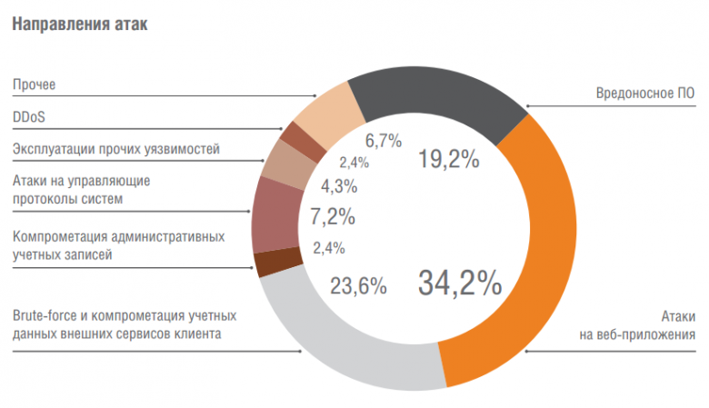
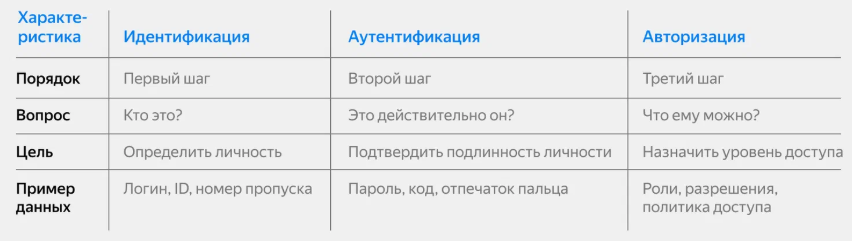
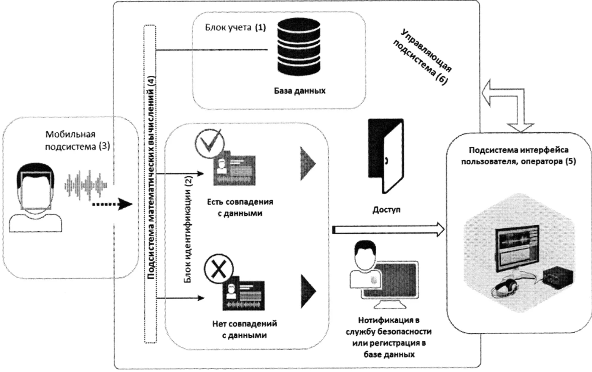
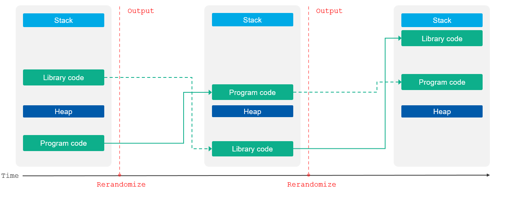
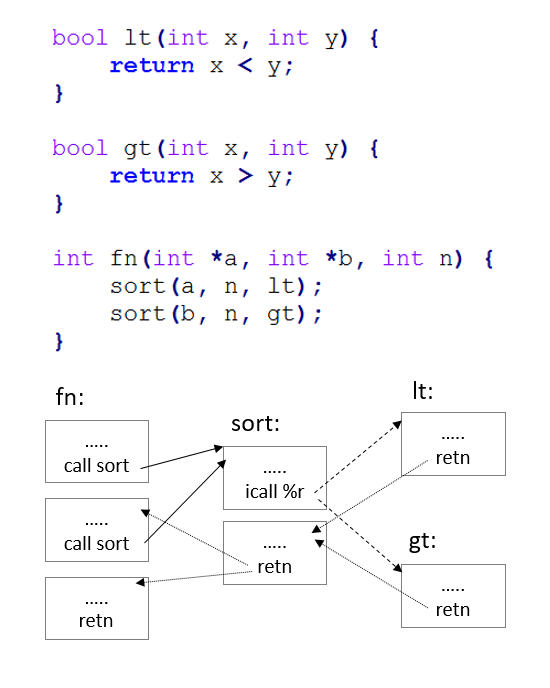
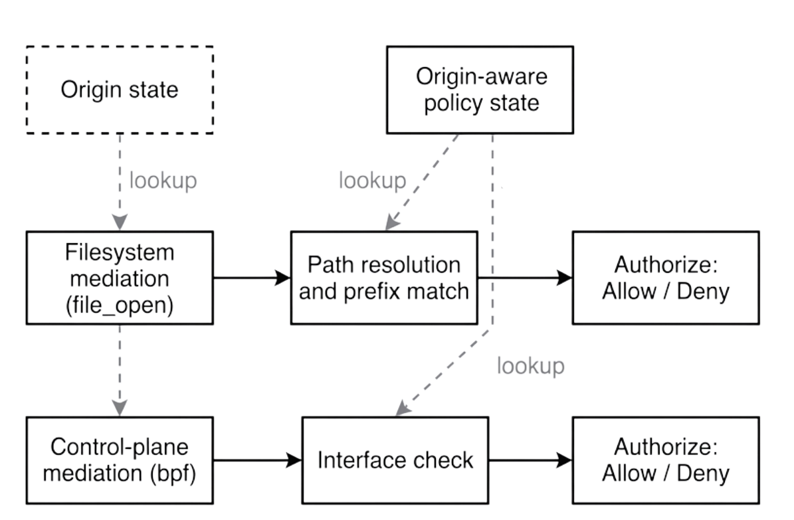

---
## Author
author:
  name: Терентеевская Светлана Александровна
  degrees: student
  email: 1032253498@rudn.ru
  affiliation:
    - name: Российский университет дружбы народов
      country: Российская Федерация
      postal-code: 117198
      city: Москва
      address: ул. Миклухо-Маклая,

## Title
title: "Реферат"
subtitle: "Методы организации безопасности в операционных системах"
license: "CC BY"
---

# Введение 

Операционная система - это тип системного программного обеспечения, управляющий всеми ресурсами компьютера, контролирующий и отслеживающий выполнение программ, которые находятся на компьютере. Окружение, в котором функционирует ОС, называется доверенной вычислительной базой (ДВБ). ДВБ включает в себя полный набор элементов, обеспечивающих информационную безопасность.

Современные ОС сталкиваются с беспрецедентным уровнем киберугроз. Ежедневно регистрируются сотни тысяч новых образцов вредоносного программного обеспечения, а количество уязвимостей в ОС, по данным национальных баз уязвимостей (NVD), не снижается, несмотря на усилия разработчиков.

В ответ на это разработчики операционных систем внедряют всё более сложные и многоуровневые механизмы безопасности. Если в 1990-х годах защита ОС сводилась в основном к парольной аутентификации и спискам контроля доступа (ACL), то сегодня речь идёт о таких технологиях, как рандомизация адресного пространства (ASLR), контроль целостности потока управления (CFI), мандатное управление доступом (SELinux) и аппаратно-обеспеченные доверенные среды выполнения (TEE).

Данный реферат посвящен систематизации и анализу методов организации безопасности в ос. В работе рассматриваются как классические механизмы, так и современные подходы к усилению защищённости, а также перспективные направления развития этой области.

# Цели и задачи работы 

## Цель работы

Систематизировать и проанализировать современные методы организации безопасности в ОС, выявить их сильные и слабые стороны, а также определить наиболее эффективные подходы к защите от угроз.

## Задачи

Для достижения поставленной цели необходимо решить следующие задачи:

1. Провести классификацию основных угроз безопасности операционных систем, выделив наиболее критичные типы атак.

2. Рассмотреть базовые механизмы защиты, реализуемые в современных ОС, включая
идентификацию и аутентификацию, управление доступом, изоляцию процессов и аудит.

3. Изучить современные методы усиления защищённости (hardening), такие как ASLR, DEP, CFI, мандатные системы управления доступом (SELinux, AppArmor) и изоляцию на основе виртуализации.

4. Проанализировать перспективные направления развития безопасности ОС, включая концепцию Origin-Aware Security, аппаратно-программную интеграцию и применение методов искусственного интеллекта.

5. Сформулировать выводы об эффективности рассмотренных методов и дать рекомендации по их комплексному применению.

# Классификация угроз безопасности операционных систем

Понимание природы угроз является необходимым условием для разработки эффективных механизмов защиты. Угрозы безопасности операционных систем можно классифицировать по нескольким критериям.

## По цели атаки 

* несанкционированное чтение информации

* несанкционированное изменение информации

* несанкционированное уничтожение информации

* полное или частичное разрушение ОС

## По принципу воздействия на операционную ситему

* использование известных (легальных) каналов получения информации

* использование скрытых каналов получения информации

* создание новых каналов получения информации с помощью программных закладок 

## По типу используемой злоумышленником информации

* неадекватная политика безопасности, в том числе и ошибки администратора системы
 
* ошибки и недокументированные возможности программного обеспечения ОС, в том числе и люки — встроенные в систему «служебные входы», позволяющие обходить систему защиты

* ранее внедренная программная закладка

## По характеру воздейтсвия на ОС

* активное воздействие — несанкционированные действия злоумышленника в системе

* пассивное воздействие — несанкционированное наблюдение злоумышленника за процессами, происходящими в системе.

На рисунке представлены направления атак за 2025 год ([рис. @fig-001]).

{#fig-001 width=100%}

# Базовые механизмы безопасности 

## Идентификация, аутентификация и авторизация

Фундаментом безопасности любой операционной системы является система управления доступом, которая базируется на трёх основных процессах: идентификации, аутентификации и авторизации.

**Идентификация**

Идентификация - это процесс, в котором субъект (пользователь, устройство, сервер) сообщает системе, кем он является. На данном этапе система еще не проверяет, правда это или нет, а просто принимает информацию, после чего уже переходит к следующему шагу - аутентификации.

Обычно идентификация происходит в виде ввода или передачи уникального идентификатора.

Это может быть:

* логин;

* email;

* номер телефона;

* ID-ключ или токен;

* номер карты или пропуска;

* имя устройства в сети.

**Аутентификация**

Аутентификация — это процесс проверки подлинности субъекта, который перед этим прошёл идентификацию. Система уже получила информацию о том, кто перед ней, — например, логин или ID. Но теперь необходимо убедиться, что субъект действительно тот, за
кого он себя выдаёт.

Подтвердить личность во время аутентификации можно с помощью одного или нескольких факторов.
Это может быть:

* То, что субъект знает. Например, пароль, PIN-код, ответ на секретный вопрос.

* То, что субъект имеет. Например, смартфон для получения кода по SMS или в
приложении, пропуск.

* То, что является частью субъекта. Например, отпечаток пальца, лицо, голос, радужная
оболочка глаза.

**Авторизация**

Авторизация — это процесс определения прав субъекта внутри системы. После того как личность была идентифицирована и подтверждена, система должна решить, что именно разрешено делать этому субъекту.Авторизация начинается только после аутентификации. Система уже знает, кто перед ней,и теперь должна проверить:

* какие данные можно просматривать;

* какие функции доступны;

* какие действия можно выполнять;

* к каким разделам системы разрешён доступ.

Авторизация контролирует, что пользователь может делать после входа. Она защищает данные и функции системы от несанкционированного использования.

Разница между этими процессами заключается в последовательности их выполнения. Сначала идентификация - система узнает, кто перед ней. Затем проверка подлинности - аутентификация. И после этого - авторизация - система определяет, как действия разрешены  ([рис. @fig-002]).

{#fig-002 width=100%}

## Модели управления доступом 

В операционных системах реализуются несколько основных моделей управления доступом:

**Дискреционное управление** основано на том, что доступ к информационным системам и ресурсам определяет сам владелец ресурсов или администратор. Т.е. на основе идентификационной информации о субъектах создаются списки на использование тех или иных ресурсов с указанием полномочий конкретных лиц.

Преимущества такой схемы: простота реализации, совместимость с любым программным обеспечением, отсутствие сложностей в настройке. Однако у модели есть существенный минус – наделение администратора слишком широкими полномочиями. В итоге сотрудник может намеренно или случайно предоставить излишний набор прав другим сотрудникам или даже посторонним лицам, что чревато несанкционированным использованием ресурсов без ведома владельцев. Если права доступа назначают сами владельцы, вероятность инцидентов
снижается, – и все же схему сложно назвать совершенной.

Дискреционная модель не подходит для крупных компаний с большим количеством сотрудников. В таких случаях нужна более универсальная и упорядоченная система.

**Мандатное управление** предполагает централизированное назначение меток безопасности субъектам и объектам доступа, причем права определяются на основе этих меток. Пользователь не может изменить метку безопасности своего процесса или файла - это делает только системный администратор в соответствии с установленной политикой безопасности.

Такая схема легко реализуется, но не обладает достаточной гибкостью для внедрения в инфраструктуру крупных организаций. Она предназначена скорее для государственных учреждений и компаний, которым требуется повышенный уровень безопасности. 

**Модель на базе атрибутов** называется ABAC и подразумевает выдачу прав доступа на основе рассматриваемых в моменте правил, привязанных к объектам (системам и ресурсам), субъектам (пользователям), конкретным операциям и рабочим задачам, окружению. В рамках этого подхода используется механизм автоматизации, оценивающий предоставленные атрибуты.

Тут применяются более сложные наборы правил и политики, регламентирующие назначение полномочий для того или иного сотрудника. На их базе анализируются и согласовываются атрибуты, после чего формируются списки доступа.

Модель управления на основе атрибутов считается достаточно гибкой и удобной в эксплуатации. Она часто применяется в IT-сфере и крупных компаниях, где счет сотрудников
идет на тысячи. 

**Ролевая схема управления доступом (RBAC)** основана на назначении ролей – наборов полномочий, привязанных к конкретным должностям или рабочим задачам.

Удобство модели в том, что не нужно назначать полномочия отдельно каждому сотруднику – достаточно распределить роли. К тому же можно легко и быстро урезать или расширять наборы прав для групп работников.

Типы доступа в рамках ролевой модели:

* Должностной – набор минимальных привилегий, необходимых для выполнения рабочих обязанностей сотрудников одной должности.

* Персональный – расширенный набор полномочий, который выдается отдельным сотрудникам.

* Функциональный – полномочия, которые назначаются отдельным сотрудникам для решения каких-либо текущих задач (например, в рамках командировки или конкретного проекта).

Такая модель доступа подходит для среднего и крупного бизнеса в любой сфере деятельности. Она позволяет обеспечить прозрачность управления, максимально исключитьриски назначения избыточных полномочий, снизить нагрузку на специалистов IT-отдела, упростить порядок выдачи прав. Впрочем, нет смысла внедрять ролевую систему, если в штате до 50 сотрудников – ролей будет слишком мало, поэтому вложения в реализацию и
обслуживание модели не оправдаются.

На рисунке представлена схема управления доступом  ([рис. @fig-003]).

{#fig-003 width=100%}

## Изоляция процессов и защита памяти

Одной из ключевых задач ОС является обеспечение изоляции выполняющихся процессов друг от друга и от ядра системы. Цель — гарантировать, что каждый процесс может получить доступ только к своему собственному адресному пространству и ресурсам, чтобы процесс не мог случайно или злонамеренно записать данные в память другого процесса или изменить системные файлы.

Методы изоляции процесса, в операционных системах предлагает различные подходы к повышению безопасности. Каждая технология предназначена для удовлетворения различных потребностей в безопасности и Операционная система помогает укрепить вашу общую безопасность. Правильная реализация этих методов делает системы более стабильными и
надежными.

**Преимущества методов изоляции процессов:**

* Предотвращает распространение уязвимостей безопасности.

* Повышает стабильность системы.

* Защищает конфиденциальность данных.

* Ограничивает воздействие вредоносного ПО.

* Это позволяет более эффективно использовать ресурсы.

| Механизмы | Объяснение | Преимущества |
|:-----------:|:----------:|:------------:|
|Виртуальные машины (ВМ)|Запуск каждого процесса в полностью изолированной виртуальной среде|Высокая изоляция,безопасность на аппаратном уровне|
|Контейнеры|Изоляция процессов на уровне операционной системы|Легкий, быстрый запуск, эффективное использование ресурсов|
|Chroot-тюрьмы|Ограничение доступа процесса к файловой системе определенным каталогом|Простое применение, базовая изоляция|
|Пространства имен|Разрешить процессам использовать системные ресурсы (PID, сеть, точки монтирования) с различными представлениями|Гибкая изоляция составляет основу контейнерной технологии|

: Сравнение механизмов изоляции {#tbl-izolation}

Изоляция не только обеспечивает безопасность, но и улучшает управление ресурсами. Ограничение каждого процесса необходимыми ему ресурсами гарантирует более эффективное использование системных ресурсов и отсутствие влияния на производительность других процессов. Это особенно выгодно в средах с ресурсоемкими приложениями и службами.

## Аудит и логирование

**Логирование** — процесс создания хронологического журнала (логов), содержащего сведения о событиях, ошибках, запросах и изменениях конфигурации, происходящих в системах, приложениях и сетевом оборудовании.

**Структурные элементы процесса**

1. Источники логов — операционные системы, приложения, сетевые устройства, средства
безопасности.

2. Сбор данных (агенты) — Logstash, Fluentd, Syslog-ng, rsyslog.

3. Передача — протоколы Syslog, HTTP(S), Kafka и др. для надёжной доставки событий.

4. Хранение — распределённые хранилища (Elasticsearch, базы данных, файловые системы) с
контролем доступа и шифрованием.

5. Обработка и нормализация — фильтрация, парсинг, обогащение метаданными.

6. Анализ и визуализация — Kibana, Grafana, Graylog, Wazuh.

**Аудит информационных систем** — независимая оценка надёжности, безопасности и соответствия ИС внутренним политикам и внешним стандартам (SOX, HIPAA, GDPR и др.). Он использует данные логирования для выявления рисков, проверки соблюдения правил и выработки рекомендаций.

**Структурные элементы процесса**

1. Инициирование — формулирование целей, объёма и критериев проверки.

2. Сбор информации — интервью, анализ документации, выгрузка конфигураций и логов.

3. Анализ и оценка — выявление уязвимостей, несоответствий, расчёт рисков.

4. Отчёт и рекомендации — подготовка вывода о состоянии ИС и мер по улучшению.

5. Внедрение рекомендаций — (опционально) контроль выполнения корректирующих действий

**Ключевое различие:** логирование создаёт «сырые» данные о событиях, тогда как аудит интерпретирует эти данные, формируя выводы и рекомендации. Принцип независимости требует, чтобы аудитор не участвовал в «производственных» функциях (ведении учёта, составлении отчётности) проверяемой организации, иначе теряется объективность оценки.

# Современные методы усиления защиты

## Рандомизация адресного пространства

Рандомизация адресного пространства ([рис. @fig-004]) - это метод защиты компьютерной системы от атак, который случайным образом изменяет расположение ключевых областей памяти: стек, исполняемый код, куча. Это затрудняет злоумышленнику предсказание адресов для усешной атаки, так как в рамках данной техники адреса памяти, используемые приложениями, генерируются случайным образом.

{#fig-004 width=100%}

Рандомизация адресного пространства является эффективным средством защиты от буферных переполнений, переполнения кучи (Heap Overflow), переполнения стека (Stack Overflow), а также от различных видов вредоносного кода, использующего известные адреса в памяти для внедрения своего кода.

ASLR реализуется на уровне операционной системы и может применяться как на уровне ядра, так и на уровне пользовательского пространства. Она может быть включена или отключена в зависимости от настроек системы.

Хотя рандомизация адресного пространства является эффективным средством защиты, она не гарантирует 100% безопасность системы. Некоторые виды атак, например, атаки типа Return-oriented programming (ROP), могут обойти эту защиту. Однако ASLR является важной и эффективной мерой для повышения общей безопасности системы.

## Контроль целостности потока управления 

CFI (control-flow integrity) - более продвинутый метод защиты, предназначенный для ограничения возможных пустей исполнения программы исключительно заранее определенным графом потока управления с целью повышения защищённости.

Идея CFI была впервые предложлена Абиадом и др. в 2005 году, но практическая реализация в коммерческих ОС появилась значительно позже. Существуют две основные разновидности:

* Forward-edge CFI — проверка косвенных вызовов функций (через указатели на функции,
виртуальные методы в C++).

* Backward-edge CFI — проверка возвратов из функций (защита от атак на стек возвратов).

В современных ОС реализованы следующие варианты CFI:

* LLVM CFI — встроен в компилятор Clang;

* Intel CET (Control-flow Enforcement Technology) — аппаратная реализация CFI в
процессорах Intel;

* Microsoft Control Flow Guard (CFG) — в Windows 8.1 и новее.

Поддержка control-flow integrity реализована в компиляторах Clang и GCC, а также в виде Guard потока управления (англ. Control Flow Guard) и Guard возврата управления (англ. Return Flow Guard) от Microsoft, а также Reuse Attack Protector (RAP) от PaX Team.

На рисунке показано, как изменяется управление при вызове подпрограмм и возврате из них. Инструкции call и icall соответствуют прямым переходам, инструкция retn - обратному ([рис. @fig-005]).

{#fig-005 width=100%}

## Принудительное управление доступом 

Как отмечалось в разделе 4.2, мандатное управление доступом (MAC) - это модель управления доступом, в которой доступ к ресурсам и объектам системы регулируется строгими правилами, установленными администратором. В экосистеме Linux наиболее распространёнными реализациями MAC являются SELinux и AppArmor.

**SELinux (Security-Enhanced Linux)**

SELinux был разработан Агентством национальной безопасности США (NSA) совместно с Red Hat и другими компаниями. Он интегрирован в ядро Linux начиная с версии 2.6. SELinux реализует гибкую модель безопасности на основе типизированного мандатного доступа (Type Enforcement, TE).

Каждый субъект (процесс) и объект (файл, сокет, устройство) получает контекст безопасности в формате user:role:type:level. Решения о доступе принимаются на основе сравнения типов субъекта и объекта. Как указано в технической документации NSA [3], «SELinux позволяет реализовать политику наименьших привилегий, при которой каждый процесс получает только те права, которые необходимы ему для выполнения своих функций».

**AppArmor**

AppArmor — альтернативная система MAC, используемая в Ubuntu и SUSE. В отличие от SELinux, AppArmor использует профили, привязанные к путям в файловой системе, а не к метаданным файлов. Это делает AppArmor более простым в настройке, но менее гибким.

|Характеристика|SELinux|AppArmor|
|:------------:|:-----:|:------:|
|Модель безопасности|Type Enforcement (TE)|Path-based|
|Сложность настройки|Высокая|Низкая|
|Гибкость|Высокая|Средняя|
|Необходимость меток на ФС|Да (ext2/3/4, XFS с атрибутами)|Нет|
|Поддержка в ядре|Встроена (Linux 2.6+)|Встроена|
|Распространение|Red Hat, Fedora, CentOS, Android|Ubuntu, SUSE, Debian|

:Сравнение характеристик SELinux и AppArmor {#tbl-comparison}

## Изоляция на основе виртуализации 

Виртуализация - это создание изолированной программной среды для выполнения изолированных процессов на одном и том же физическом устройстве. Данная технология похволяет эффективно расходовать возрастающие возможности аппаратных платформ, распределяя их между несколькими программами или процессами.

Изоляция на основе виртуализации — это метод создания изолированной среды выполнения на одной физической машине с помощью виртуальных машин. Это позволяет нескольким операционным системам или экземплярам одной и той же операционной системы работать одновременно, каждая со своими собственным виртуализированными аппаратными ресурсами, памятью и хранилищем. 

**Принцип работы**

Некоторые виды изоляции на основе виртуализации:

* **Изоляция вычислительных ресурсов**. Например, в мультитенантных облачных платформах
несколько клиентских приложений и данных хранятся на одном физическом оборудовании, и
изоляция помогает разделить приложения и данные от других клиентов.

* **Сетевая изоляция**. Например, в виртуальной сети частный сетевой трафик между
виртуальными машинами изолирован от трафика, относящегося к другим клиентам.

* **Изоляция ядра (Core Isolation)**. В операционных системах, например в Windows,
возможности аппаратной виртуализации (Hyper-V) используются для создания
изолированной области памяти — «Виртуального защищённого режима». Это отделяет
критически важные компоненты операционной системы от основного ядра, что делает их
недоступными для большинства вредоносных программ.

# Перспективные направления развития безопасности ОС

## Origin-Aware Security (OAMAC)

Традиционные модели безопасности ОС не различают происхождение выполнения кода
- процесс, запущенный локально (через физический вход в систему) или через удалённое подключение (SSH, RDP), обрабатывается одинаково. Это создаёт серьёзную проблему: после компрометации системы через удалённый доступ злоумышленник получает те же права, что и локальный администратор.

На ([рис. @fig-006]) показана методология принудительного применения, используемая в некоторых точках посредничества ядра. OAMAC применяет централизованную стратегию принудительного применения, ориентируясь на интерфейсы, которые обеспечивают контроль над критически важными системными функциями, а не пытаясь вмешаться во все возможные пути доступа.

{#fig-006 width=100%}

В статье на arXiv исследователи из Университета Южной Дании предлагают концепцию OAMAC (Origin-Aware Mandatory Access Control). Авторы формулируют проблему так: «В современных операционных системах мощные механизмы мандатного управления доступом не различают, откуда возникло выполнение — физическое присутствие пользователя, удалённый доступ или фоновый сервис». 

Ключевая идея OAMAC — сделать происхождение выполнения (execution origin) полноценным атрибутом безопасности. В threat model авторы уточняют: «Мы предполагаем злоумышленника, который получает удалённый доступ (например, через SSH) и может повысить привилегии до root. Однако у него нет физического доступа к машине. OAMAC ограничивает действия удалённого злоумышленника после компрометации, сохраняя нормальное локальное администрирование».

Реализация: прототип OAMAC реализован с использованием фреймворка eBPF LSM в ядре Linux — «без необходимости модификации ядра». Это означает, что предложенный механизм может быть внедрён в существующие дистрибутивы Linux без перекомпиляции ядра.

## Применение методов искусственного интеллекта

Применение методов машинного обучения для обнаружения, реагирования и ликвидаций последтсвий инцидента становится важным направлением развития систем безопасности ОС. Нейросетевые модели могут анализировать системные вызовы, сетевой трафик и поведение пользователей для выявления подозрительной активности.

Основные направления применения ИИ в безопасности ОС:

* Снижение нагрузки на специалиста по кибербезопасности 

* Предсказание атак — анализ временных рядов метрик безопасности (логи аудита,
метрики производительности) для прогнозирования вероятности успешной атаки.

* Обнаружение аномалий на основе системных вызовов — модель обучается на
последовательностях системных вызовов типичных приложений и выявляет отклонения,
которые могут указывать на эксплуатацию.

* Автоматическая генерация политик безопасности — ИИ-системы анализируют
поведение приложений и предлагают минимально необходимые наборы прав.

# Заключение 

В данном реферате были рассмотрены основные методы организации безопасности в операционных системах. Проведенный анализ позволяет сделать следующие выводы:

1. Безопасность операционной системы является многоуровневой задачей, требующей комплексного подхода. Ни один отдельно взятый механизм защиты не обеспечивает полной безопасности. Эффективная защита достигается за счёт комбинирования методов на разных уровнях — от аппаратного до прикладного.

2. Классические механизмы защиты (идентификация, аутентификация, дискреционное управление доступом и тд) остаются фундаментом безопасности, но уже недостаточны для противодействия современным атакам. 

3. Современные методы усиления защищенности(ASLR, CFI, системы мандатного управления доступом) существенно повышают устойчивость ОС к атакам, особенно к эксплуатации уязвимостей памяти. 

4. Применение методов искусственного интеллекта для обнаружения аномалий и автоматической генерации политик безопасности находится на ранней стадии, но является многообещающим направлением для создания адаптивных систем защиты.

# Список литературы:

[Операционные системы](https://trends.rbc.ru/trends/industry/67a0b8549a794784a5330840)

[Основные угрозы безопасности](https://cyberleninka.ru/article/n/osnovnye-ugrozy-bezopasnosti-operatsionnyh-sistem/viewer)

[Анализ количества вирусов](https://tass.ru/ekonomika/22214383)

[ACLs](https://habr.com/ru/articles/154879/)

[TEE](https://learn.microsoft.com/ru-ru/azure/confidential-computing/trusted-execution-environment)

[SELinux](https://docs.redhat.com/en/documentation/Red_Hat_Enterprise_Linux/4/html/Reference_Guide/ch-selinux)

[Классификация угроз безопасности](https://studfile.net/preview/10643093/page:17/)

[Идентификация, аутентификация и авторизация](https://practicum.yandex.ru/blog/identifikatsiya-autentifikatsiya-avtorizatsiya-chem-oni-razlichayutsya/)

[Модели управления доступом](https://rt-solar.ru/products/solar_inrights/blog/3742/)

[Методы изоляции процессов](https://www.hostragons.com/ru/блог/методы-изоляции-процессов-и-песочни/#Process_Isolation_Teknikleri_Nelerdir)

[Логирование и аудит](https://ru.ruwiki.ru/wiki/Логирование_и_аудит)

[Рандомизация адресного пространства](https://www.securitylab.ru/glossary/randomizatsiya_adresnogo_prostranstva/?ref=123)

[CFI](https://ru.ruwiki.ru/wiki/Control-flow_integrity)

[MAC](https://serverspace.ru/support/glossary/mac/?utm_source=yandex.ru&utm_medium=organic&utm_campaign=yandex.ru&utm_referrer=yandex.ru)

[Виртуализация](https://blog.skillfactory.ru/glossary/virtualizatsiya/)

[Изоляция](https://learn.microsoft.com/ru-ru/azure/azure-government/azure-secure-isolation-guidance)

[OAMAC](https://arxiv.org/html/2601.14021v1)

[Применение ИИ в киберзащите](https://habr.com/ru/companies/pt/articles/904936/#1)

