---
author:
- Терентеевская Светлана Александровна
authors:
- affiliation:
  - address: ул. Миклухо-Маклая, д. 6
    city: Москва
    country: Российская Федерация
    name: Российский университет дружбы народов
    postal-code: 117198
  degrees: Student
  email: 1032253498@rudn.ru
  name: Терентеевская Светлана Александровна
crossref:
  lof-title: Список иллюстраций
  lol-title: Листинги
  lot-title: Список таблиц
date: 2026-05-10
date-format: 2026-05-10
engines:
- path: /opt/quarto/share/extension-subtrees/julia-engine/\_extensions/julia-engine/julia-engine.js
lang: ru-RU
license:
  text: CC BY 4.0
  type: creative-commons
  url: "https://creativecommons.org/licenses/by/4.0/deed.ru-ru"
subtitle: Введение
title: Отчёт по прохождению 1 этапа внешнего курса
toc-title: Содержание
---

# Информация

## Докладчик

- Терентеевская Светлана Александровна
- Группа НКАбд-05-25, студент бакалавра
- Российский университет дружбы народов им. П. Лумумбы
- <1032253498@rudn.ru>
- <https://github.com/SvetlanaTerenteevskaya> \# Вводная часть

## Цель работы

Пройти 1 этапа курса "Введение в Linux" на платформе Stepik и
ознакомиться с функционалом Linux.

## Задание

Просмотреть обучающие видео и на основе полученной информации пройти
тестовые и интерактивные задание

## Теоретическое введение

Линукс - в части случаев GNU/Linux --- семейство Unix-подобных
операционных систем на базе ядра Linux, включающих тот или иной набор
утилит и программ проекта GNU, и, возможно, другие компоненты. Как и
ядро Linux, системы на его основе, как правило, создаются и
распространяются в соответствии с моделью разработки свободного и
открытого программного обеспечения. Linux-системы распространяются в
основном бесплатно в виде различных дистрибутивов --- в форме, готовой
для установки и удобной для сопровождения и обновлений, --- и имеющих
свой набор системных и прикладных компонентов, как свободных, так и
проприетарных.

# Прохождение внешнего курса

Название внешнего курса "Введение в Linux"
([рис. 1](#fig-001){.quarto-xref}).

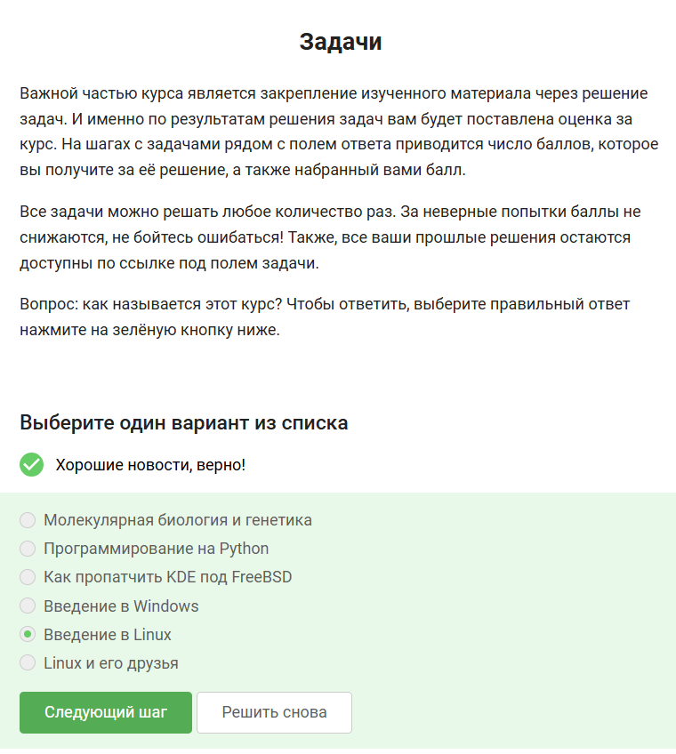{width="30%"}

------------------------------------------------------------------------

Я ознакомилась с критериями и выбрала подходящие
([рис. 2](#fig-002){.quarto-xref}).

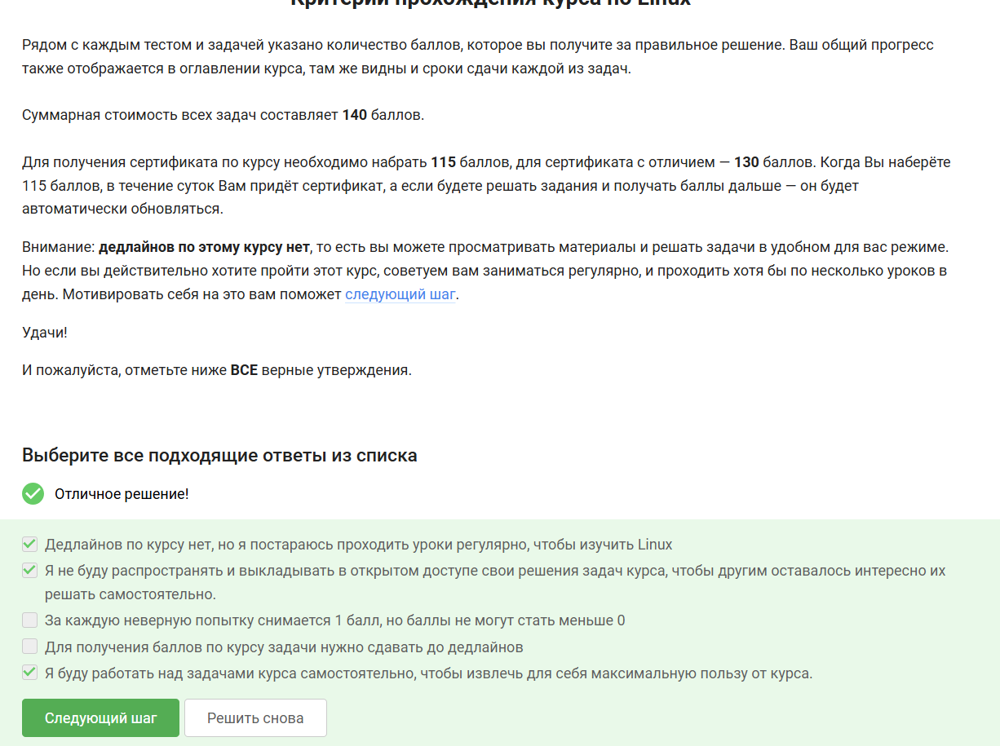{width="60%"}

------------------------------------------------------------------------

Я пользуюсь 2 операционными системами: Linux и Windows
([рис. 3](#fig-003){.quarto-xref}).

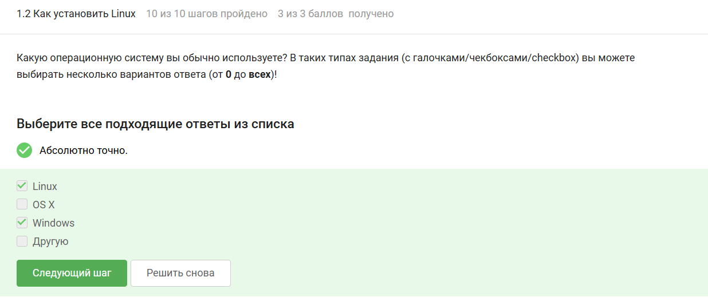{width="60%"}

------------------------------------------------------------------------

На компьютер мы устанавливаем VirtualBox, которая является специальной
программой для запуска одной ОС на другой ОС, соответственно виртуальной
машиной ([рис. 4](#fig-004){.quarto-xref}).

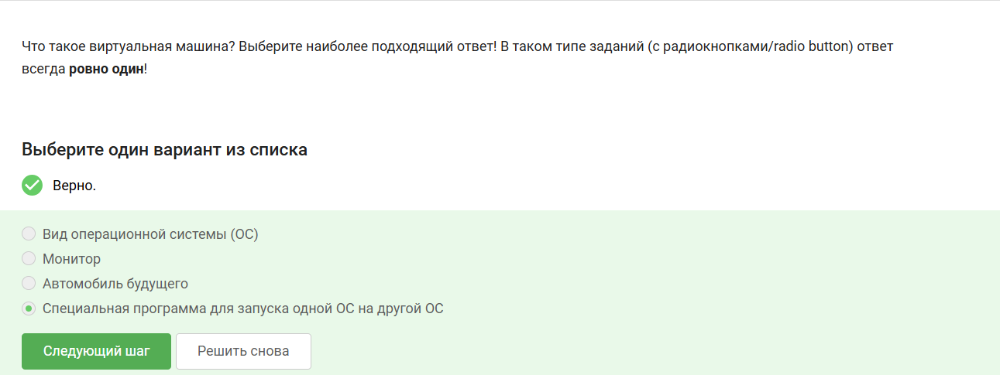{width="60%"}

------------------------------------------------------------------------

У меня получилось успешно запустить виртуальную машину с Linux на моем
компьютере ([рис. 5](#fig-005){.quarto-xref}).

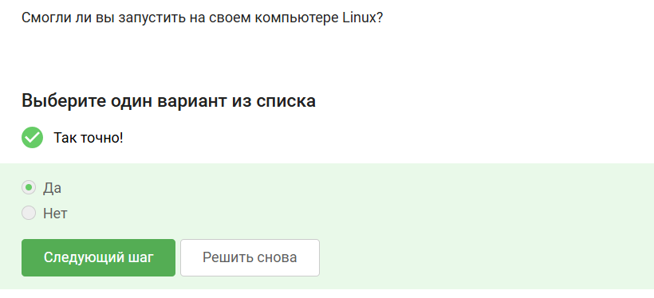{width="60%"}

------------------------------------------------------------------------

Я создала документ в LibreOffice и написала в нем "Hello, Linux"
([рис. 6](#fig-006){.quarto-xref}).

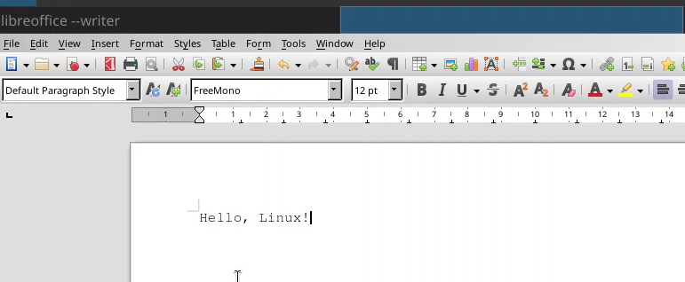{width="60%"}

------------------------------------------------------------------------

Загрузила на Stepik ([рис. 7](#fig-007){.quarto-xref}).

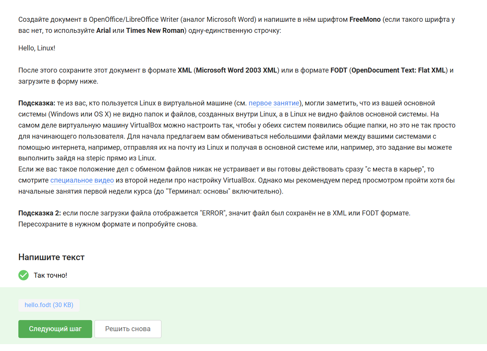{width="60%"}

------------------------------------------------------------------------

deb - формат пакетов ОС проекта Debian. Используется их производными,
например Ubuntu и другими ([рис. 8](#fig-008){.quarto-xref}).

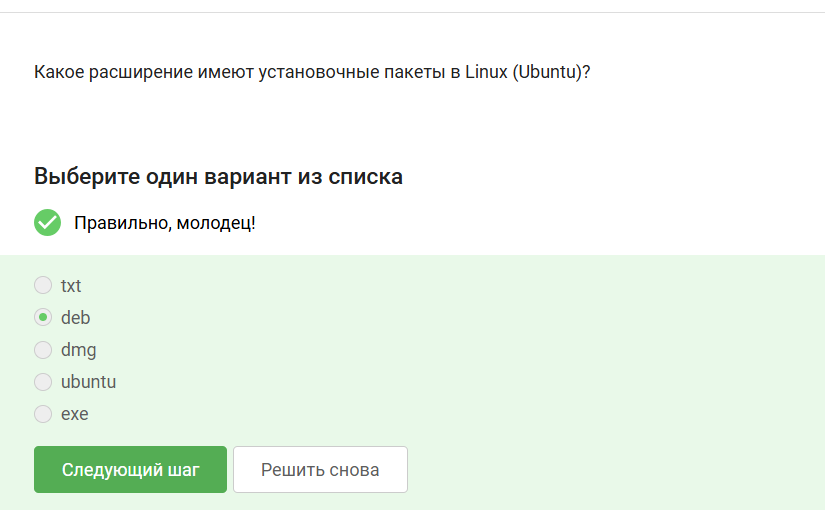{width="60%"}

------------------------------------------------------------------------

Я поставила себе в систему плеер VLC и посмотрела авторов
([рис. 9](#fig-009){.quarto-xref}).

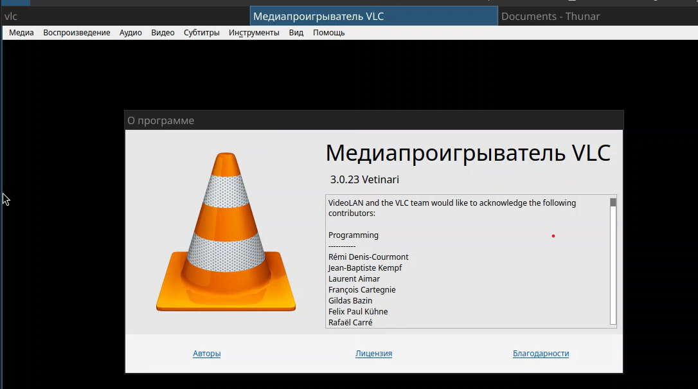{width="60%"}

------------------------------------------------------------------------

Фамилия первого автора - Denis-Courmont
([рис. 10](#fig-010){.quarto-xref}).

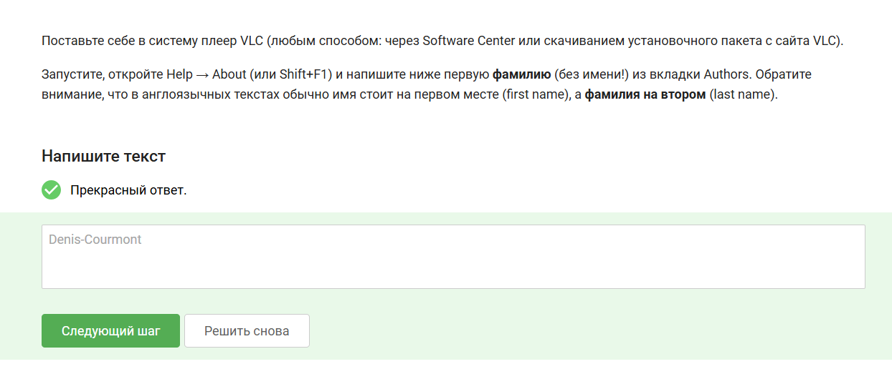{width="60%"}

------------------------------------------------------------------------

Update Manager - программа для обновления установленного ПО в
дистрибутивах линукса, основанных на Debian или использующих систему
управления пакетами APT. Update Manager следит за обновлением
установленных программ, всей системы и ссылок в Software Center.
Установка или удаление - это не его задачи
([рис. 11](#fig-011){.quarto-xref}).

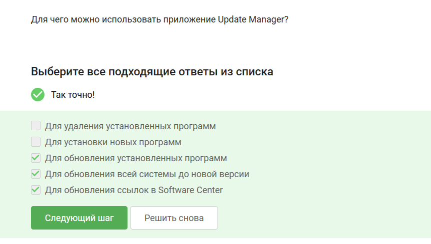{width="60%"}

------------------------------------------------------------------------

Ассоль - женское имя, термин - определение, терминал и консоль -
синонимы к командной строке ([рис. 12](#fig-012){.quarto-xref}).

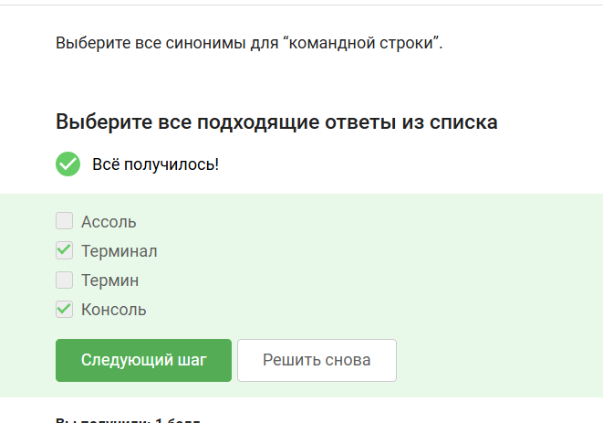{width="60%"}

------------------------------------------------------------------------

Только pwd. PWD и Pwd не сработают, потому что регистр важен
([рис. 13](#fig-013){.quarto-xref}).

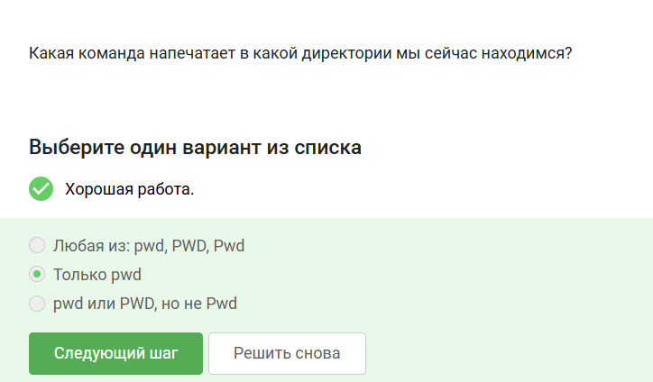{width="60%"}

------------------------------------------------------------------------

Все варианты кроме последнего являются верными, потому что в последнем
нет аргумента /some/directory ([рис. 14](#fig-014){.quarto-xref}).

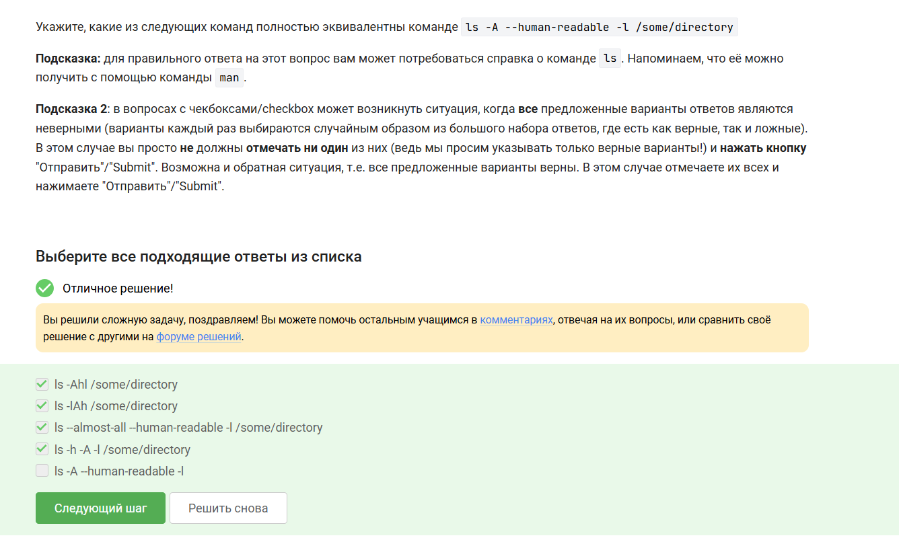{width="60%"}

------------------------------------------------------------------------

Все команды верные и ведут в нужную папку
([рис. 15](#fig-015){.quarto-xref}).

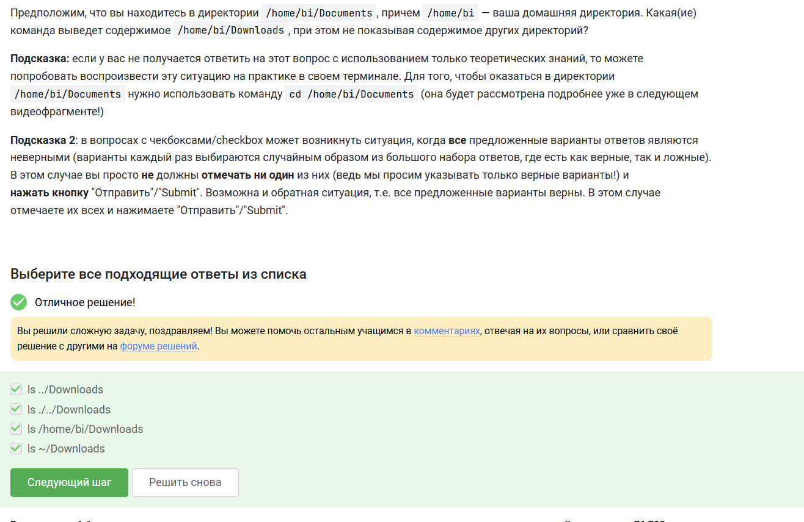{width="60%"}

------------------------------------------------------------------------

rm -r - удаление директорий рекурсивно, mkdir - создание директорий,
mkdir -r - вызовет ошибку, rm -f - удаляет файлы
([рис. 16](#fig-016){.quarto-xref}).

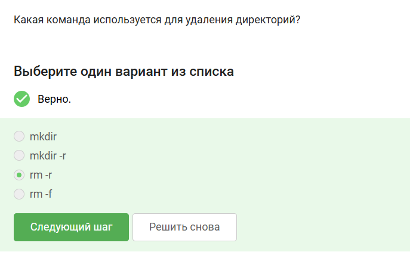{width="60%"}

------------------------------------------------------------------------

Терминал зависает в ожидании Firefox, exit не срабатывает, Firefox не
закрывается ([рис. 17](#fig-017){.quarto-xref}).

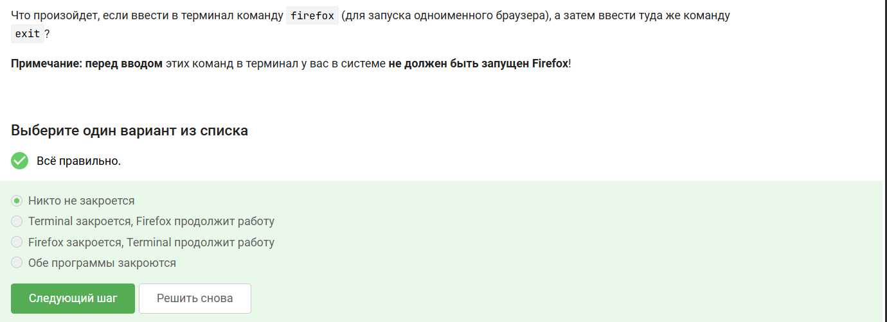{width="60%"}

------------------------------------------------------------------------

& - запуск в фоновом режиме. Ctrl+Z остонавливает, bg продолжает в фоне
([рис. 18](#fig-018){.quarto-xref}).

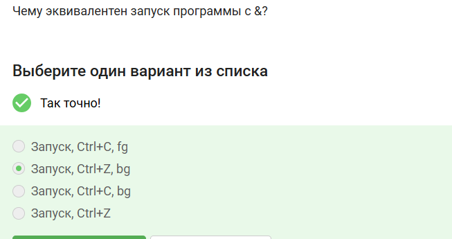{width="60%"}

------------------------------------------------------------------------

Я скачала файл и запустила его у себя в вм
([рис. 19](#fig-019){.quarto-xref}).

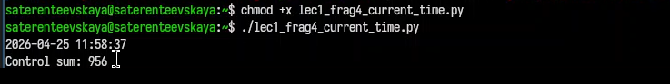{width="60%"}

------------------------------------------------------------------------

Вывод вписала в Stepik ([рис. 20](#fig-020){.quarto-xref}).

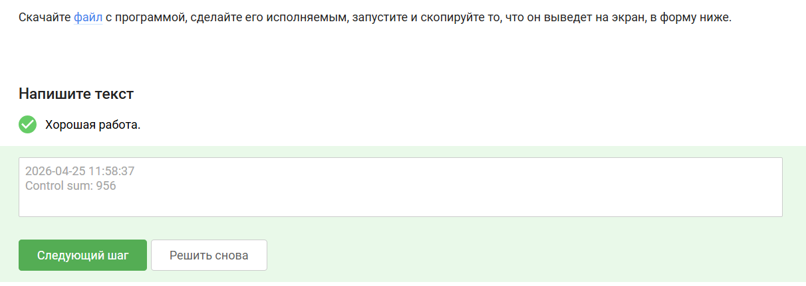{width="60%"}

------------------------------------------------------------------------

Stderr и stdout по умолчанию выводятся на экран
([рис. 21](#fig-021){.quarto-xref}).

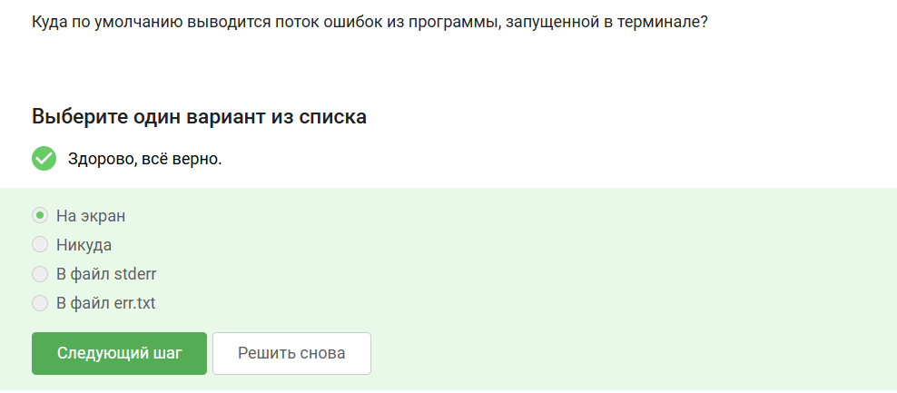{width="60%"}

------------------------------------------------------------------------

2\> и 2\>\> перенаправляют stderr и создают файл file.txt, остальное
либо не туда, либо не создает файл ([рис. 22](#fig-022){.quarto-xref}).

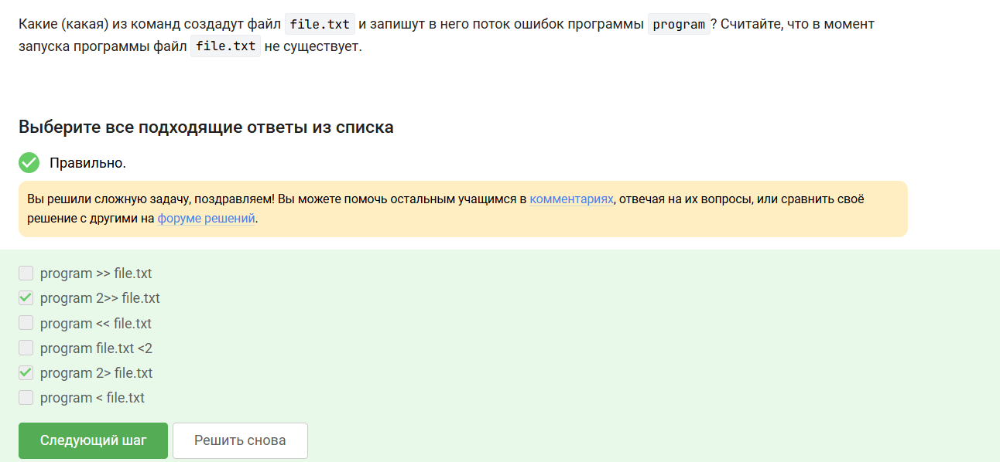{width="60%"}

------------------------------------------------------------------------

Автоматически поток ошибок выводится на экран, например, в ходе
выполнения лабораторых работ. В файл поток выводится только, если его
туда перенапрвить ([рис. 23](#fig-023){.quarto-xref}).

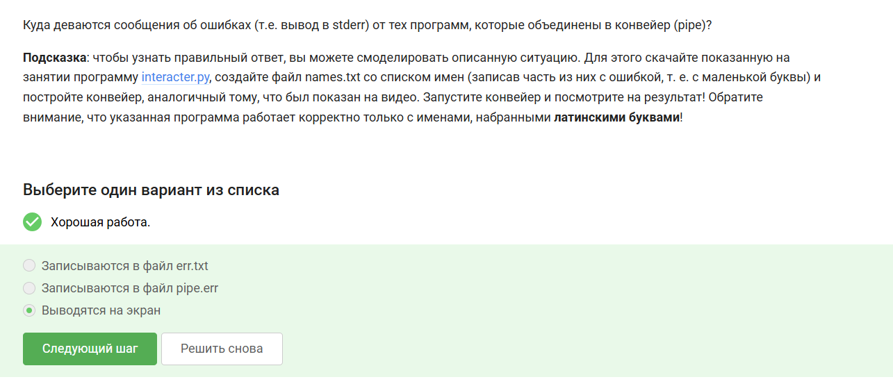{width="60%"}

------------------------------------------------------------------------

-P задает папку, а -0 имя файла ([рис. 24](#fig-024){.quarto-xref}).

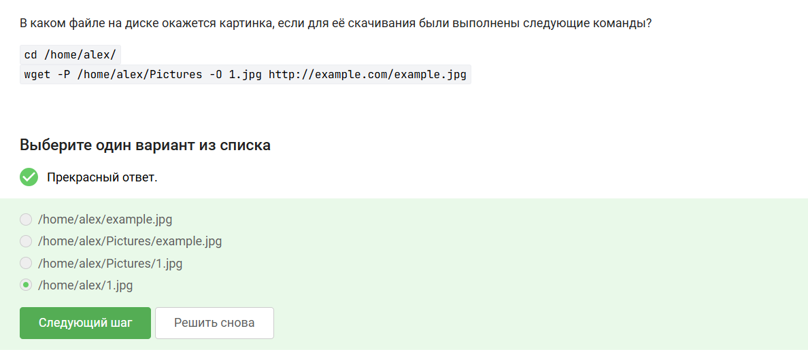{width="60%"}

------------------------------------------------------------------------

-q (--quiet) подавляет вывод, -v включает подробный вывод, -nv отключает
подробный вывод, но не все, остаются сообщения об ошибках и прогрессе
([рис. 25](#fig-025){.quarto-xref}).

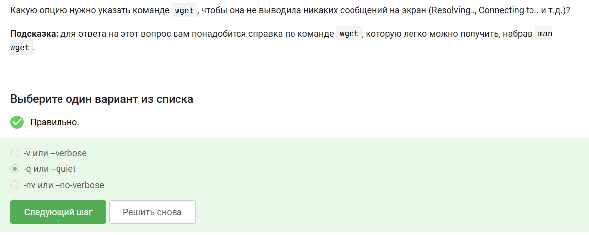{width="60%"}

------------------------------------------------------------------------

-A jpg ограничивает загрузку, но wget качает html для рекурсии, потом
удаляет ([рис. 26](#fig-026){.quarto-xref}).

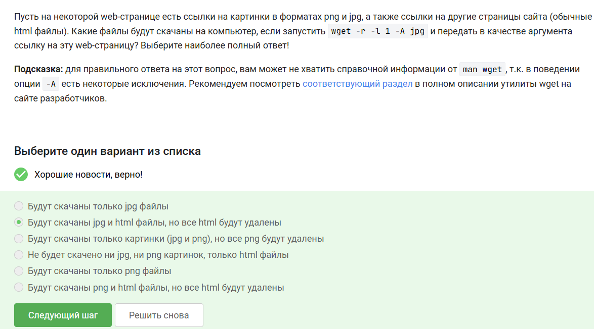{width="60%"}

------------------------------------------------------------------------

gunzip file gz - распаковывает файл file.gz,оставляя file.zip, а
исходный file.gz удаляет. unzip file.zip распаковывает содержимое,
исходный file.zip остается на месте ([рис. 27](#fig-027){.quarto-xref}).

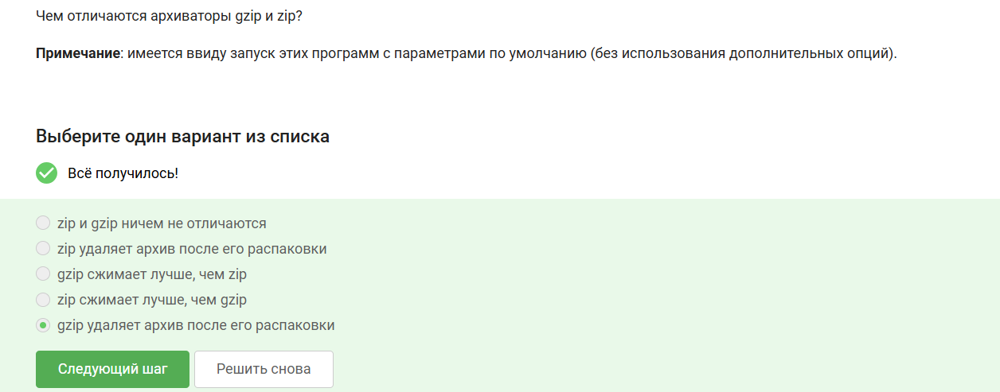{width="60%"}

------------------------------------------------------------------------

gzip сжимает только один файл, если применить его к директории, то
выдаст ошибку ([рис. 28](#fig-028){.quarto-xref}).

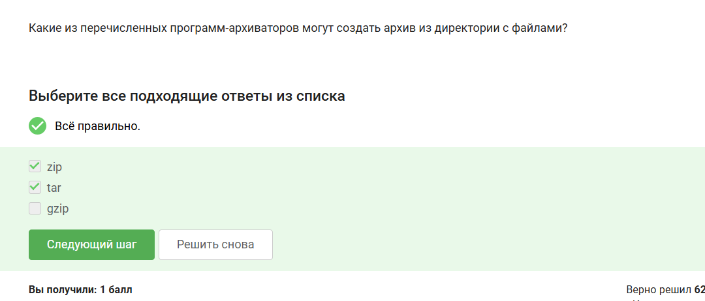{width="60%"}

------------------------------------------------------------------------

c --- create (создать архив), j --- использовать сжатие bzip2 (отсюда
расширение .bz2), f --- file (следующий аргумент --- имя файла архива)

Почему не подходят другие: -xzf --- x означает extract (распаковать), z
--- gzip, а не bzip2, -czf --- z = gzip (даст .tar.gz, а не .tar.bz2),
-xjf --- x = extract, а не create (будет распаковывать, а не
запаковывать), -wtf --- w --- interact, t --- list contents (не create),
неверная комбинация ([рис. 29](#fig-029){.quarto-xref}).

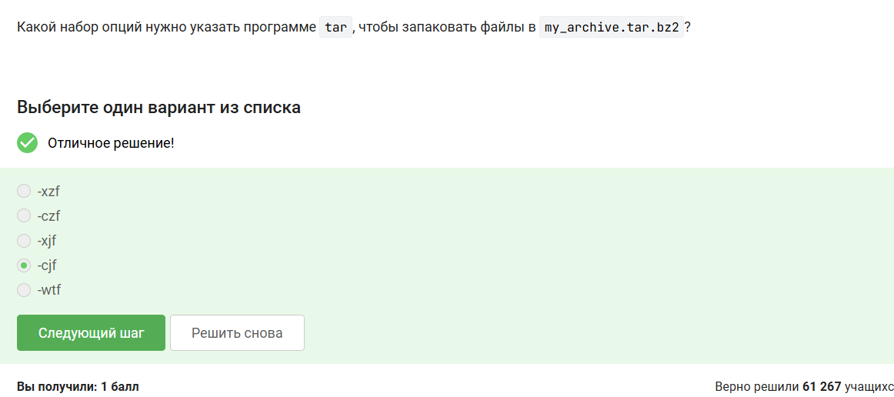{width="60%"}

------------------------------------------------------------------------

*.? не хватает букв, alexey.* не совпадает по регистру, \*.jpg не
совпадает по расширению ([рис. 30](#fig-030){.quarto-xref}).

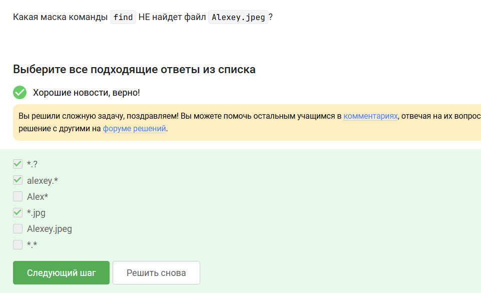{width="60%"}

------------------------------------------------------------------------

grep ищет точное вхождение world, с учётом регистра. Варианты с World
или The World Is Not Enough не подходят (большая буква). beautiful-
world и beautifulworld содержат world. The word is not enough --- нет
world ([рис. 31](#fig-031){.quarto-xref}).

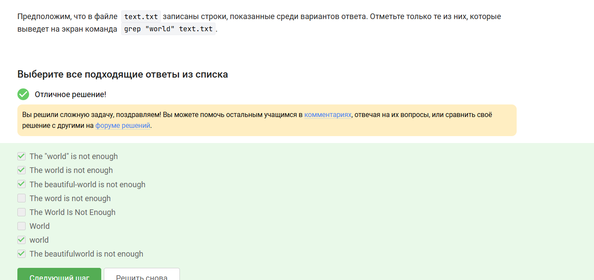{width="60%"}

------------------------------------------------------------------------

Я скачала архив с произведениями Шекспира, распаковала его и создала
файл, в котором все строки из этих произведений, содержащие love
([рис. 32](#fig-032){.quarto-xref}).

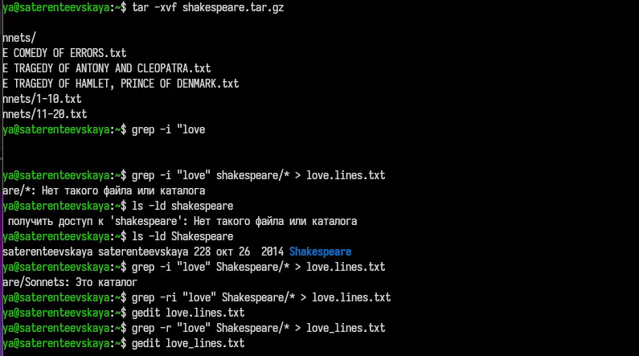{width="60%"}

------------------------------------------------------------------------

Загрузила в форму ([рис. 33](#fig-033){.quarto-xref}).

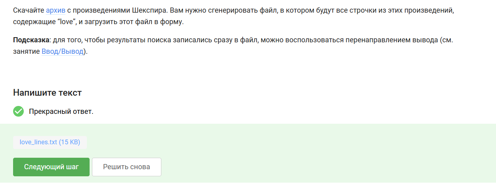{width="60%"}

# Выводы

Я прошла 1 этап курса "Введение в Linux" на платформе Stepik и
ознакомилась с функционалом системы Linux.

# Список литературы

[Введение в Linux](https://stepik.org/course/73/syllabus)
