---
author:
- Терентеевская Светлана Александровна
authors:
- affiliation:
  - address: ул. Миклухо-Маклая, д. 6
    city: Москва
    country: Российская Федерация
    name: Российский университет дружбы народов
    postal-code: 117198
  degrees: Student
  email: 1032253498@rudn.ru
  name: Терентеевская Светлана Александровна
crossref:
  lof-title: Список иллюстраций
  lol-title: Листинги
  lot-title: Список таблиц
date: 2026-05-10
date-format: 2026-05-10
engines:
- path: /opt/quarto/share/extension-subtrees/julia-engine/\_extensions/julia-engine/julia-engine.js
lang: ru-RU
license:
  text: CC BY 4.0
  type: creative-commons
  url: "https://creativecommons.org/licenses/by/4.0/deed.ru-ru"
subtitle: Работа с серверами
title: Отчёт по прохождению 2 этапа внешнего курса
toc-title: Содержание
---

# Информация

## Докладчик

- Терентеевская Светлана Александровна
- Группа НКАбд-05-25, студент бакалавра
- Российский университет дружбы народов им. П. Лумумбы
- <1032253498@rudn.ru>
- <https://github.com/SvetlanaTerenteevskaya>

# Вводная часть

## Цель работы

Пройти 2 этапа курса "Введение в Linux" на платформе Stepik и
ознакомиться с функционалом Linux.

## Задание

Просмотреть видео и на основе полученной информации пройти тестовые и
интерактивнные задания.

## Теоретическое введение

Линукс - в части случаев GNU/Linux --- семейство Unix-подобных
операционных систем на базе ядра Linux, включающих тот или иной набор
утилит и программ проекта GNU, и, возможно, другие компоненты. Как и
ядро Linux, системы на его основе, как правило, создаются и
распространяются в соответствии с моделью разработки свободного и
открытого программного обеспечения. Linux-системы распространяются в
основном бесплатно в виде различных дистрибутивов --- в форме, готовой
для установки и удобной для сопровождения и обновлений, --- и имеющих
свой набор системных и прикладных компонентов, как свободных, так и
проприетарных.

# Прохождение внешнего курса

Удаленный сервер - это компьютер, который находится в дата-центре, а
доступ к нему можно получить через Интернет. Он позволяет хранить
общедоступные данные, конфиденциальные данные. Также может выполнять
затратные по времени и памяти вычисления и хранить большие объемы данных
([рис. 1](#fig-001){.quarto-xref}).

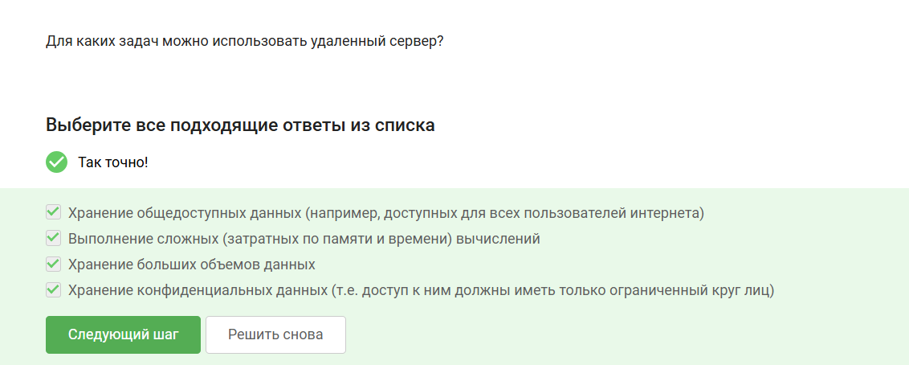{width="60%"}

------------------------------------------------------------------------

Только id_rsa.pub, потому что он является открытым
([рис. 2](#fig-002){.quarto-xref}).

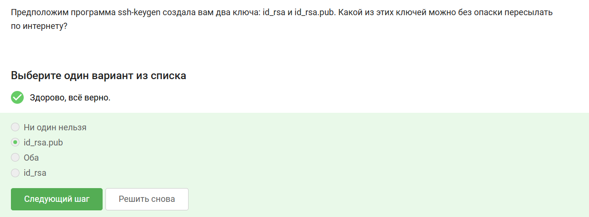{width="60%"}

------------------------------------------------------------------------

-r рекурсивно копирует все папки и подпапки
([рис. 3](#fig-003){.quarto-xref}).

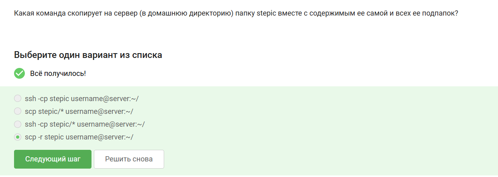{width="60%"}

------------------------------------------------------------------------

Необходимо проверить интернет соединения, чтоб понять, может ли
устройство соединиться с сервером, а затем проверить, знает ли оно
вообще о существовании такой программы
([рис. 4](#fig-004){.quarto-xref}).

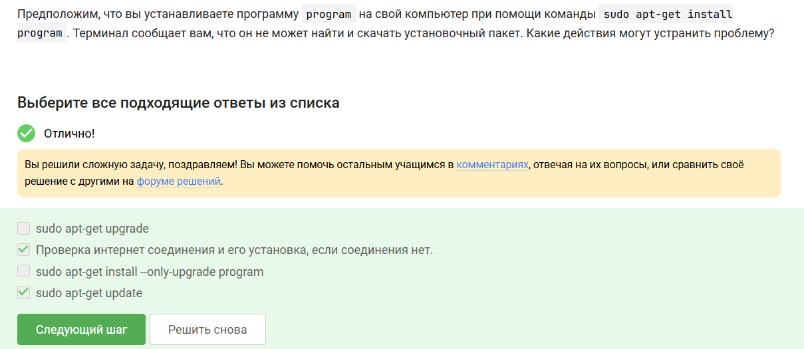{width="60%"}

------------------------------------------------------------------------

Filezilla - FTP/SFTP-клиент и его главная задача - передавать файлы в
обе стороны, также он показывает удаленную файловую систему как обычный
файловый менеджер и работает только с файлами, а не с выполнением
программ на сервере ([рис. 5](#fig-005){.quarto-xref}).

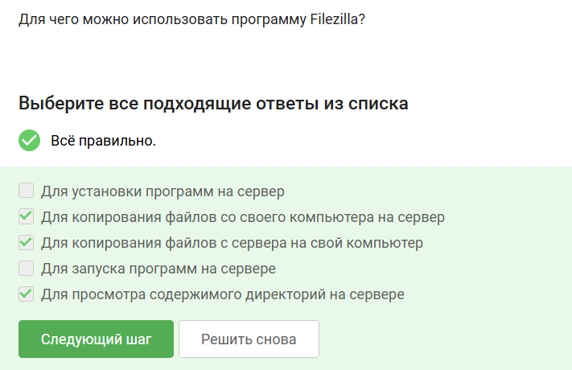{width="60%"}

------------------------------------------------------------------------

Запуск программы на своем компьютере не решит проблему "запуск программы
на сервере", поэтому необходимо настроить сервер, чтоб он поддерживал
вывод информации на экран компьютера и проверить, есть ли другая версия
этой программы ([рис. 6](#fig-006){.quarto-xref}).

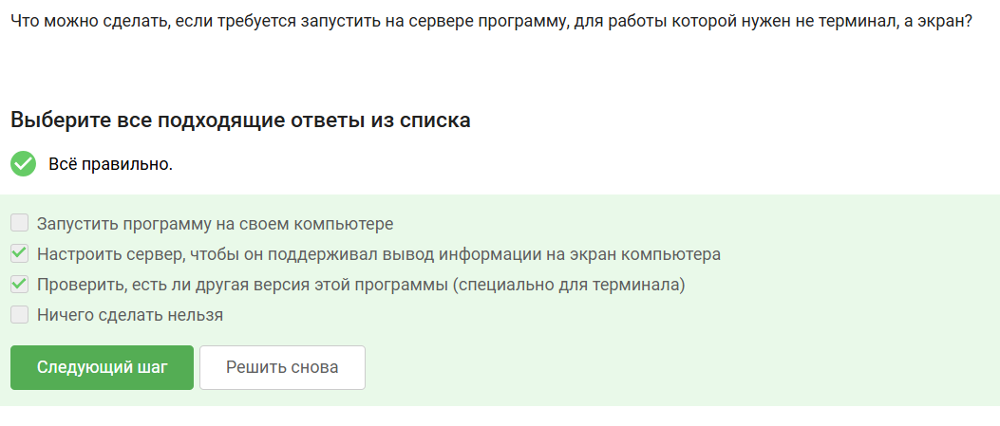{width="60%"}

------------------------------------------------------------------------

Все варинаты кроме program ?! верны. Не существует такой команды program
?! ([рис. 7](#fig-007){.quarto-xref}).

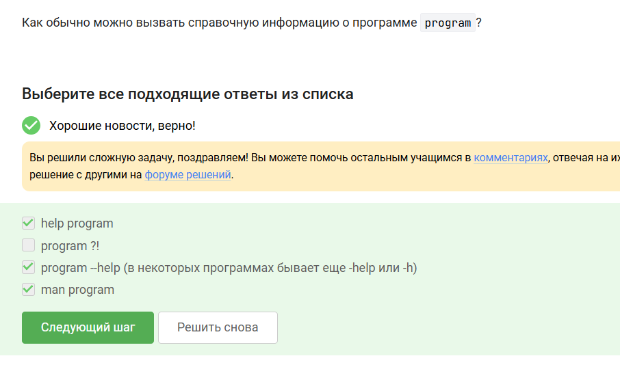{width="60%"}

------------------------------------------------------------------------

Из справки программы FastQC следует, что она принимает форматы: bam,
sam, bam_mapped, sam_mapped, fastq. Остальные не поддерживаются, а
fastqc-это название программы, а не формат
([рис. 8](#fig-008){.quarto-xref}).

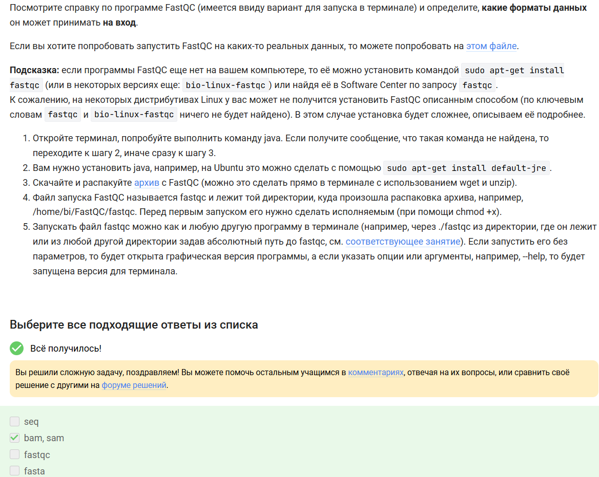{width="45%"}

------------------------------------------------------------------------

-infile=test.fasta - указывает входной файл. -align - опция, которая
явно запускает множественное выравнивание
([рис. 9](#fig-009){.quarto-xref}).

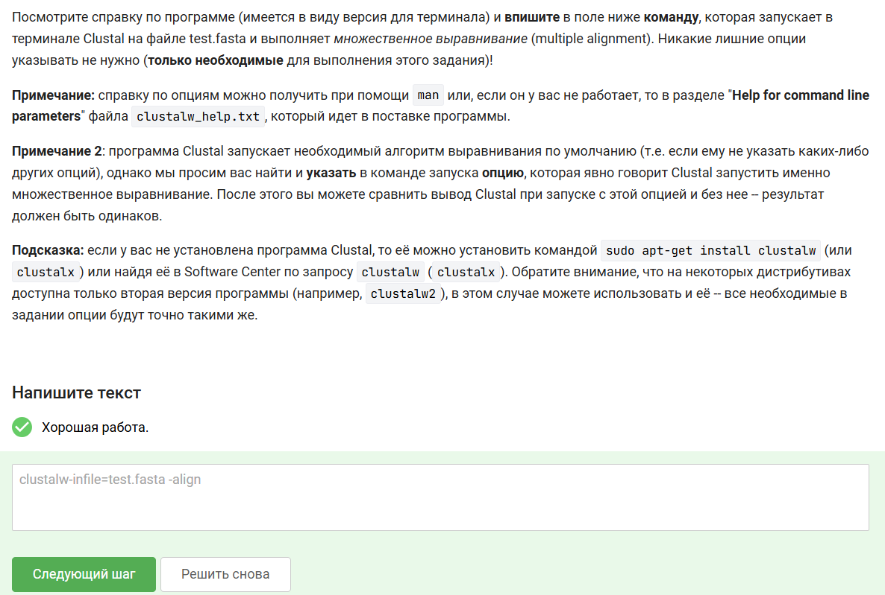{width="60%"}

------------------------------------------------------------------------

Ctrl+C завершает процесс, а Ctrl+Z приостанавливает
([рис. 10](#fig-010){.quarto-xref}).

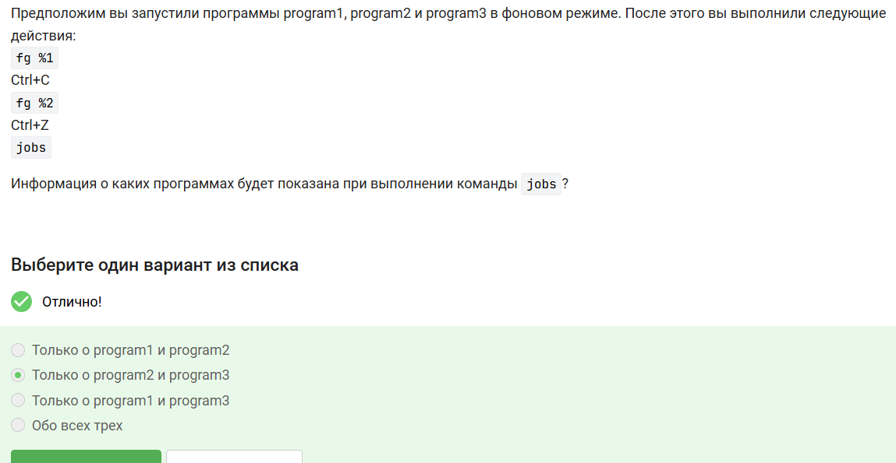{width="60%"}

------------------------------------------------------------------------

ps и top показывают PID, jobs - номер задачи, который не совпадает с PID
([рис. 11](#fig-011){.quarto-xref}).

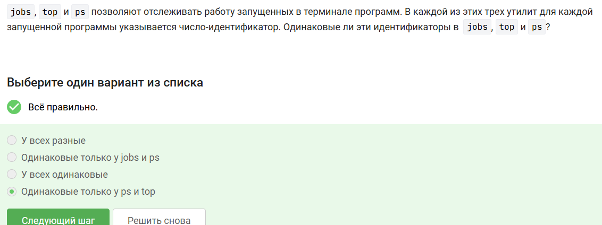{width="60%"}

------------------------------------------------------------------------

При kill -9 ядро мгновенно завершает процесс без возможности
игнорирования. kill -18 продолжает остановленный процесс, а просто kill
процесс может его перехватить или завершиться "мягко"
([рис. 12](#fig-012){.quarto-xref}).

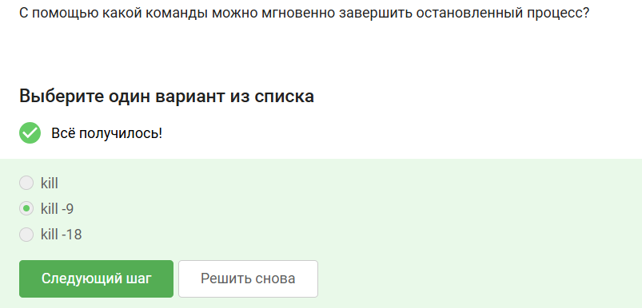{width="60%"}

------------------------------------------------------------------------

Приостановленный процесс не получает сигналы, пока не будет продолжен,
после kill процесс останется остановленным. А когда его продолжат он
начнет завершаться ([рис. 13](#fig-013){.quarto-xref}).

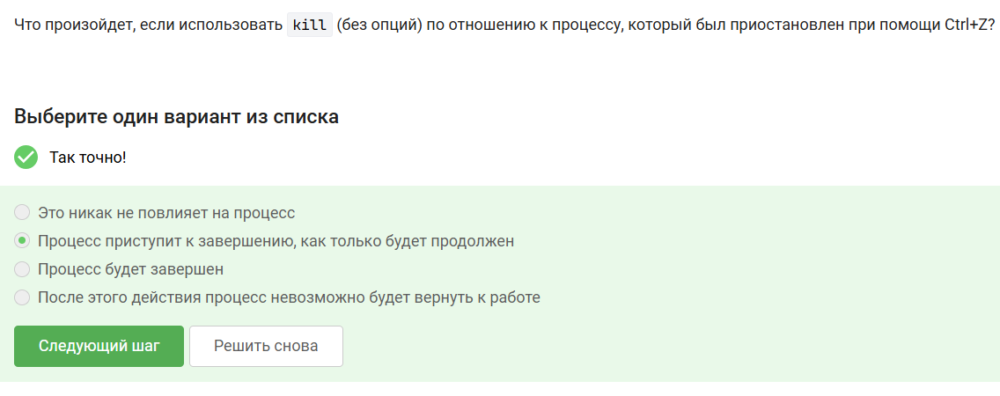{width="60%"}

------------------------------------------------------------------------

Запущенная программа потребляет ресурсы CPU, а остановленная нет
([рис. 14](#fig-014){.quarto-xref}).

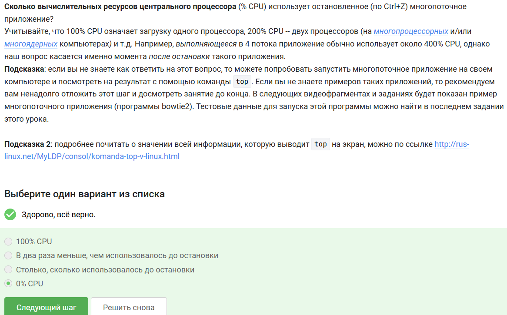{width="60%"}

------------------------------------------------------------------------

Приостановленное приложение не выполняет новых действий, поэтому не
занимает вычислительные ресурсы компьютера (CPU 0%). При этом, в
оперативной памяти оно сохранится, поэтому оно будет занимать столько же
оперативной памяти, сколько до постановки на паузу
([рис. 15](#fig-015){.quarto-xref}).

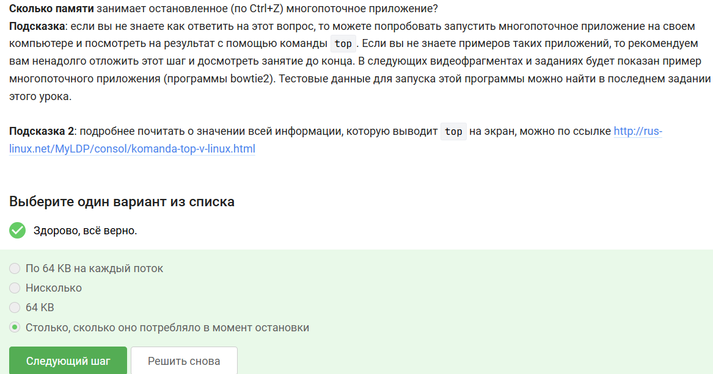{width="60%"}

------------------------------------------------------------------------

Завершить один из потоков запущенного многопоточного приложения никак
нельзя ([рис. 16](#fig-016){.quarto-xref}).

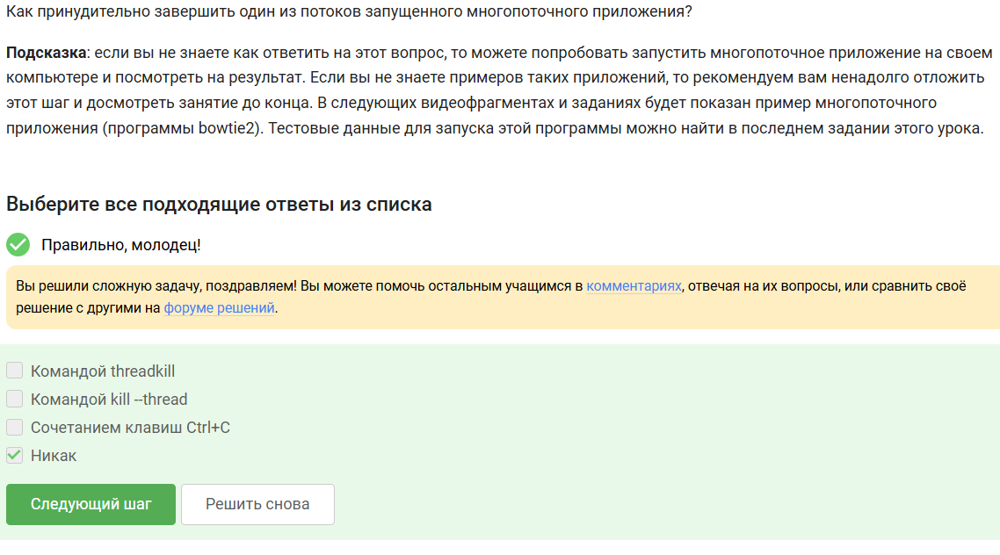{width="60%"}

------------------------------------------------------------------------

Только bowtie2 можно выполнить в несколько потоков
([рис. 17](#fig-017){.quarto-xref}).

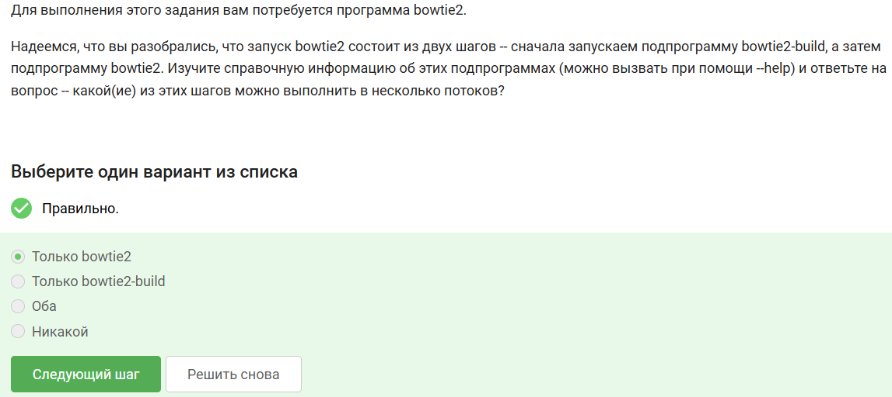{width="60%"}

------------------------------------------------------------------------

Я скачала необходимые для запуска bowtie2 файлы, запустила программу
bowtie ([рис. 18](#fig-018){.quarto-xref}).

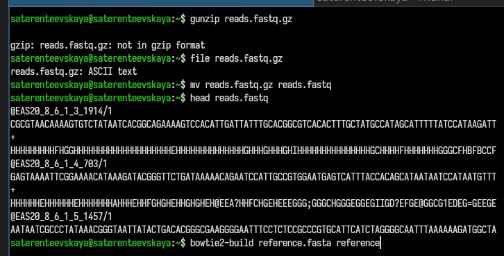{width="60%"}

------------------------------------------------------------------------

Записала данные в файл ([рис. 19](#fig-019){.quarto-xref}).

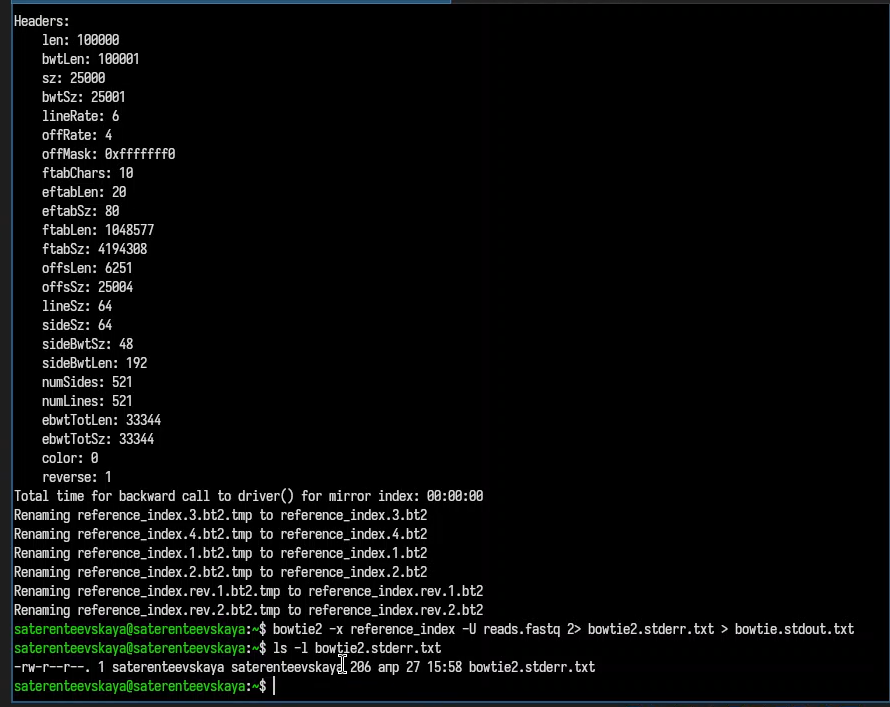{width="60%"}

------------------------------------------------------------------------

Вставила в форму на степике ([рис. 20](#fig-020){.quarto-xref}).

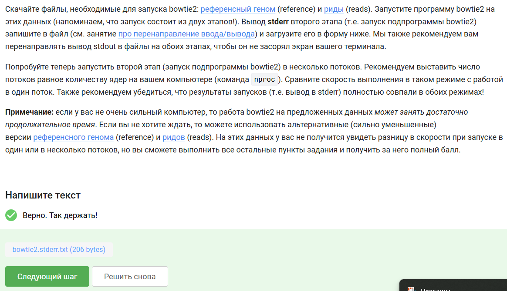{width="60%"}

------------------------------------------------------------------------

fg работает только в той оболочке, где процесс был запущен и остановлен.
Во второй вкладке - другой экземпляр оболочки, у него нет доступа к
списку задач первой вкладки, поэтому терминал сообщит, что нет процесса
для fg ([рис. 21](#fig-021){.quarto-xref}).

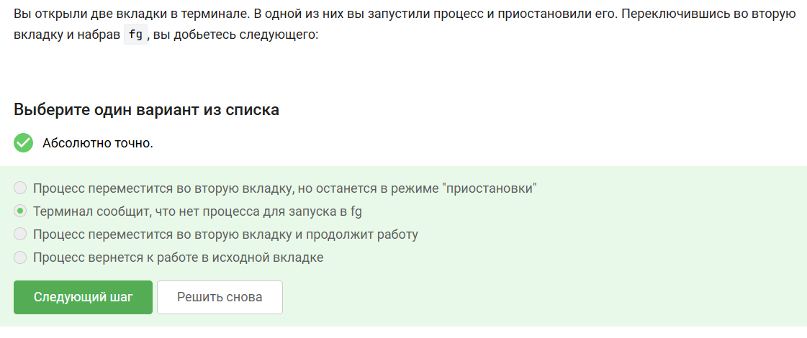{width="60%"}

------------------------------------------------------------------------

exit завершает работу tmux ([рис. 22](#fig-022){.quarto-xref}).

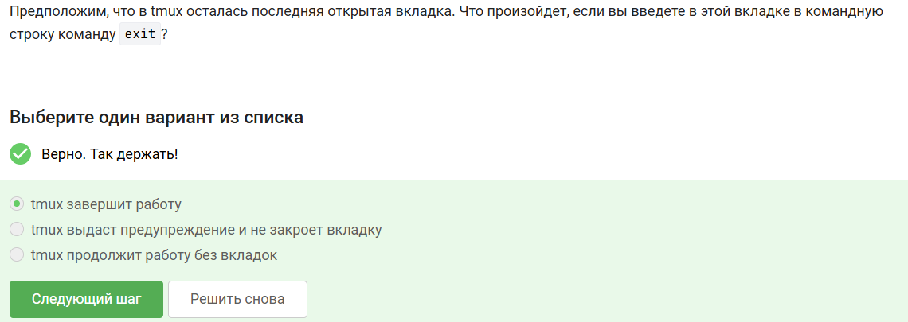{width="60%"}

------------------------------------------------------------------------

Мы заходили на сервер с терминала, который и закрыли, а tmux будет
продолжать свою работу на сервере ([рис. 23](#fig-023){.quarto-xref}).

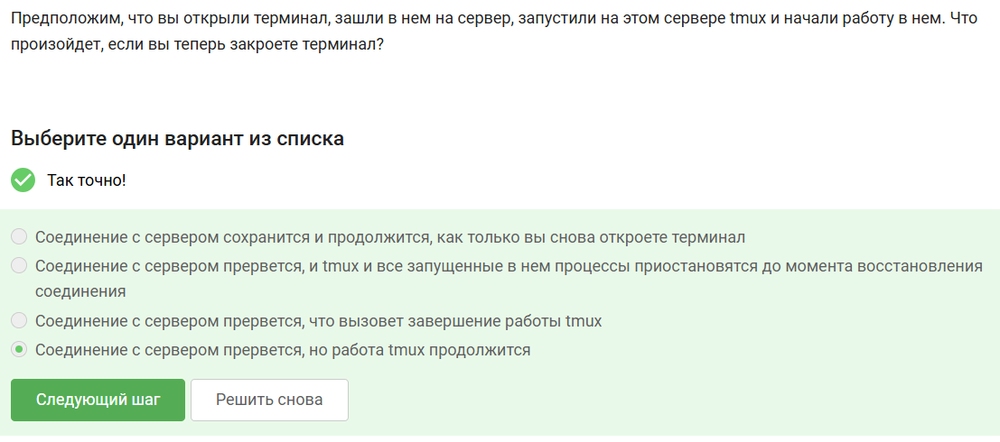{width="60%"}

------------------------------------------------------------------------

Ещё будет предупреждение о том, что работа завершится. Запущенный
процесс во вкладке, конечно же, при её закрытии, пропадёт
([рис. 24](#fig-024){.quarto-xref}).

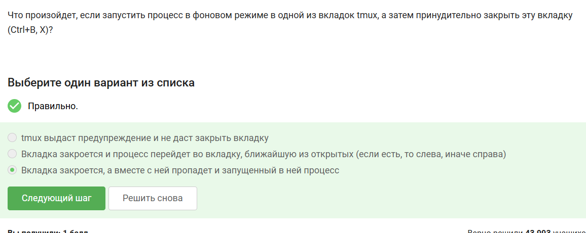{width="60%"}

------------------------------------------------------------------------

За переименование текущей вкладки отвечает Ctrl+B и запятая
([рис. 25](#fig-025){.quarto-xref}).

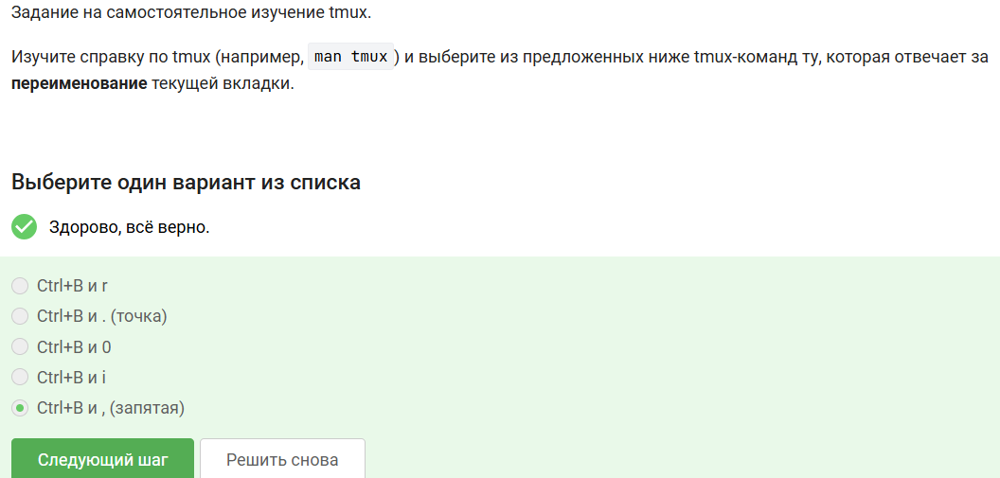{width="60%"}

------------------------------------------------------------------------

Ctrl+b c - создать новое окно;

Ctrl+b w - выбрать окно из списка;

Ctrl+b 0-9 - открыть окно по его номеру;

Ctrl+b , - переименовать текущее окно;

Ctrl+b % - разделить текущую панель по горизонтали;

Ctrl+b " - разделить текущую панель по вертикали;

Ctrl+b стрелка - перейти на панель, находящуюся в стороне, куда
указывает стрелка;

Ctrl+b Ctrl+стрелка - изменить размер текущей панели;

Ctrl+b o - перейти на следующую панель;

Ctrl+b ; - переключаться между текущей и предыдущей панелью;

Ctrl+b x - закрыть текущую панель;

Ctrl+b \[ - войти в режим копирования (подробнее ниже);

Ctrl+b \] - вставить из внутреннего буфера обмена tmux;

Ctrl+b d - отключится от текущей сессии;

Ctrl+b : - открыть командную строку.

------------------------------------------------------------------------

Можно закрыть одно из делений вкладки выполнив команды Ctrl+B и Х, по
половинам "разделенной" вкладки можно перемещаться при помощи Ctrl+B и
стрелок - как описано в задании выше, делить экран можно только в
текущей вкладке tmux, а не во всех вкладках одновременно
([рис. 26](#fig-026){.quarto-xref}).

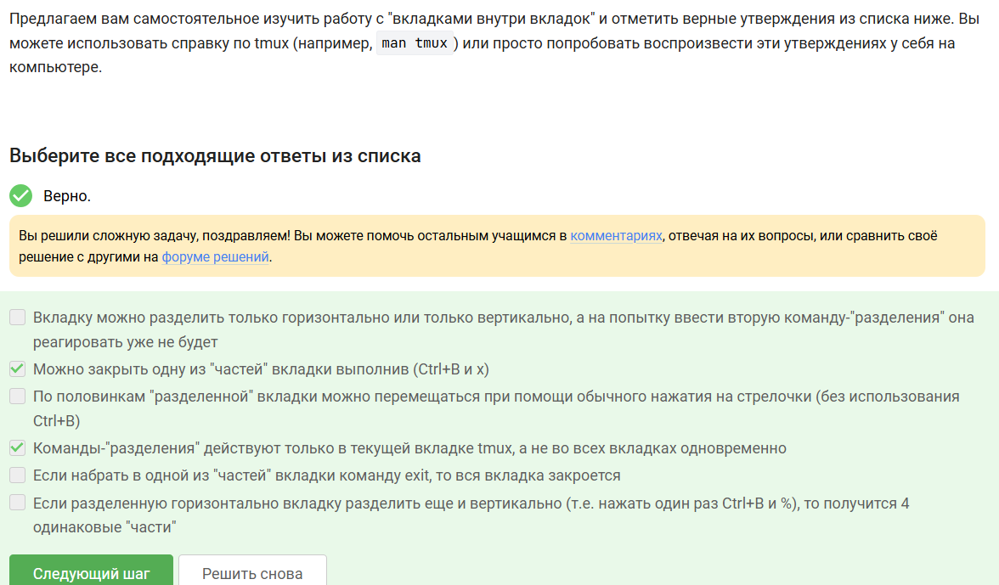{width="60%"}

# Выводы

Я прошла 2 этап курса "Введение в Linux" на платформе Stepik
ознакомилась с функционалом операционной системы Linux.

# Список литературы

[Введение в Linux](https://stepik.org/course/73/syllabus)
