---
author:
- Терентеевская Светлана Александровна
authors:
- affiliation:
  - address: ул. Миклухо-Маклая, д. 6
    city: Москва
    country: Российская Федерация
    name: Российский университет дружбы народов
    postal-code: 117198
  degrees: Student
  email: 1032253498@rudn.ru
  name: Терентеевская Светлана Александровна
bibliography:
- bib/cite.bib
crossref:
  lof-title: Список иллюстраций
  lol-title: Листинги
  lot-title: Список таблиц
csl: \_resources/csl/gost-r-7-0-5-2008-numeric.csl
engines:
- path: /opt/quarto/share/extension-subtrees/julia-engine/\_extensions/julia-engine/julia-engine.js
lang: ru-RU
license:
  text: CC BY 4.0
  type: creative-commons
  url: "https://creativecommons.org/licenses/by/4.0/deed.ru-ru"
subtitle: Продвинутые темы
title: Отчёт по прохождению 3 этапа внешнего курса
toc-title: Содержание
---

- [[1]{.toc-section-number} Цель работы](#цель-работы){#toc-цель-работы}
- [[2]{.toc-section-number} Задание](#задание){#toc-задание}
- [[3]{.toc-section-number} Теоретическое
  введение](#теоретическое-введение){#toc-теоретическое-введение}
- [[4]{.toc-section-number} Прохождение внешнего
  курса](#прохождение-внешнего-курса){#toc-прохождение-внешнего-курса}
- [[5]{.toc-section-number} Выводы](#выводы){#toc-выводы}
- [[6]{.toc-section-number} Список
  литературы](#список-литературы){#toc-список-литературы}

# Цель работы {#цель-работы number="1"}

Пройти 3 этап курса "Введение в Linux" на платформе Stepik и
ознакомиться с функционалом Linux.

# Задание {#задание number="2"}

Просмотреть видео и на основе полученной информации пройти тестовые и
интерактивнные задания.

# Теоретическое введение {#теоретическое-введение number="3"}

Линукс - в части случаев GNU/Linux --- семейство Unix-подобных
операционных систем на базе ядра Linux, включающих тот или иной набор
утилит и программ проекта GNU, и, возможно, другие компоненты. Как и
ядро Linux, системы на его основе, как правило, создаются и
распространяются в соответствии с моделью разработки свободного и
открытого программного обеспечения. Linux-системы распространяются в
основном бесплатно в виде различных дистрибутивов --- в форме, готовой
для установки и удобной для сопровождения и обновлений, --- и имеющих
свой набор системных и прикладных компонентов, как свободных, так и
проприетарных.

# Прохождение внешнего курса {#прохождение-внешнего-курса number="4"}

В vim команда выхода - :q (двоеточие для командной строки, q-quit,
Enter - выполнить). Остальное: q-макрос, Q-режим Ez, Esc-смена режима, а
не выод ([рис. 1](#fig-001){.quarto-xref}).

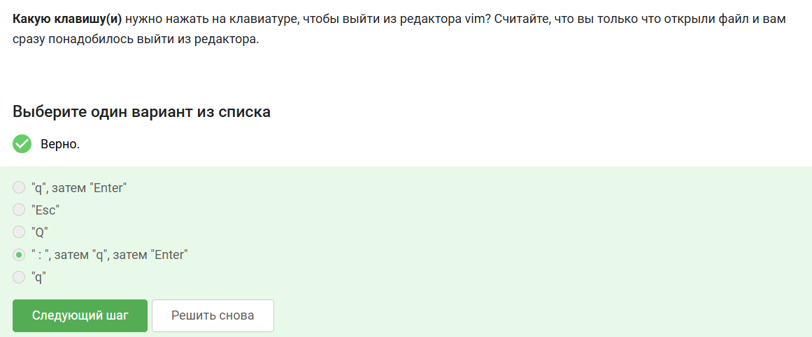{width="100%"}

Последовательность любых символов кроме пробелов. Пробелов 4, значит 5
фрагметов (больших слов). W перепрыгнет через . (так как точка не
пробел). w-9 нажатий, W-5, через 10 оба в конце. w - буквы, цифры, \_
считаются, знаки .,=,!-отдельные слова
([рис. 2](#fig-002){.quarto-xref}).

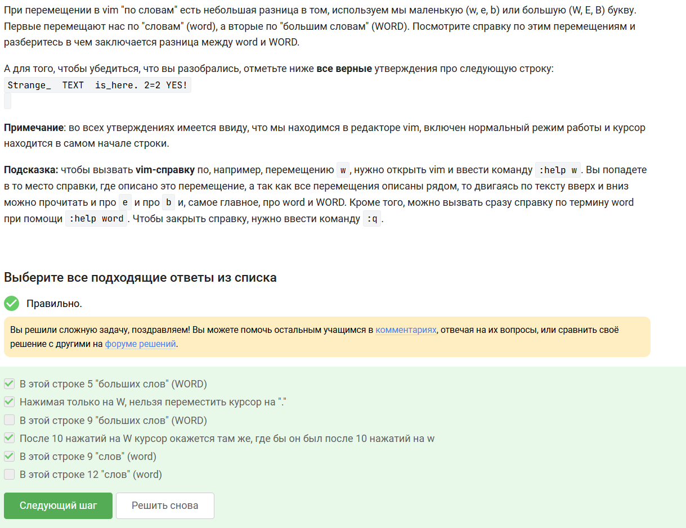{width="100%"}

x2wwywPp - x удалит только о, затем 2w перейдет не туда. В итоге
получится ne two three three three four five или
подобное([рис. 3](#fig-003){.quarto-xref}).

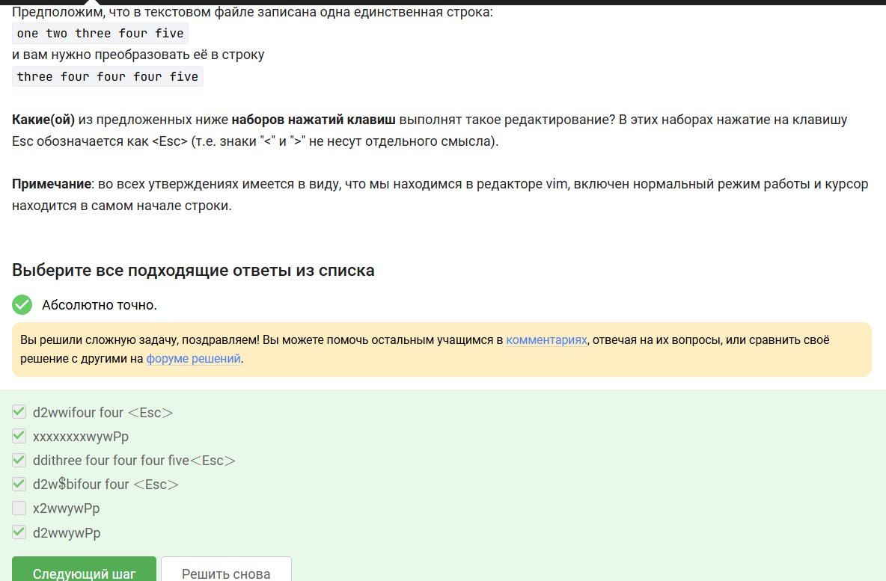{width="100%"}

\% - весь файл, s - замена, /Windows/Linux - что на что заменяем, без
флага g - только первое вхождение в строке
([рис. 4](#fig-004){.quarto-xref}).

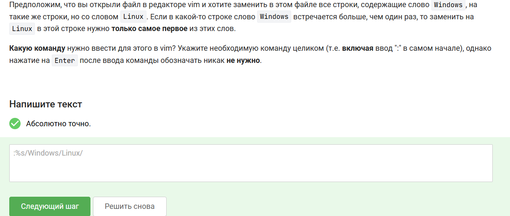{width="100%"}

:q - это выход из редактора, а не из режима выделения
([рис. 5](#fig-005){.quarto-xref}).

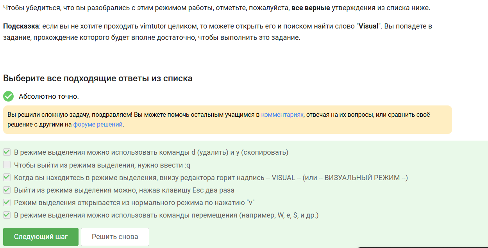{width="100%"}

У каждой оболочки (bash) своя история. Новая bash не наследует историю
от предыдущих, поэтому команды С - последняя bash, их и покажут
стрелочки ([рис. 6](#fig-006){.quarto-xref}).

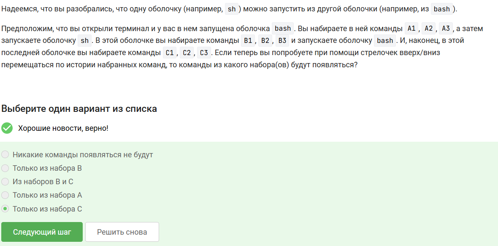{width="100%"}

cd /home/bi/ файл создается там. cd /home/bi/Desktop/ не перемещает файл
([рис. 7](#fig-007){.quarto-xref}).

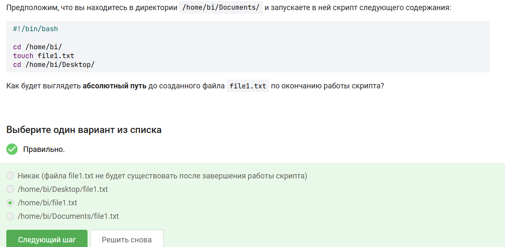{width="100%"}

    #!/bin/bash
    echo "Arguments are: \$1=$1 \$2=$2"

Построчно:

#!/bin/bash --- интерпретатор

echo "Arguments are: \$1=\$1 \$2=\$2" --- выводим текст, где \$1 даёт
буквально \$1, а \$1 подставляет первый аргумент
([рис. 8](#fig-008){.quarto-xref}).

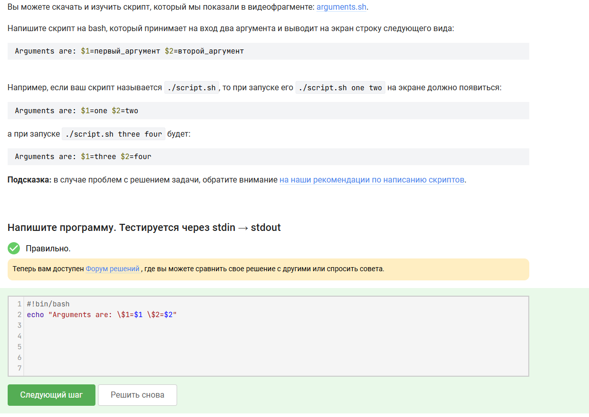{width="100%"}

Имя может начинаться с буквы или *, затем буквы, цифры,*. 123variable -
цифры в начале, остальные: /, -, пробел, \$\$, @ - недопустимы
([рис. 9](#fig-009){.quarto-xref}).

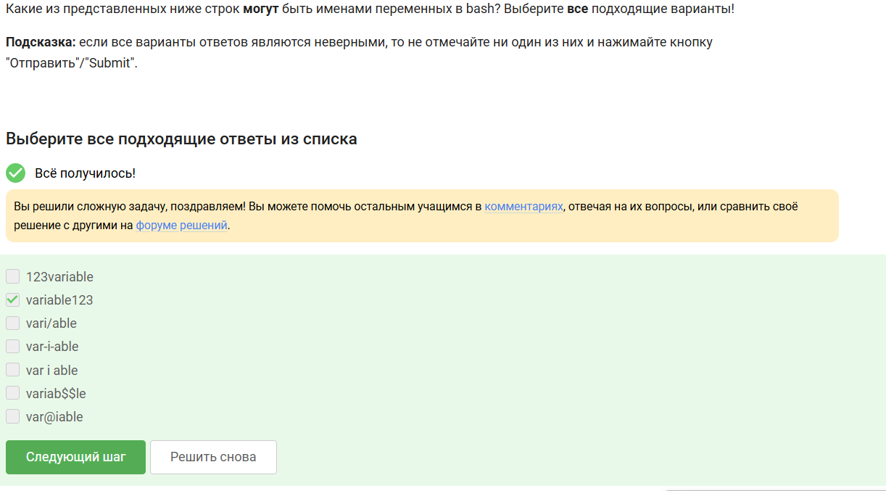{width="100%"}

!(4 -le 3): 4\<=3 - ложно, отрицание и ложь получается истина. \$# -ge
0: \$# - количество аргументов, переданных скрипту, оно всегда целое
неотрицательное, а -ge 0 значит больше или равно 0, значит условие
всегда истинно ([рис. 10](#fig-010){.quarto-xref}).

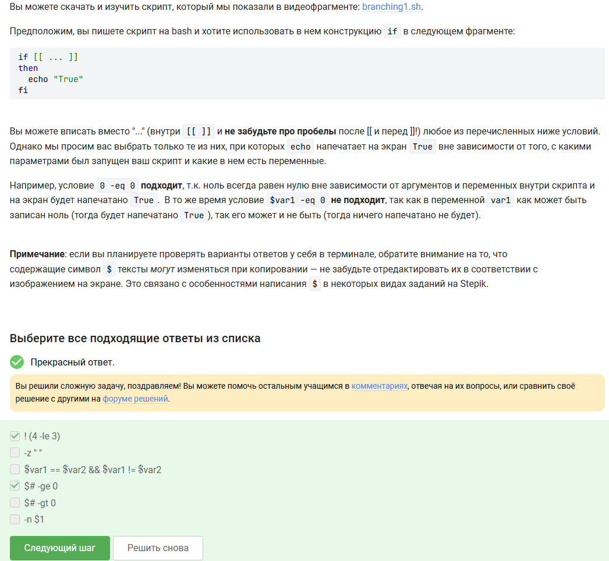{width="100%"}

    #!/bin/bash
    case $1 in
      0) echo "No students" ;;
      1) echo "1 student" ;;
      2|3|4) echo "$1 students" ;;
      *) echo "A lot of students" ;;
    esac

Построчно:

case \$1 in --- проверяем первый аргумент

0)  echo "No students" ;; --- если 0, вывести "No students"

1)  echo "1 student" ;; --- если 1, вывести "1 student"

2\|3\|4) echo "\$1 students" ;; --- если 2, 3 или 4, вывести "X
students"

\*) echo "A lot of students" ;; --- если любое другое число, вывести "A
lot of students"

esac --- конец конструкции case ([рис. 11](#fig-011){.quarto-xref}).

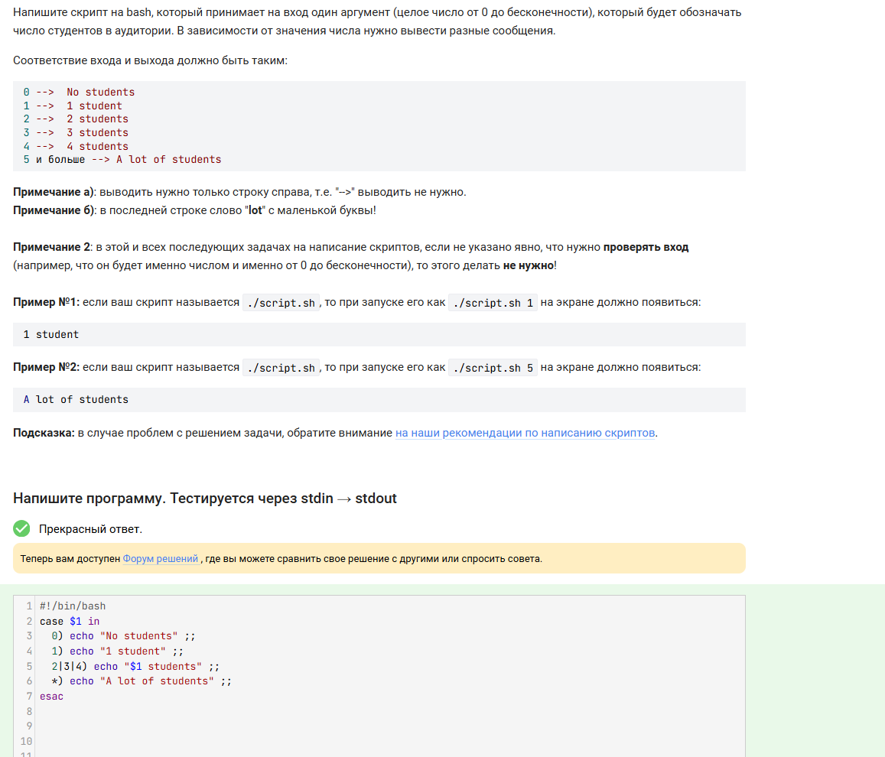{width="100%"}

Оба значения (var=3 и var=5) не подпадают ни под одно из условий (-gt 5,
-lt 3, -eq 4), поэтому оба раза выполняется ветка else, печатающая four
([рис. 12](#fig-012){.quarto-xref}).

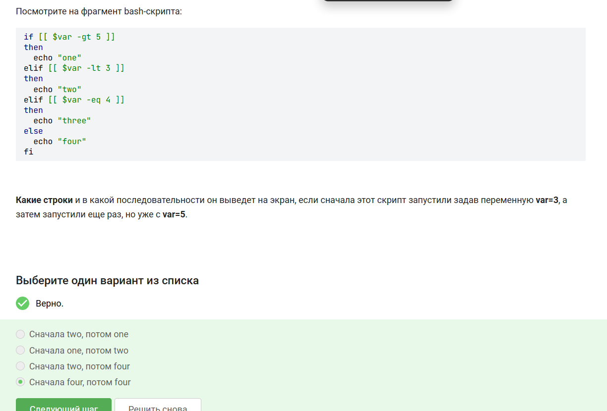{width="100%"}

    while true; do
      echo "enter your name:"
      read name
      [ -z "$name" ] && echo "bye" && exit
      echo "enter your age:"
      read age
      [ "$age" -eq 0 ] && echo "bye" && exit
      if [ "$age" -le 16 ]; then group="child"
      elif [ "$age" -le 25 ]; then group="youth"
      else group="adult"
      fi
      echo "$name, your group is $group"
    done

Построчно:

while true; do --- бесконечный цикл

echo "enter your name:" --- приглашение ввести имя

read name --- читаем имя

\[ -z "\$name" \] && echo "bye" && exit --- если имя пустое, выводим
"bye" и выходим

echo "enter your age:" --- приглашение ввести возраст

read age --- читаем возраст

\[ "\$age" -eq 0 \] && echo "bye" && exit --- если возраст 0, выводим
"bye" и выходим

if \[ "\$age" -le 16 \]; then group="child" --- если возраст ≤16, группа
child

elif \[ "\$age" -le 25 \]; then group="youth" --- иначе если ≤25, группа
youthelse group="adult" --- иначе (старше 25) группа adult

echo "\$name, your group is \$group" --- выводим результат

done --- конец цикла([рис. 13](#fig-013){.quarto-xref},
[рис. 14](#fig-014){.quarto-xref}).

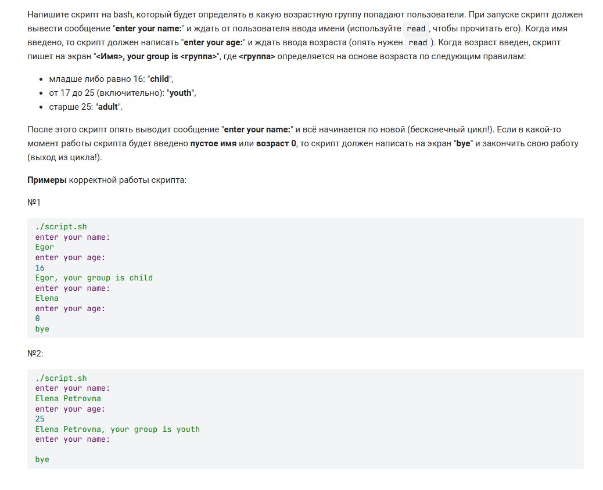{width="100%"}

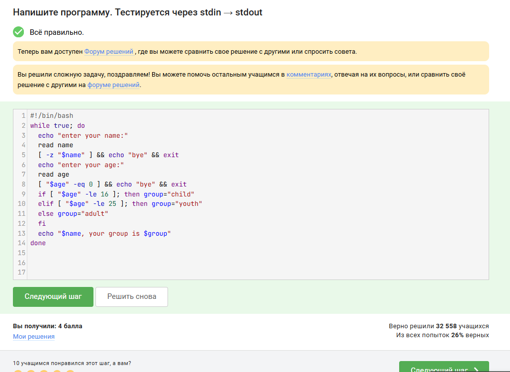{width="100%"}

- -lt, (\<) - меньше

- -gt - больше

- -eq - равно

3 не больше 5, 3 не меньше 3, 3 не равно 4. 5 не больше 5, 5 не меньше
3, 5 не равно 4. Оба раза выведет
four.([рис. 15](#fig-015){.quarto-xref}).

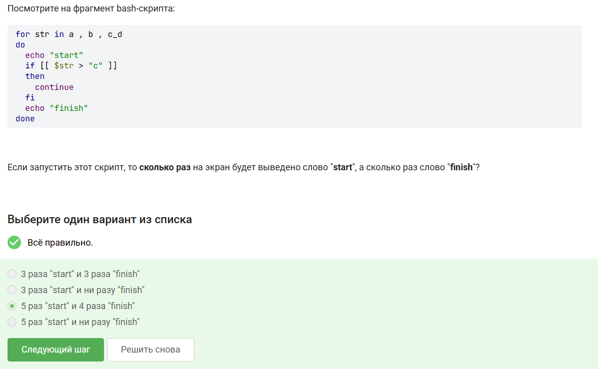{width="100%"}

- let "a=a+b" --- классика.

- let a=a+b --- без кавычек работает, если без пробелов.

- let "a+=b" --- сокращённая запись.

- let a=$a+$b --- с \$ тоже работает.

- let "a = a + b" --- пробелы допустимы в кавычках.

Все варианты корректно прибавляют b к a
([рис. 16](#fig-016){.quarto-xref}).

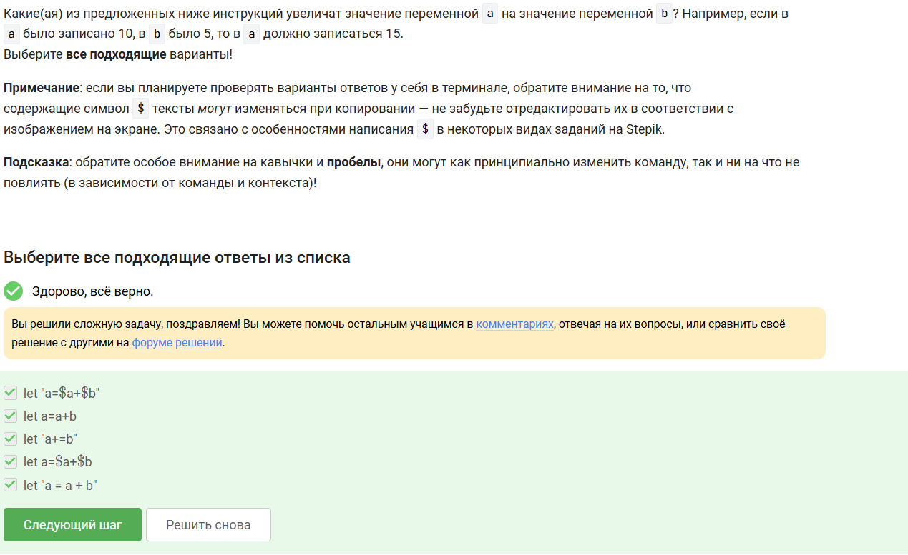{width="100%"}

cd /home/bi/ меняет директорию, обратные кавычки выполняют pwd там, echo
выводит /home/bi([рис. 17](#fig-017){.quarto-xref}).

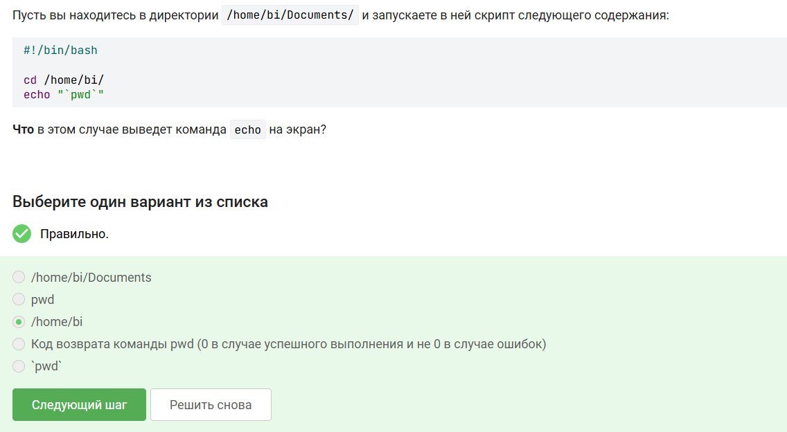{width="100%"}

program; if \[\[ \$? -eq 0 \]\] --- сохраняет код возврата. if program
\> some_file.txt --- проверяет код, stdout в файл. Остальные пытаются
использовать вывод вместо кода возврата
([рис. 18](#fig-018){.quarto-xref}).

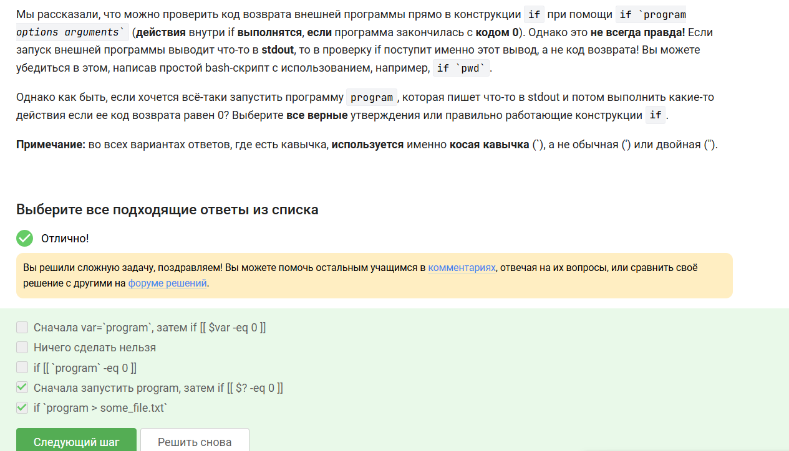{width="100%"}

    #!/bin/bash
    gcd() {
      if [ $1 -eq $2 ]; then echo "GCD is $1"; return
      elif [ $1 -gt $2 ]; then gcd $(($1 - $2)) $2
      else gcd $1 $(($2 - $1)); fi
    }
    while read m n; do
      [ -z "$m" ] && echo "bye" && exit
      gcd $m $n
    done

gcd() { --- объявление функции

if \[ \$1 -eq \$2 \]; then --- если числа равны

echo "GCD is \$1" --- выводим НОД

return --- выходим из функции

elif \[ \$1 -gt \$2 \]; then --- если первое больше второго

gcd \$((\$1 - \$2)) \$2 --- вызываем gcd с разностью

else --- иначе (второе больше первого)

gcd \$1 \$((\$2 - \$1)) --- вызываем gcd с разностью

while read m n; do --- читаем два числа

\[ -z "\$m" \] && echo "bye" && exit --- если пустая строка, выводим bye
и выходим

gcd \$m \$n --- вызываем функцию

done --- конец цикла ([рис. 19](#fig-019){.quarto-xref},
[рис. 20](#fig-020){.quarto-xref}).

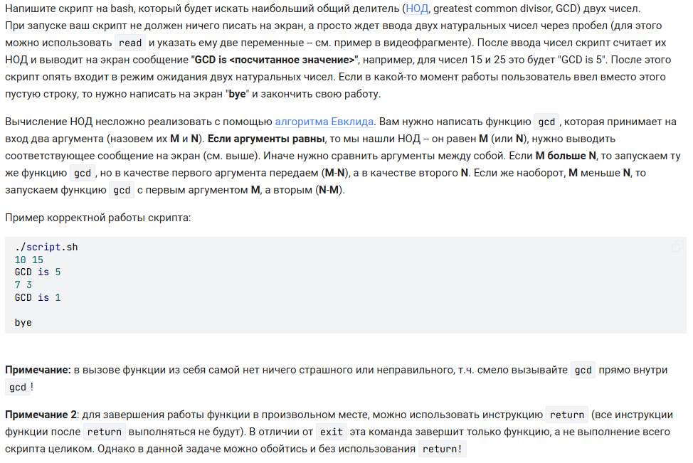{width="100%"}

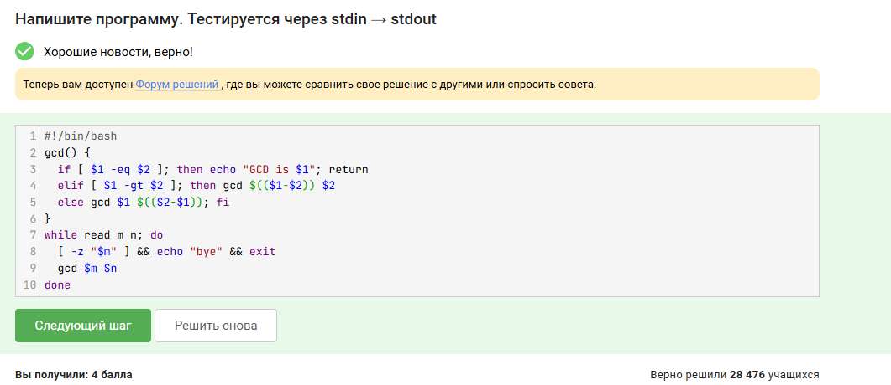{width="100%"}

c1 --- локальная, глобальная остаётся пустой (выводит пусто). c2 ---
глобальная, сумма 2×(1+2+...+10) = 110
([рис. 21](#fig-021){.quarto-xref}).

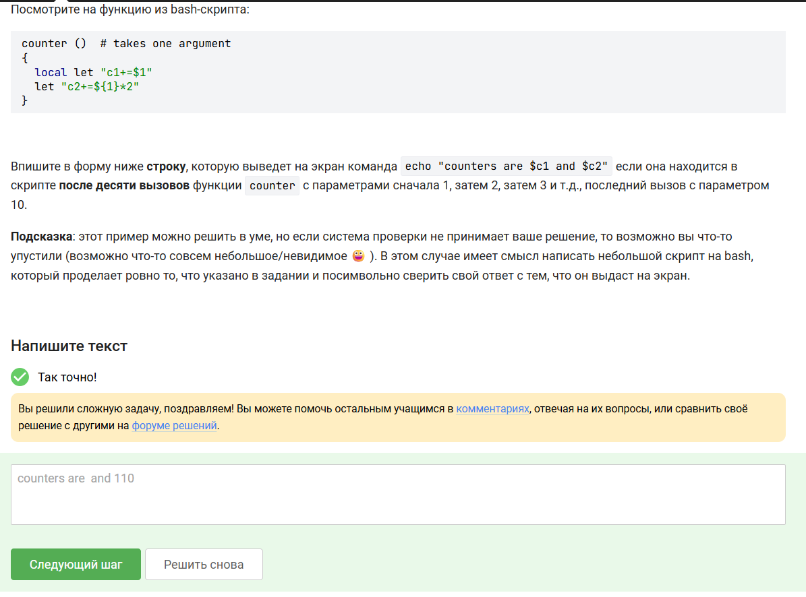{width="100%"}

    #!/bin/bash
    while true; 
    do
        read a op b
        if [[ $a == "exit" ]]; 
        then
            echo "bye"
            exit
        elif [[ ! $a =~ ^[0-9]+$ || ! $b =~ ^[0-9]+$ ]]; 
        then
        echo "error"
        exit
        else
        case $op in
            "+") let "res = a + b" ;;
            "-") let "res = a - b" ;;
            "*") let "res = a * b" ;;
            "/") let "res = a / b" ;;
            "%") let "res = a % b" ;;
            "**") let "res = a ** b" ;;
            *) echo "error"; exit ;;
        esac
        echo "$res"
        fi
    done

while true; do --- бесконечный цикл

read a op b --- читаем число, операцию, число

if \[\[ \$a == "exit" \]\]; then --- если введено "exit" echo "bye" ---
выводим bye

exit --- выходим

elif \[\[ ! $a =~ ^[0-9]+$ \|\| ! $b =~ ^[0-9]+$ \]\]; then --- если a
или b не числа

echo "error"; exit --- выводим error и выходим

case \$op in --- смотрим операцию

"+") let "res = a + b" ;;--- сложение"-") let"res = a - b" ;; ---
вычитание

"*") let "res = a* b" ;;--- умножение"/") let"res = a / b" ;; ---
деление

"%") let "res = a % b" ;;--- остаток"**") let"res = a** b" ;; ---
возведение в степень

\*) echo "error"; exit ;;--- неизвестная операция → erroresac--- конец
caseecho "\$res"--- выводим результатdone\` --- конец цикла
([рис. 22](#fig-022){.quarto-xref}, [рис. 23](#fig-023){.quarto-xref}).

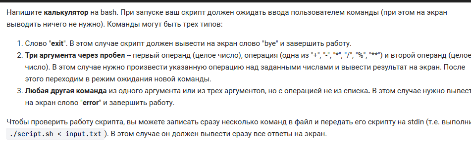{width="100%"}

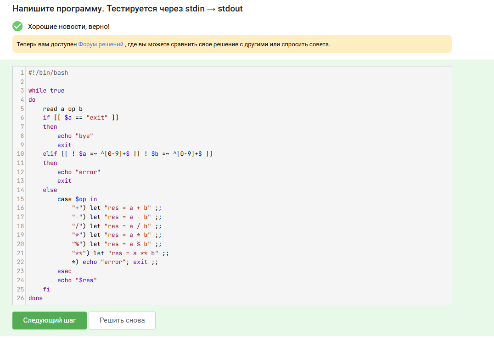{width="100%"}

-iname без учёта регистра найдёт и STARS.txt, и Star_Wars.avi. -name ---
только с маленькой буквы, поэтому их не найдёт. Остальные файлы либо не
начинаются на star, либо начинаются с маленькой star (найдутся обоими)
([рис. 24](#fig-024){.quarto-xref}).

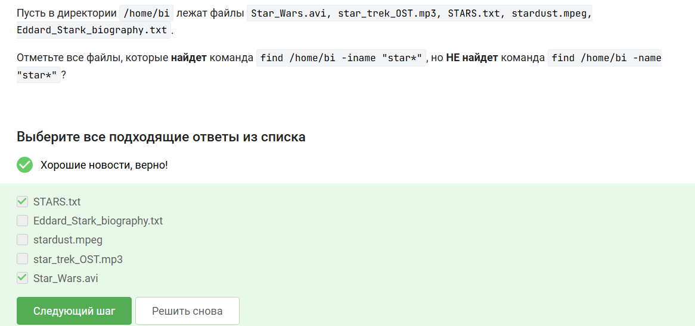{width="100%"}

-name ищет только имя, -path --- весь путь. Если файл с нужным именем
лежит в подпапке, -path может найти его, а -name
нет.([рис. 25](#fig-025){.quarto-xref}).

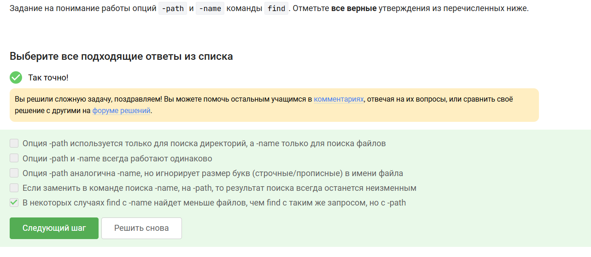{width="100%"}

file1 --- глубина 2. file2 --- глубина 3. file3 --- глубина 4 (не
попадает в -maxdepth 3) ([рис. 26](#fig-026){.quarto-xref}).

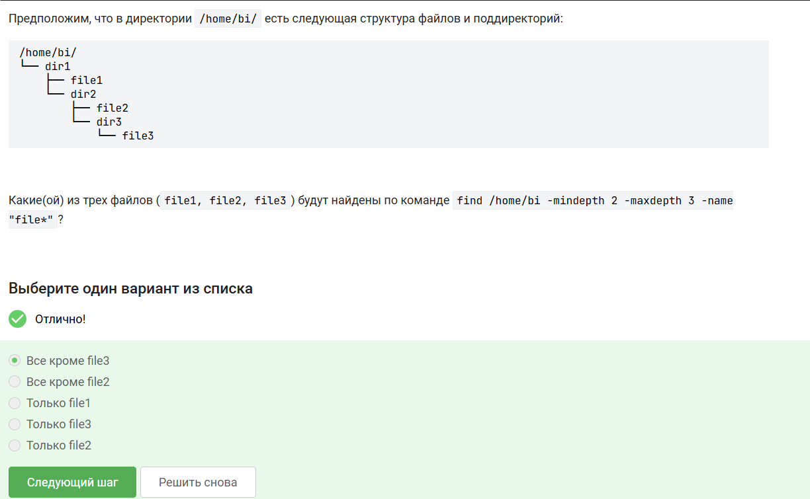{width="100%"}

Для файла из 10 строк, где слово есть в каждой, -A 1, -B 1, -C 1 из-за
границ файла не добавляют дополнительных строк. Все команды выведут 10
строк → размер одинаков.([рис. 27](#fig-027){.quarto-xref}).

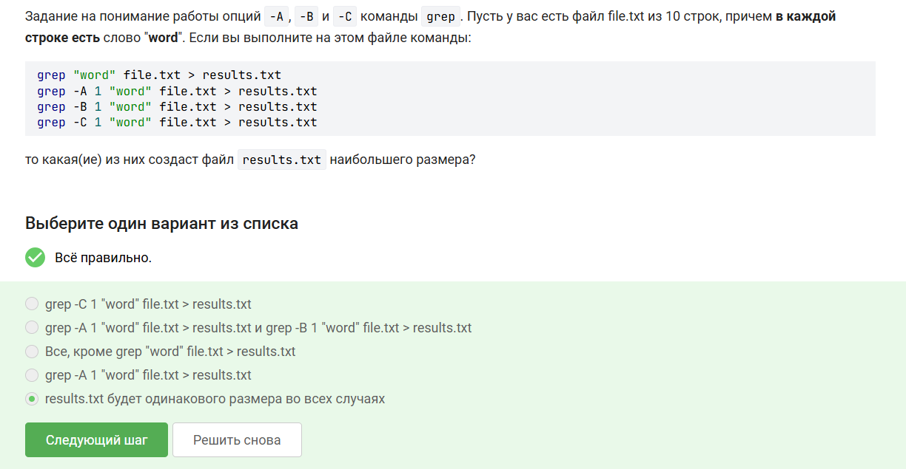{width="100%"}

Шаблон: любой символ из xklXKL (необязательно), затем ubuntu в конце
строки.

- Lubuntu --- нет L в скобках, но Ubuntu подходит.

- Linux...Ubuntu --- Ubuntu в конце подходит.

- Kubuntu --- нет K в скобках, но ubuntu подходит.

- xubuntu --- x есть в скобках.

Uuuubuntu! --- не подходит из-за ! (конец строки)
([рис. 28](#fig-028){.quarto-xref}).

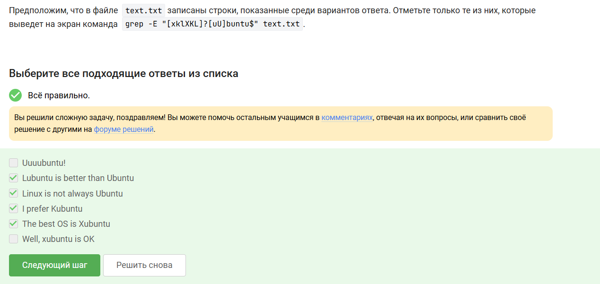{width="100%"}

Без -n sed печатает каждую строку автоматически. Команда p печатает ещё
раз. Итого 2 раза.([рис. 29](#fig-029){.quarto-xref}).

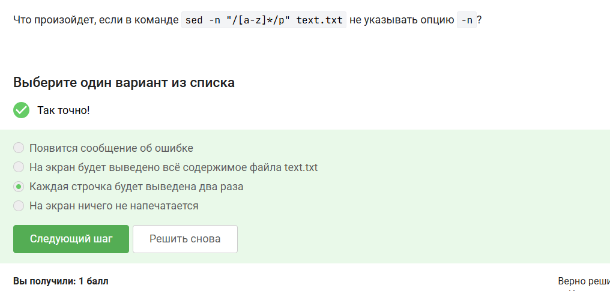{width="100%"}

\[A-Z\] --- большие буквы, {2,} --- от 2 и более, пробел после ---
окружение справа. Замена с пробелом сохраняет форматирование
([рис. 30](#fig-030){.quarto-xref}).

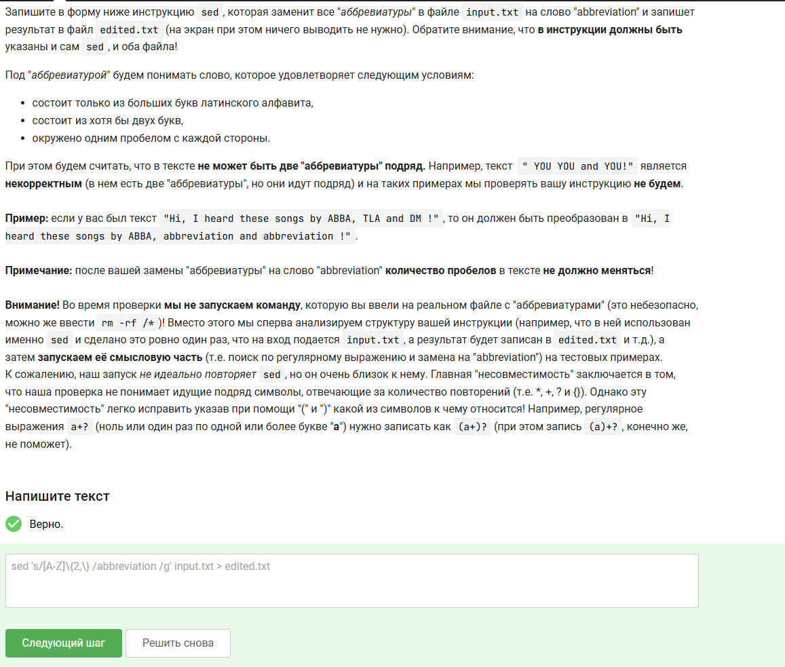{width="100%"}

Опция --persist оставляет окна графиков после выхода из gnuplot
([рис. 31](#fig-031){.quarto-xref}).

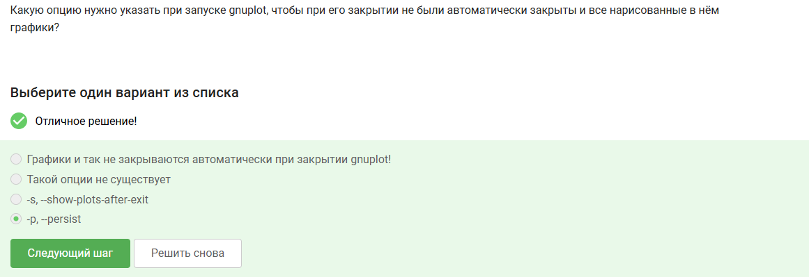{width="100%"}

set key autotitle columnhead берёт заголовок из первого значения второго
столбца (первая строка). Первая строка данных не рисуется, только 9
точек.([рис. 32](#fig-032){.quarto-xref}).

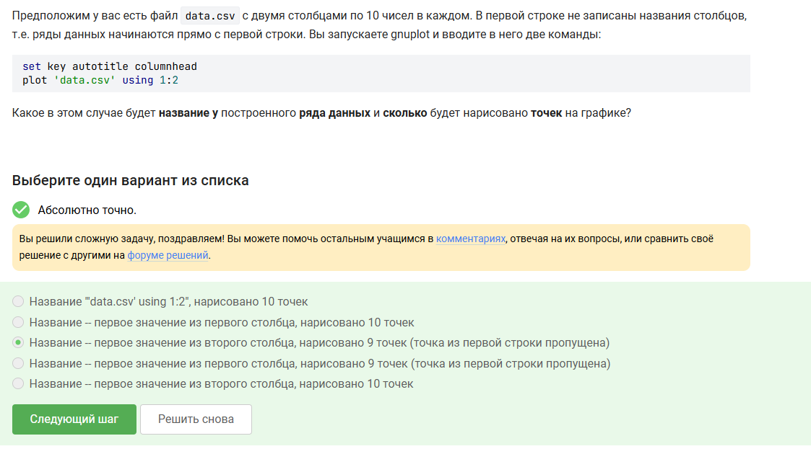{width="100%"}

set xtics --- устанавливает деления на оси X

("point 1, value".x1) x1 --- метка "point 1, value
`<значение x1>`{=html}" в координате x1

, --- разделитель

("point 2, value".x2) x2 --- метка в координате x2

("point 3, value".x3) x3 --- метка в координате x3

. --- конкатенация (склеивание строк)
([рис. 33](#fig-033){.quarto-xref}).

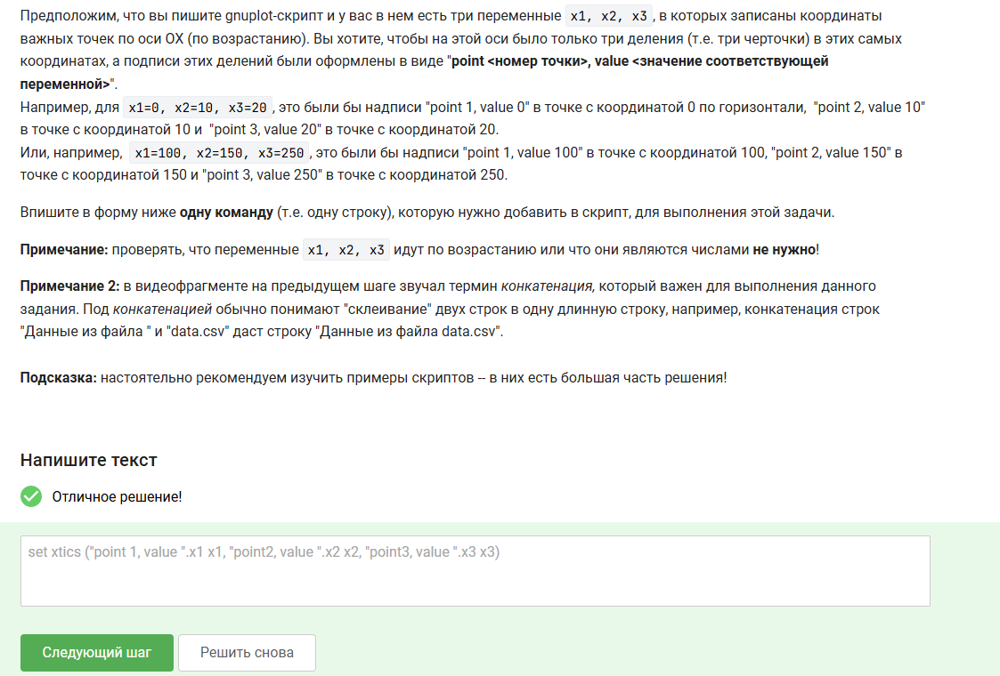{width="100%"}

Правильный текст:

text a=a+1 zrot=(zrot-20)%360 set view xrot,zrot splot -(x**2+y**2)
pause 0.2 if (a\<50) reread

Пояснение:

- -(x**2+y**2) --- отражение по горизонтали (Z).

- -20 вместо +10 --- обратное вращение и ускорение (20 --- в 2 раза
  быстрее 10) [рис. 34](#fig-034){.quarto-xref}).

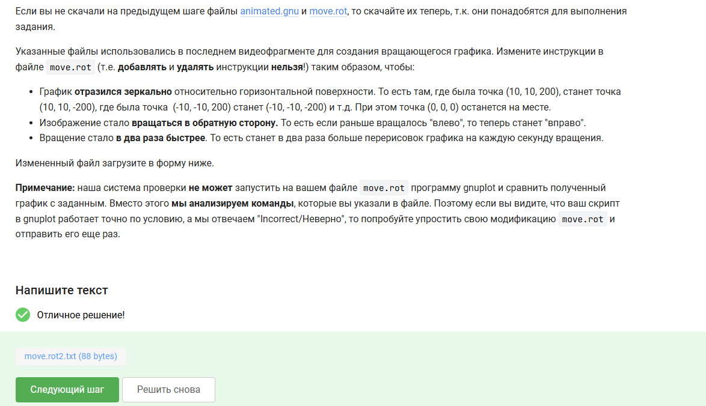{width="100%"}

a+wx добавляет всем wx, затем убирает лишнее у группы и остальных,
добивается нужных прав. u+wx добавляет х владельцу и w группе.
764=rwxrw-r-- напрямую. ug+w добавляет w владельцу и группе, х -
владельцу и получается rwxr-r--. В остальных 467 - дает r--rw-rwx(не то)
и 777 - дает полные права всем ([рис. 35](#fig-035){.quarto-xref}).

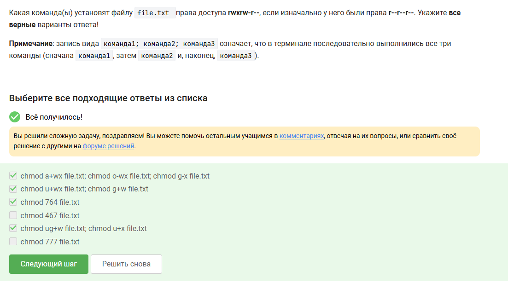{width="100%"}

- (sudo chmod a+w dir) --- даёт запись всем, включая user.

- (sudo chown user.group dir) --- user становится владельцем → может
  писать.

- (sudo chown user dir) --- user владелец → может писать.

- sudo chmod o+x --- даёт выполнение, не запись.

- chmod o+w (без sudo) --- нет прав менять.

- sudo chmod g+w --- группа root, а user в ней не состоит
  ([рис. 36](#fig-036){.quarto-xref}).

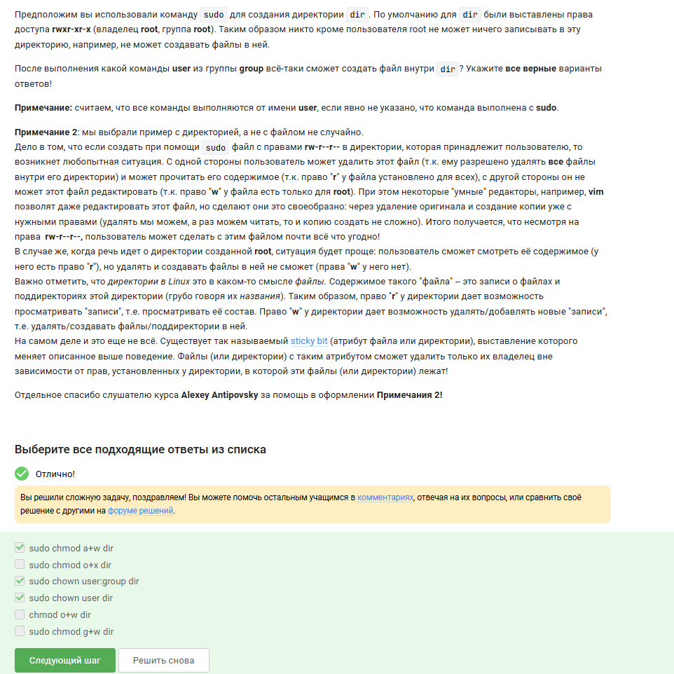{width="100%"}

wc умеет считать: количество строк (-l), количество слов (-w),
количество символов (-m) или байт (-c). Количество предложений и
определенных букв не умеет ([рис. 37](#fig-037){.quarto-xref}).

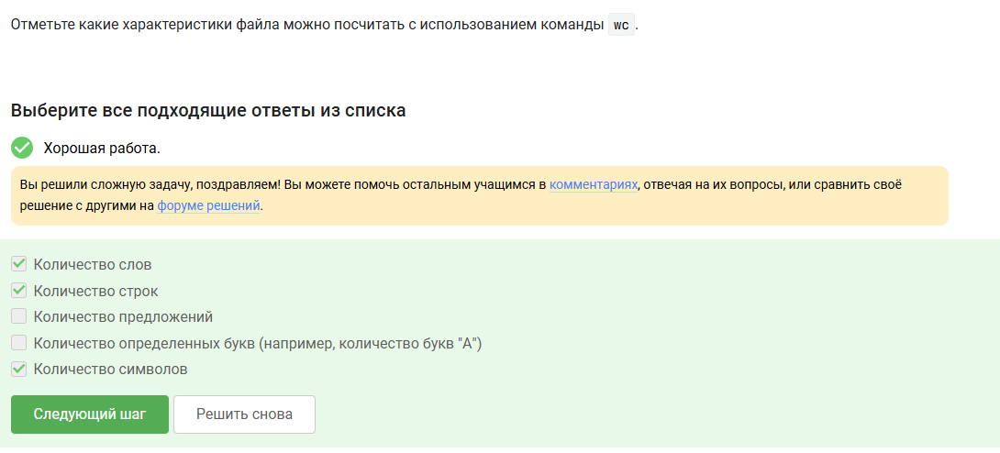{width="100%"}

du - показывает размер файлов и директории. -h - выводит размер в
удобном формате. -s - показывает только общий размер текущей директории,
без перечисления вложенных файлов и поддиректорий
([рис. 38](#fig-038){.quarto-xref}).

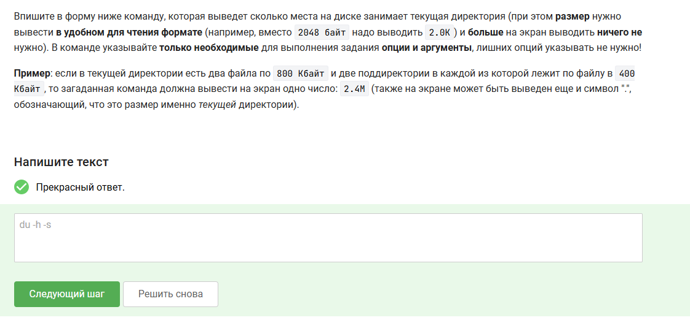{width="100%"}

mrdir - создает директории. {1..3} - фигурные скобки раскрываются в 1 2
3. dir{1..3} превращается в dir1 dir 2 dir 3
([рис. 39](#fig-039){.quarto-xref}).

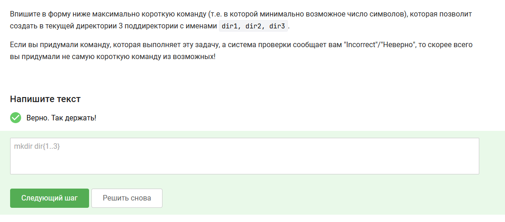{width="100%"}

Я получила сертификат о прохождении курса
([рис. 40](#fig-040){.quarto-xref}).

{width="100%"}

# Выводы {#выводы number="5"}

Я успешно прошла 3 этап курса "Введение в Linux" на платформе Stepik и
ознакомилась с функционалом Linux, а также получила сертификат об
окончании курса.

# Список литературы {#список-литературы number="6"}

[Введение в Linux](https://stepik.org/course/73/syllabus)
